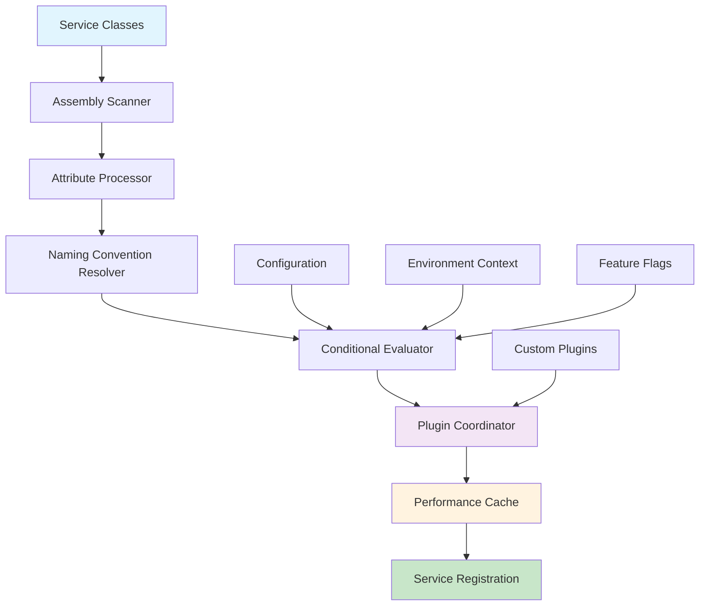

# FS.AutoServiceDiscovery.Extensions

[](https://www.nuget.org/packages/FS.AutoServiceDiscovery.Extensions)
[](https://www.nuget.org/packages/FS.AutoServiceDiscovery.Extensions)
[](https://github.com/furkansarikaya/FS.AutoServiceDiscovery/blob/main/LICENSE)
[](https://github.com/furkansarikaya/FS.AutoServiceDiscovery/stargazers)

A powerful, convention-based automatic service discovery and registration library for .NET 9.0 applications. This library transforms manual dependency injection configuration into an intelligent, attribute-driven system that can discover, validate, and register services automatically while maintaining full control and flexibility.

## 🚀 Quick Start

Transform your service registration from manual configuration to intelligent automation:

```csharp
// 1. Mark your services with attributes
[ServiceRegistration(ServiceLifetime.Scoped)]
public class UserService : IUserService
{
    public async Task<User> GetUserAsync(int id)
    {
        return new User { Id = id, Name = "Sample User" };
    }
}

// 2. Enable automatic discovery in Program.cs
var builder = WebApplication.CreateBuilder(args);

// Single line to automatically discover and register all services
builder.Services.AddAutoServices();

var app = builder.Build();
```

That's it! Your `IUserService` is now automatically discovered, registered, and ready for dependency injection.

## 🎯 Core Features

### Convention-Based Discovery
Automatically discover services using intelligent naming conventions and attributes:

```csharp
[ServiceRegistration(ServiceLifetime.Scoped)]
public class ProductService : IProductService { }

[ServiceRegistration(ServiceLifetime.Singleton)]
public class CacheService : ICacheService { }
```

### Environment-Aware Registration
Register different implementations based on environment:

```csharp
[ServiceRegistration(ServiceLifetime.Scoped, Profile = "Development")]
public class MockEmailService : IEmailService { }

[ServiceRegistration(ServiceLifetime.Scoped, Profile = "Production")]
public class SmtpEmailService : IEmailService { }
```

### Expression-Based Conditional Registration
Use powerful, type-safe conditional logic:

```csharp
[ConditionalService(ctx => 
    ctx.Environment.IsProduction() && 
    ctx.FeatureEnabled("AdvancedLogging") &&
    !ctx.Configuration.GetValue<bool>("MaintenanceMode"))]
[ServiceRegistration(ServiceLifetime.Scoped)]
public class AdvancedLoggingService : ILoggingService { }
```

### Fluent Configuration API
Build complex configurations with readable, chainable syntax:

```csharp
builder.Services.ConfigureAutoServices()
    .FromCurrentDomain(assembly => !assembly.FullName.StartsWith("System"))
    .WithProfile(ctx => ctx.Environment.IsDevelopment() ? "Dev" : "Prod")
    .When(ctx => ctx.FeatureEnabled("AutoDiscovery"))
    .ExcludeNamespaces("MyApp.Internal.*", "MyApp.Testing.*")
    .WithPerformanceOptimizations()
    .Apply();
```

### High-Performance Discovery
Optimized for production with advanced caching and parallel processing:

```csharp
builder.Services.AddAutoServicesWithPerformanceOptimizations(options =>
{
    options.EnableParallelProcessing = true;
    options.EnablePerformanceMetrics = true;
    options.MaxDegreeOfParallelism = 4;
});
```

## 🏗️ Architecture Overview



The library follows a sophisticated pipeline architecture where each component has a specific responsibility:

- **Assembly Scanner**: Efficiently discovers service candidates using reflection
- **Attribute Processor**: Interprets registration attributes and metadata
- **Naming Convention Resolver**: Applies intelligent interface-to-implementation mapping
- **Conditional Evaluator**: Processes environment and configuration-based conditions
- **Plugin Coordinator**: Manages extensible discovery strategies
- **Performance Cache**: Optimizes repeated discovery operations
- **Service Registration**: Final registration with dependency injection container

## 📚 Documentation

### Core Concepts
- **[Getting Started Guide](docs/GettingStarted.md)** - Step-by-step introduction
- **[Service Registration](docs/ServiceRegistration.md)** - Attribute-based service marking
- **[Naming Conventions](docs/NamingConventions.md)** - Interface resolution strategies
- **[Conditional Registration](docs/ConditionalRegistration.md)** - Environment and configuration-based logic

### Advanced Features
- **[Fluent Configuration](docs/FluentConfiguration.md)** - Advanced configuration patterns
- **[Plugin Architecture](docs/PluginArchitecture.md)** - Extensible discovery mechanisms
- **[Performance Optimization](docs/PerformanceOptimization.md)** - Caching and parallel processing
- **[Expression-Based Conditions](docs/ExpressionBasedConditions.md)** - Type-safe conditional logic

### Architecture & Extensibility
- **[System Architecture](docs/SystemArchitecture.md)** - Detailed architectural overview
- **[Custom Naming Conventions](docs/CustomNamingConventions.md)** - Building custom resolution logic
- **[Plugin Development](docs/PluginDevelopment.md)** - Creating discovery extensions
- **[Performance Monitoring](docs/PerformanceMonitoring.md)** - Metrics and optimization

## 🛠️ Installation

```bash
dotnet add package FS.AutoServiceDiscovery.Extensions
```

**Requirements:**
- .NET 9.0 or later
- Microsoft.Extensions.DependencyInjection 9.0.0+

## 🎨 Usage Patterns

### Basic Service Registration
```csharp
[ServiceRegistration(ServiceLifetime.Scoped)]
public class UserService : IUserService
{
    // Automatically registered as IUserService -> UserService
}
```

### Profile-Based Environment Configuration
```csharp
[ServiceRegistration(ServiceLifetime.Scoped, Profile = "Development")]
public class DevUserService : IUserService { }

[ServiceRegistration(ServiceLifetime.Scoped, Profile = "Production")]
public class ProdUserService : IUserService { }
```

### Complex Conditional Logic
```csharp
[ConditionalService(ctx => 
    ctx.Environment.IsProduction() && 
    ctx.Configuration.GetValue<bool>("Features:EnableCaching") &&
    ctx.EvaluateCustomCondition("DatabaseHealthy"))]
[ServiceRegistration(ServiceLifetime.Singleton)]
public class RedisCacheService : ICacheService { }
```

### High-Performance Discovery
```csharp
// Optimized for large applications
builder.Services.AddAutoServicesWithPerformanceOptimizations(options =>
{
    options.EnableParallelProcessing = true;
    options.EnablePerformanceMetrics = true;
    options.EnableLogging = false; // Reduce overhead in production
});

// Get performance statistics
var stats = PerformanceServiceCollectionExtensions.GetCacheStatistics();
Console.WriteLine($"Cache Hit Ratio: {stats.HitRatio:F1}%");
```

## 🔧 Configuration Options

### Basic Configuration
```csharp
builder.Services.AddAutoServices(options =>
{
    options.Profile = builder.Environment.EnvironmentName;
    options.Configuration = builder.Configuration;
    options.EnableLogging = true;
    options.IsTestEnvironment = false;
});
```

### Advanced Performance Configuration
```csharp
builder.Services.AddAutoServicesWithPerformanceOptimizations(options =>
{
    options.EnableParallelProcessing = true;
    options.MaxDegreeOfParallelism = Environment.ProcessorCount;
    options.EnablePerformanceMetrics = true;
    options.EnableLogging = false;
});
```

### Fluent Configuration
```csharp
builder.Services.ConfigureAutoServices()
    .FromAssemblies(Assembly.GetExecutingAssembly())
    .WithProfile("Production")
    .When(ctx => ctx.FeatureEnabled("AutoDiscovery"))
    .ExcludeTypes(type => type.Name.EndsWith("Test"))
    .WithDefaultLifetime(ServiceLifetime.Scoped)
    .WithPerformanceOptimizations()
    .Apply();
```

## 📊 Performance Characteristics

| Feature | Impact | Best Use Case |
|---------|---------|---------------|
| Basic Discovery | ~10-50ms | Small to medium applications |
| Cached Discovery | ~1-5ms | Repeated discovery operations |
| Parallel Processing | 2-4x faster | Large applications (100+ services) |
| Plugin System | Variable | Complex discovery requirements |

## 🤝 Contributing

We welcome contributions! This project is open source and benefits from community involvement:

1. Fork the repository
2. Create a feature branch (`git checkout -b feature/amazing-feature`)
3. Commit your changes (`git commit -m 'Add amazing feature'`)
4. Push to the branch (`git push origin feature/amazing-feature`)
5. Open a Pull Request

**Development Guidelines:**
- Follow existing code patterns and conventions
- Add comprehensive tests for new features
- Update documentation for any public API changes
- Ensure backward compatibility when possible

## 📄 License

This project is licensed under the MIT License. See the [LICENSE](LICENSE) file for details.

**Made with ❤️ by [Furkan Sarıkaya](https://github.com/furkansarikaya)**

For detailed documentation, advanced usage patterns, and architectural insights, explore the comprehensive guides in our [documentation directory](docs/)