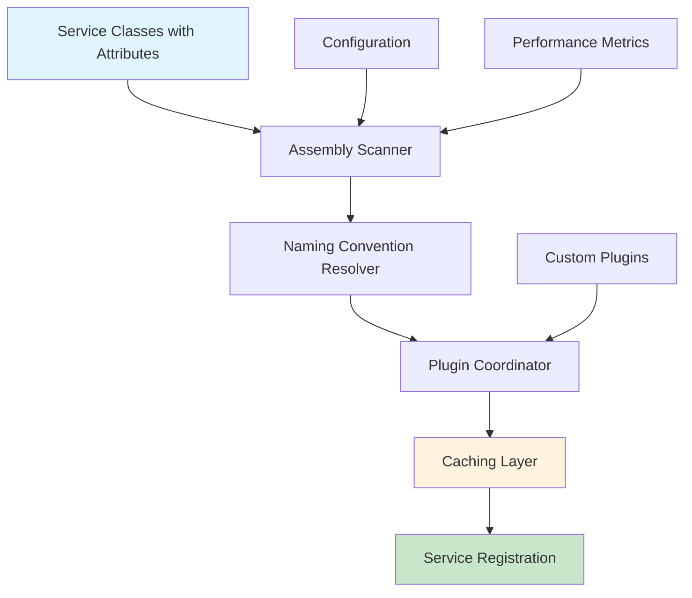

# FS.AutoServiceDiscovery.Extensions

**Dosya Yolu:** `/README.md`

[](https://www.nuget.org/packages/FS.AutoServiceDiscovery.Extensions)
[](https://www.nuget.org/packages/FS.AutoServiceDiscovery.Extensions)
[](https://github.com/furkansarikaya/FS.AutoServiceDiscovery/blob/main/LICENSE)

## 🚀 Hızlı Başlangıç

Bu kütüphane, .NET 9.0 uygulamalarında dependency injection için **convention-based otomatik servis keşfi ve kaydı** sağlar. Geleneksel manuel servis kaydı yerine, attribute'lar kullanarak servislerinizi otomatik olarak keşfetmenizi ve kaydetmenizi sağlar.

### Basit Kullanım

```csharp
// 1. Servisinizi işaretleyin
[ServiceRegistration(ServiceLifetime.Scoped)]
public class UserService : IUserService
{
    public async Task<User> GetUserAsync(int id)
    {
        // Implementation
        return new User { Id = id, Name = "Sample User" };
    }
}

// 2. Program.cs'de otomatik kaydı etkinleştirin
var builder = WebApplication.CreateBuilder(args);

// Tek satırda tüm servisleri otomatik kaydet
builder.Services.AddAutoServices();

var app = builder.Build();
```

**Bu kadar!** Artık `IUserService` dependency injection container'ında kayıtlı ve kullanıma hazır.

## 🎯 Temel Özellikler

### Convention-Based Discovery
Servislerinizi attribute'larla işaretleyin, sistem otomatik olarak keşfetsin:

```csharp
[ServiceRegistration(ServiceLifetime.Scoped)]
public class ProductService : IProductService { }

[ServiceRegistration(ServiceLifetime.Singleton)]
public class CacheService : ICacheService { }

[ServiceRegistration(ServiceLifetime.Transient)]
public class EmailService : IEmailService { }
```

### Environment-Based Registration
Farklı ortamlar için farklı implementasyonlar:

```csharp
[ServiceRegistration(ServiceLifetime.Scoped, Profile = "Development")]
public class MockEmailService : IEmailService { }

[ServiceRegistration(ServiceLifetime.Scoped, Profile = "Production")]
public class SmtpEmailService : IEmailService { }
```

### Feature Flag Tabanlı Kayıt
Konfigürasyona dayalı koşullu servis kaydı:

```csharp
[ConditionalService("FeatureFlags:EnableAdvancedReporting", "true")]
[ServiceRegistration(ServiceLifetime.Scoped)]
public class AdvancedReportingService : IReportingService { }
```

### Performance Optimizasyonları
Büyük uygulamalar için yüksek performanslı keşif:

```csharp
// Caching ve parallel processing ile optimize edilmiş kayıt
builder.Services.AddAutoServicesWithPerformanceOptimizations(options =>
{
    options.Profile = builder.Environment.EnvironmentName;
    options.Configuration = builder.Configuration;
    options.EnableLogging = true;
});
```

## 📊 Sistem Mimarisi Genel Bakış



## 🔧 Kurulum

```bash
dotnet add package FS.AutoServiceDiscovery.Extensions
```

## 📝 Temel Kullanım Senaryoları

### 1. Basit Servis Kaydı
```csharp
[ServiceRegistration(ServiceLifetime.Scoped)]
public class UserService : IUserService
{
    // Otomatik olarak IUserService -> UserService olarak kayıt edilir
}
```

### 2. Explicit Service Type
```csharp
[ServiceRegistration(ServiceLifetime.Scoped, ServiceType = typeof(ISpecificInterface))]
public class MultiInterfaceService : ISpecificInterface, IAnotherInterface
{
    // Sadece ISpecificInterface olarak kayıt edilir
}
```

### 3. Kayıt Sırası Kontrolü
```csharp
[ServiceRegistration(ServiceLifetime.Singleton, Order = 1)]
public class DatabaseService : IDatabaseService { }

[ServiceRegistration(ServiceLifetime.Scoped, Order = 2)]
public class UserRepository : IUserRepository
{
    public UserRepository(IDatabaseService dbService) { }
}
```

### 4. Test Ortamında Hariç Tutma
```csharp
[ServiceRegistration(ServiceLifetime.Singleton, IgnoreInTests = true)]
public class BackgroundTaskService : IBackgroundTaskService
{
    // Test ortamında kayıt edilmez
}
```

## 🚀 İleri Düzey Özellikler

### Plugin Sistemi
Özel keşif mantığı için extensible plugin mimarisi:

```csharp
public class CustomDiscoveryPlugin : IServiceDiscoveryPlugin
{
    public string Name => "Custom Discovery";
    public int Priority => 100;
    
    public IEnumerable<ServiceRegistrationInfo> DiscoverServices(
        Assembly assembly, AutoServiceOptions options)
    {
        // Özel keşif mantığınız
    }
}
```

### Custom Naming Conventions
Kendi adlandırma kurallarınızı oluşturun:

```csharp
public class CustomNamingConvention : INamingConvention
{
    public string Name => "Custom Naming";
    public int Priority => 10;
    
    public Type? ResolveServiceType(Type implementationType, 
        IEnumerable<Type> availableInterfaces)
    {
        // Özel adlandırma mantığınız
    }
}
```

### Performance Monitoring
Detaylı performans metrikleri:

```csharp
builder.Services.AddAutoServices(options =>
{
    options.EnablePerformanceMetrics = true;
});

// Uygulama çalışırken metrics alın
var stats = PerformanceServiceCollectionExtensions.GetCacheStatistics();
Console.WriteLine($"Cache Hit Ratio: {stats.HitRatio:F1}%");
```

## 📋 Konfigürasyon Seçenekleri

```csharp
builder.Services.AddAutoServices(options =>
{
    options.Profile = "Production";                    // Environment-based registration
    options.Configuration = builder.Configuration;     // Feature flag support
    options.EnableLogging = true;                     // Detailed logging
    options.IsTestEnvironment = false;                // Test environment mode
    options.EnablePerformanceOptimizations = true;   // High-performance mode
    options.EnableParallelProcessing = true;         // Multi-threaded scanning
    options.MaxDegreeOfParallelism = 4;              // Thread limit
});
```

## 📖 Detaylı Dokümantasyon

- **[Architecture Guide](docs/Architecture.md)** - Sistem mimarisi ve tasarım prensipleri
- **[Performance Guide](docs/Performance.md)** - Performans optimizasyonları ve caching
- **[Plugin Development](docs/Plugins.md)** - Custom plugin geliştirme rehberi
- **[Configuration Reference](docs/Configuration.md)** - Tüm konfigürasyon seçenekleri
- **[Examples & Patterns](docs/Examples.md)** - Gerçek dünya kullanım örnekleri
- **[Troubleshooting](docs/Troubleshooting.md)** - Yaygın sorunlar ve çözümleri

## 🤝 Katkıda Bulunma

Bu proje açık kaynak kodludur ve katkılarınızı memnuniyetle karşılarız:

1. Fork yapın
2. Feature branch oluşturun (`git checkout -b feature/amazing-feature`)
3. Değişikliklerinizi commit edin (`git commit -m 'Add amazing feature'`)
4. Branch'inizi push edin (`git push origin feature/amazing-feature`)
5. Pull Request oluşturun

## 📄 Lisans

Bu proje MIT lisansı altında yayınlanmıştır. Detaylar için [LICENSE](LICENSE) dosyasına bakın.

## 🙏 Teşekkürler

Bu projeyi geliştiren [Furkan SARIKAYA](https://github.com/furkansarikaya) ve katkıda bulunan tüm geliştiricilere teşekkürler.

---

**Made with ❤️ for the .NET community**