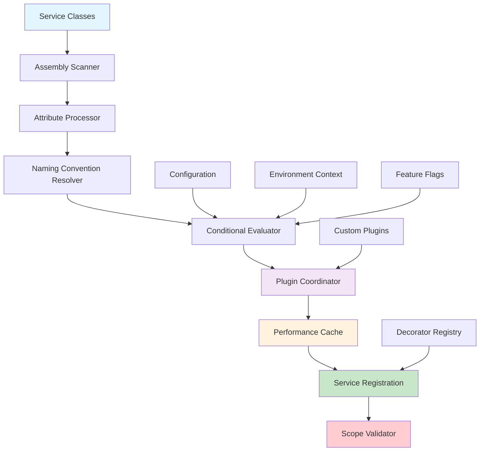

# FS.AutoServiceDiscovery.Extensions

[](https://www.nuget.org/packages/FS.AutoServiceDiscovery.Extensions)
[](https://www.nuget.org/packages/FS.AutoServiceDiscovery.Extensions)
[](https://github.com/furkansarikaya/FS.AutoServiceDiscovery/blob/main/LICENSE)
[](https://github.com/furkansarikaya/FS.AutoServiceDiscovery/stargazers)

A powerful, convention-based automatic service discovery and registration library for .NET 10.0 applications. This library transforms manual dependency injection configuration into an intelligent, attribute-driven system that can discover, validate, and register services automatically while maintaining full control and flexibility.

## What's New in v10.0.2

- **Keyed Services** (.NET 8+) - Register multiple implementations of the same interface with unique keys
- **TryAdd Pattern** - Prevent duplicate service registrations in modular applications
- **Multiple Interface Registration** - Register a single implementation under multiple service types
- **Open Generics** - Automatic registration for `IRepository<T>` -> `Repository<T>` patterns
- **Decorator Pattern** - Wrap existing services with cross-cutting concerns (caching, logging, etc.)
- **Scope Validation** - Detect captive dependency issues at startup

## Quick Start

Transform your service registration from manual configuration to intelligent automation:

```csharp
// 1. Mark your services with attributes
[ServiceRegistration(ServiceLifetime.Scoped)]
public class UserService : IUserService
{
    public async Task<User> GetUserAsync(int id)
    {
        return new User { Id = id, Name = "Sample User" };
    }
}

// 2. Enable automatic discovery in Program.cs
var builder = WebApplication.CreateBuilder(args);

// Single line to automatically discover and register all services
builder.Services.AddAutoServices();

var app = builder.Build();
```

That's it! Your `IUserService` is now automatically discovered, registered, and ready for dependency injection.

## Core Features

### Convention-Based Discovery
Automatically discover services using intelligent naming conventions and attributes:

```csharp
[ServiceRegistration(ServiceLifetime.Scoped)]
public class ProductService : IProductService { }

[ServiceRegistration(ServiceLifetime.Singleton)]
public class CacheService : ICacheService { }
```

### Keyed Services (.NET 8+)
Register multiple implementations of the same interface, resolved by key:

```csharp
[ServiceRegistration(ServiceLifetime.Scoped, ServiceKey = "smtp")]
public class SmtpEmailService : IEmailService { }

[ServiceRegistration(ServiceLifetime.Scoped, ServiceKey = "sendgrid")]
public class SendGridEmailService : IEmailService { }

// Resolve by key:
public class NotificationService([FromKeyedServices("smtp")] IEmailService emailService) { }
```

### TryAdd Pattern
Prevent duplicate registrations in modular applications:

```csharp
// Only registers if IUserService is not already registered
[ServiceRegistration(ServiceLifetime.Scoped, UseTryAdd = true)]
public class DefaultUserService : IUserService { }

// Or enable globally:
builder.Services.AddAutoServices(options =>
{
    options.UseTryAddByDefault = true;
});
```

### Multiple Interface Registration
Register a single implementation under multiple service types:

```csharp
[ServiceRegistration(ServiceLifetime.Scoped,
    ServiceTypes = new[] { typeof(IUserService), typeof(IProfileService) })]
public class UserService : IUserService, IProfileService { }
```

### Open Generics
Automatic registration for generic service patterns:

```csharp
[OpenGenericRegistration(ServiceLifetime.Scoped)]
public class Repository<T> : IRepository<T> where T : class { }

// Now IRepository<User>, IRepository<Order>, etc. all resolve automatically
```

### Decorator Pattern
Wrap existing services with cross-cutting concerns:

```csharp
[DecoratorService(typeof(IUserService))]
public class CachingUserService : IUserService
{
    private readonly IUserService _inner;
    public CachingUserService(IUserService inner) => _inner = inner;

    public async Task<User> GetUserAsync(int id)
    {
        // Add caching logic around the inner service
        return await _inner.GetUserAsync(id);
    }
}
```

### Scope Validation
Detect captive dependency issues at startup:

```csharp
builder.Services.AddAutoServices(options =>
{
    options.EnableScopeValidation = true;
    options.ThrowOnScopeViolation = true; // Throw on Singleton -> Scoped dependencies
});
```

### Environment-Aware Registration
Register different implementations based on environment:

```csharp
[ServiceRegistration(ServiceLifetime.Scoped, Profile = "Development")]
public class MockEmailService : IEmailService { }

[ServiceRegistration(ServiceLifetime.Scoped, Profile = "Production")]
public class SmtpEmailService : IEmailService { }
```

### Expression-Based Conditional Registration
Use powerful, type-safe conditional logic:

```csharp
[ConditionalService(ctx =>
    ctx.Environment.IsProduction() &&
    ctx.FeatureEnabled("AdvancedLogging") &&
    !ctx.Configuration.GetValue<bool>("MaintenanceMode"))]
[ServiceRegistration(ServiceLifetime.Scoped)]
public class AdvancedLoggingService : ILoggingService { }
```

### Fluent Configuration API
Build complex configurations with readable, chainable syntax:

```csharp
builder.Services.ConfigureAutoServices()
    .FromCurrentDomain(assembly => !assembly.FullName.StartsWith("System"))
    .WithProfile(ctx => ctx.Environment.IsDevelopment() ? "Dev" : "Prod")
    .When(ctx => ctx.FeatureEnabled("AutoDiscovery"))
    .ExcludeNamespaces("MyApp.Internal.*", "MyApp.Testing.*")
    .WithTryAdd()
    .WithScopeValidation(throwOnViolation: true)
    .WithPerformanceOptimizations()
    .Apply();
```

### High-Performance Discovery
Optimized for production with advanced caching and parallel processing:

```csharp
builder.Services.AddAutoServicesWithPerformanceOptimizations(options =>
{
    options.EnableParallelProcessing = true;
    options.EnablePerformanceMetrics = true;
    options.MaxDegreeOfParallelism = 4;
});
```

## Architecture Overview


```mermaid
graph TB
    A[Service Classes] --> B[Assembly Scanner]
    B --> C[Attribute Processor]
    C --> D[Naming Convention Resolver]
    D --> E[Conditional Evaluator]
    E --> F[Plugin Coordinator]
    F --> G[Performance Cache]
    G --> H[Service Registration]
    H --> I[Scope Validator]

    J[Configuration] --> E
    K[Environment Context] --> E
    L[Feature Flags] --> E
    M[Custom Plugins] --> F
    N[Decorator Registry] --> H

    style A fill:#e1f5fe
    style H fill:#c8e6c9
    style G fill:#fff3e0
    style F fill:#f3e5f5
    style I fill:#ffcdd2
```

The library follows a sophisticated pipeline architecture where each component has a specific responsibility:

- **Assembly Scanner**: Efficiently discovers service candidates using reflection
- **Attribute Processor**: Interprets registration attributes and metadata
- **Naming Convention Resolver**: Applies intelligent interface-to-implementation mapping
- **Conditional Evaluator**: Processes environment and configuration-based conditions
- **Plugin Coordinator**: Manages extensible discovery strategies
- **Performance Cache**: Optimizes repeated discovery operations
- **Service Registration**: Final registration with dependency injection container (keyed, TryAdd, decorators)
- **Scope Validator**: Validates service lifetimes to prevent captive dependency issues

## Documentation

### Core Concepts
- **[Getting Started Guide](docs/GettingStarted.md)** - Step-by-step introduction
- **[Service Registration](docs/ServiceRegistration.md)** - Attribute-based service marking
- **[Naming Conventions](docs/NamingConventions.md)** - Interface resolution strategies
- **[Conditional Registration](docs/ConditionalRegistration.md)** - Environment and configuration-based logic

### New in v10.0.2
- **[Keyed Services](docs/KeyedServices.md)** - Multiple implementations with unique keys
- **[TryAdd Pattern](docs/TryAddPattern.md)** - Duplicate registration prevention
- **[Multiple Interface Registration](docs/MultipleInterfaceRegistration.md)** - Single implementation, multiple types
- **[Open Generics](docs/OpenGenerics.md)** - Generic service pattern registration
- **[Decorator Pattern](docs/DecoratorPattern.md)** - Service wrapping for cross-cutting concerns
- **[Scope Validation](docs/ScopeValidation.md)** - Captive dependency detection

### Advanced Features
- **[Fluent Configuration](docs/FluentConfiguration.md)** - Advanced configuration patterns
- **[Plugin Architecture](docs/PluginArchitecture.md)** - Extensible discovery mechanisms
- **[Performance Optimization](docs/PerformanceOptimization.md)** - Caching and parallel processing
- **[Expression-Based Conditions](docs/ExpressionBasedConditions.md)** - Type-safe conditional logic

### Architecture & Extensibility
- **[System Architecture](docs/SystemArchitecture.md)** - Detailed architectural overview
- **[Custom Naming Conventions](docs/CustomNamingConventions.md)** - Building custom resolution logic
- **[Plugin Development](docs/PluginDevelopment.md)** - Creating discovery extensions
- **[Performance Monitoring](docs/PerformanceMonitoring.md)** - Metrics and optimization

## Installation

```bash
dotnet add package FS.AutoServiceDiscovery.Extensions --version 10.0.2
```

**Requirements:**
- .NET 10.0 or later
- Microsoft.Extensions.DependencyInjection 10.0.0+

## Configuration Options

### Basic Configuration
```csharp
builder.Services.AddAutoServices(options =>
{
    options.Profile = builder.Environment.EnvironmentName;
    options.Configuration = builder.Configuration;
    options.EnableLogging = true;
    options.IsTestEnvironment = false;
    options.UseTryAddByDefault = true;
    options.EnableScopeValidation = true;
});
```

### Advanced Performance Configuration
```csharp
builder.Services.AddAutoServicesWithPerformanceOptimizations(options =>
{
    options.EnableParallelProcessing = true;
    options.MaxDegreeOfParallelism = Environment.ProcessorCount;
    options.EnablePerformanceMetrics = true;
    options.EnableLogging = false;
});
```

### Fluent Configuration
```csharp
builder.Services.ConfigureAutoServices()
    .FromAssemblies(Assembly.GetExecutingAssembly())
    .WithProfile("Production")
    .When(ctx => ctx.FeatureEnabled("AutoDiscovery"))
    .ExcludeTypes(type => type.Name.EndsWith("Test"))
    .WithDefaultLifetime(ServiceLifetime.Scoped)
    .WithTryAdd()
    .WithScopeValidation(throwOnViolation: true)
    .WithPerformanceOptimizations()
    .Apply();
```

## Performance Characteristics

| Feature | Impact | Best Use Case |
|---------|---------|---------------|
| Basic Discovery | ~10-50ms | Small to medium applications |
| Cached Discovery | ~1-5ms | Repeated discovery operations |
| Parallel Processing | 2-4x faster | Large applications (100+ services) |
| Plugin System | Variable | Complex discovery requirements |
| Keyed Services | Minimal overhead | Strategy pattern, multi-tenant |
| Open Generics | Minimal overhead | Repository patterns |
| Scope Validation | ~1-10ms | Development/CI builds |

## API Reference

### Attributes
| Attribute | Description |
|-----------|-------------|
| `ServiceRegistrationAttribute` | Marks a class for automatic DI registration |
| `OpenGenericRegistrationAttribute` | Marks an open generic for automatic registration |
| `DecoratorServiceAttribute` | Marks a class as a decorator for an existing service |
| `ConditionalServiceAttribute` | Adds conditional logic for registration |

### Key Properties (ServiceRegistrationAttribute)
| Property | Type | Description |
|----------|------|-------------|
| `Lifetime` | `ServiceLifetime` | Service lifetime (Singleton, Scoped, Transient) |
| `ServiceKey` | `object?` | Key for keyed service registration |
| `UseTryAdd` | `bool` | Use TryAdd to prevent duplicates |
| `ServiceTypes` | `Type[]?` | Register under multiple service types |
| `ServiceType` | `Type?` | Explicit service type override |
| `Profile` | `string?` | Profile-based conditional registration |
| `Order` | `int` | Registration order priority |

## Contributing

We welcome contributions! This project is open source and benefits from community involvement:

1. Fork the repository
2. Create a feature branch (`git checkout -b feature/amazing-feature`)
3. Commit your changes (`git commit -m 'Add amazing feature'`)
4. Push to the branch (`git push origin feature/amazing-feature`)
5. Open a Pull Request

**Development Guidelines:**
- Follow existing code patterns and conventions
- Add comprehensive tests for new features
- Update documentation for any public API changes
- Ensure backward compatibility when possible

## License

This project is licensed under the MIT License. See the [LICENSE](LICENSE) file for details.

**Made with ❤️ by [Furkan Sarikaya](https://github.com/furkansarikaya)**

For detailed documentation, advanced usage patterns, and architectural insights, explore the comprehensive guides in our [documentation directory](docs/)
