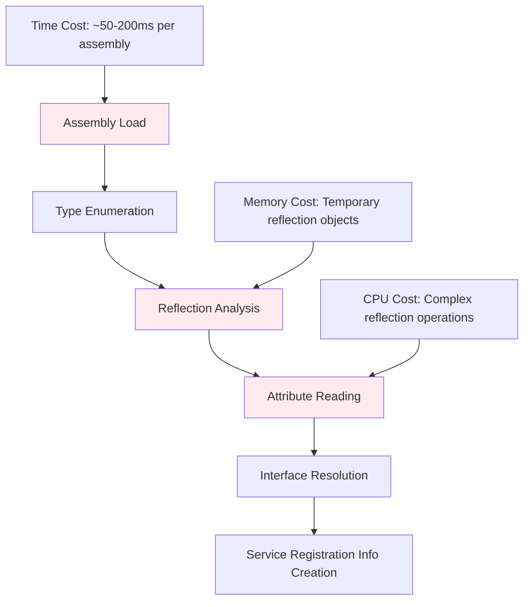

# Advanced Caching Guide

Imagine you're running a busy restaurant where the same popular dishes are ordered repeatedly throughout the day. You could prepare each dish from scratch every time, but that would be incredibly inefficient and slow. Instead, you'd prepare some components in advance, keep commonly used ingredients readily accessible, and maybe even pre-prepare complete dishes during slower periods. Advanced caching in service discovery works exactly the same way - it anticipates what will be needed and prepares it in advance, dramatically reducing the time needed to serve requests.

The advanced caching system transforms service discovery from a potentially expensive operation into a lightning-fast lookup process by intelligently storing and reusing the results of expensive reflection and analysis operations.

## 🎯 Understanding Caching in Service Discovery

Traditional service discovery performs the same expensive operations repeatedly: loading assemblies, examining types with reflection, reading attributes, and analyzing service relationships. In a typical application lifecycle, these operations might happen dozens or even hundreds of times with identical inputs, making caching not just beneficial but essential for good performance.

### The Cost of Uncached Discovery

Consider what happens during each service discovery operation without caching:



Without caching, these costs accumulate quickly:
- **Development**: Every code change and restart pays the full cost
- **Testing**: Each test run processes assemblies from scratch
- **Production**: Cold starts and scaling events experience discovery delays
- **CI/CD**: Build and deployment processes repeat identical work

### The Benefits of Advanced Caching

Advanced caching transforms this expensive process into efficient lookups:

```csharp
// First run: Full discovery cost
var services = DiscoverServices(assemblies); // 500ms

// Subsequent runs: Cache lookup cost
var services = DiscoverServices(assemblies); // 5ms - 100x faster!
```

The benefits compound across different scenarios:
- **Consistent Performance**: Discovery time becomes predictable and fast
- **Resource Efficiency**: Less CPU and memory usage during startup
- **Developer Productivity**: Faster development iteration cycles
- **Scalability**: New instances start faster during scaling events

## 🏗️ Cache Architecture and Design

The caching system is built on a sophisticated multi-layer architecture that balances performance, memory usage, and reliability.

### Core Cache Interface

The foundation of the caching system is the `IAssemblyScanCache` interface, which provides a clean abstraction for different caching strategies:

```csharp
public interface IAssemblyScanCache
{
    bool TryGetCachedResults(Assembly assembly, out IEnumerable<ServiceRegistrationInfo>? cachedResults);
    void CacheResults(Assembly assembly, IEnumerable<ServiceRegistrationInfo> results);
    void ClearCache();
    CacheStatistics GetStatistics();
}
```

This interface design enables several powerful patterns:

**Strategy Pattern**: Different cache implementations can be swapped based on requirements
```csharp
// In-memory cache for development
services.UseAssemblyScanCache<MemoryAssemblyScanCache>();

// Distributed cache for production
services.UseAssemblyScanCache<DistributedAssemblyScanCache>();

// Persistent cache for CI/CD
services.UseAssemblyScanCache<FileSystemAssemblyScanCache>();
```

**Decorator Pattern**: Caches can be layered for sophisticated behavior
```csharp
// L1: Memory cache for immediate access
// L2: File system cache for persistence
// L3: Distributed cache for sharing across instances
var cache = new LayeredCache(
    new MemoryAssemblyScanCache(),
    new FileSystemAssemblyScanCache(),
    new DistributedAssemblyScanCache());
```

### Memory Cache Implementation

The default `MemoryAssemblyScanCache` provides high-performance in-memory caching with intelligent invalidation:

```csharp
public class MemoryAssemblyScanCache : IAssemblyScanCache
{
    private readonly ConcurrentDictionary<string, CacheEntry> _cache = new();
    
    private class CacheEntry
    {
        public IEnumerable<ServiceRegistrationInfo> Results { get; set; }
        public DateTime LastWriteTime { get; set; }
        public long AssemblySize { get; set; }
        public DateTime CachedAt { get; set; }
    }
    
    public bool TryGetCachedResults(Assembly assembly, out IEnumerable<ServiceRegistrationInfo>? cachedResults)
    {
        cachedResults = null;
        var cacheKey = GenerateCacheKey(assembly);

        if (!_cache.TryGetValue(cacheKey, out var entry))
            return false;

        // Validate that the assembly hasn't changed
        if (!IsEntryValid(assembly, entry))
        {
            _cache.TryRemove(cacheKey, out _);
            return false;
        }

        cachedResults = entry.Results;
        return true;
    }
}
```

The implementation includes several sophisticated features:

**Thread Safety**: Uses `ConcurrentDictionary` for safe concurrent access
**Smart Invalidation**: Detects assembly changes using file metadata
**Memory Management**: Implements LRU eviction for bounded memory usage
**Statistics Tracking**: Provides detailed performance metrics

### Cache Key Generation and Validation

Effective caching requires reliable cache keys and validation strategies:

```csharp
private static string GenerateCacheKey(Assembly assembly)
{
    // Use full name including version for precise identification
    var fullName = assembly.FullName ?? assembly.GetName().Name ?? assembly.ToString();
    
    // Include location hash for additional validation
    if (!assembly.IsDynamic && !string.IsNullOrEmpty(assembly.Location))
    {
        var locationHash = assembly.Location.GetHashCode();
        return $"{fullName}#{locationHash}";
    }
    
    return fullName;
}

private static bool IsEntryValid(Assembly assembly, CacheEntry entry)
{
    // Skip validation for dynamic assemblies
    if (assembly.IsDynamic || string.IsNullOrEmpty(assembly.Location))
        return true;

    try
    {
        var fileInfo = new FileInfo(assembly.Location);
        
        // Check both timestamp and size for reliable change detection
        return fileInfo.LastWriteTimeUtc == entry.LastWriteTime &&
               fileInfo.Length == entry.AssemblySize;
    }
    catch
    {
        // If we can't validate, assume invalid for safety
        return false;
    }
}
```

This validation strategy provides multiple layers of protection against stale cache data:
- **Timestamp Comparison**: Detects when assemblies are rebuilt
- **Size Comparison**: Catches changes that don't affect timestamps
- **Exception Handling**: Gracefully handles inaccessible files

## 🚀 Cache Configuration and Tuning

The caching system provides extensive configuration options for optimizing performance in different scenarios.

### Basic Cache Configuration

The `CacheConfiguration` class provides comprehensive control over cache behavior:

```csharp
public class CacheConfiguration
{
    public int MaxCachedAssemblies { get; set; } = 50;
    public TimeSpan MaxCacheAge { get; set; } = TimeSpan.FromHours(1);
    public bool EnableDetailedLogging { get; set; } = false;
    public bool EnablePreloading { get; set; } = false;
    public List<string> PreloadPatterns { get; set; } = new();
}
```

### Environment-Specific Configurations

Different environments have different optimization priorities:

**Development Configuration**: Optimized for fast iteration cycles
```csharp
services.UseCacheConfiguration(CacheConfiguration.ForDevelopment());

// Equivalent to:
services.UseCacheConfiguration(new CacheConfiguration
{
    MaxCachedAssemblies = 20,      // Lower memory usage
    MaxCacheAge = TimeSpan.FromMinutes(10), // Frequent refresh for changing code
    EnableDetailedLogging = true,   // More logging for debugging
    EnablePreloading = false        // Faster startup for development
});
```

**Production Configuration**: Optimized for performance and stability
```csharp
services.UseCacheConfiguration(CacheConfiguration.ForProduction());

// Equivalent to:
services.UseCacheConfiguration(new CacheConfiguration
{
    MaxCachedAssemblies = 100,     // Higher cache capacity
    MaxCacheAge = TimeSpan.FromHours(4), // Longer retention
    EnableDetailedLogging = false,  // Minimal logging overhead
    EnablePreloading = true         // Better first-request performance
});
```

**Testing Configuration**: Optimized for isolation and predictability
```csharp
services.UseCacheConfiguration(CacheConfiguration.ForTesting());

// Equivalent to:
services.UseCacheConfiguration(new CacheConfiguration
{
    MaxCachedAssemblies = 10,      // Minimal caching for isolation
    MaxCacheAge = TimeSpan.FromMinutes(1), // Short duration
    EnableDetailedLogging = false,  // Reduce test output noise
    EnablePreloading = false        // Faster test startup
});
```

### Advanced Configuration Patterns

**Adaptive Configuration**: Adjusts based on runtime conditions
```csharp
services.UseCacheConfiguration(serviceProvider =>
{
    var environment = serviceProvider.GetRequiredService<IWebHostEnvironment>();
    var configuration = serviceProvider.GetRequiredService<IConfiguration>();
    
    var cacheConfig = new CacheConfiguration();
    
    // Adapt based on available memory
    var availableMemory = GC.GetTotalMemory(false) / (1024 * 1024); // MB
    cacheConfig.MaxCachedAssemblies = availableMemory > 512 ? 100 : 50;
    
    // Adapt based on deployment scenario
    if (configuration.GetValue<bool>("IsContainerized"))
    {
        cacheConfig.EnablePreloading = false; // Faster container starts
        cacheConfig.MaxCacheAge = TimeSpan.FromMinutes(30); // Shorter for ephemeral containers
    }
    
    return cacheConfig;
});
```

**Performance-Driven Configuration**: Optimizes based on application characteristics
```csharp
public static CacheConfiguration ForHighVolumeApplication()
{
    return new CacheConfiguration
    {
        MaxCachedAssemblies = 200,           // Large cache for many assemblies
        MaxCacheAge = TimeSpan.FromHours(8), // Long retention for stable assemblies
        EnablePreloading = true,             // Aggressive preloading
        EnableDetailedLogging = false,       // Minimal overhead
        PreloadPatterns = new List<string>   // Preload critical assemblies
        {
            "MyApp.Core.*",
            "MyApp.Services.*",
            "MyApp.Data.*"
        }
    };
}
```

## 🔄 Cache Lifecycle and Management

Understanding cache lifecycle is crucial for effective cache management and troubleshooting.

### Cache Population Strategies

**Lazy Population**: Cache entries are created on-demand
```csharp
public bool TryGetCachedResults(Assembly assembly, out IEnumerable<ServiceRegistrationInfo>? cachedResults)
{
    cachedResults = null;
    
    // First check cache
    if (_cache.TryGetValue(assembly.FullName, out var entry))
    {
        cachedResults = entry.Results;
        return true;
    }
    
    // Cache miss - caller will populate cache after discovery
    return false;
}
```

**Eager Preloading**: Cache entries are created proactively
```csharp
public async Task PreloadAssembliesAsync(IEnumerable<Assembly> assemblies)
{
    var preloadTasks = assemblies.Select(async assembly =>
    {
        if (!_cache.ContainsKey(assembly.FullName))
        {
            var services = await DiscoverServicesAsync(assembly);
            CacheResults(assembly, services);
        }
    });
    
    await Task.WhenAll(preloadTasks);
}
```

**Intelligent Preloading**: Preloads based on usage patterns
```csharp
public class IntelligentPreloader
{
    private readonly Dictionary<string, AssemblyUsageStats> _usageStats = new();
    
    public void RecordAssemblyAccess(Assembly assembly)
    {
        var stats = _usageStats.GetOrAdd(assembly.FullName, _ => new AssemblyUsageStats());
        stats.AccessCount++;
        stats.LastAccessed = DateTime.UtcNow;
    }
    
    public IEnumerable<Assembly> GetPreloadCandidates()
    {
        return _usageStats
            .Where(kvp => kvp.Value.AccessCount > 3) // Frequently accessed
            .Where(kvp => kvp.Value.LastAccessed > DateTime.UtcNow.AddHours(-1)) // Recently accessed
            .Select(kvp => GetAssemblyByName(kvp.Key))
            .Where(a => a != null);
    }
}
```

### Cache Invalidation Strategies

**Time-Based Invalidation**: Entries expire after a configured duration
```csharp
private bool IsEntryExpired(CacheEntry entry, TimeSpan maxAge)
{
    return DateTime.UtcNow - entry.CachedAt > maxAge;
}

public bool TryGetCachedResults(Assembly assembly, out IEnumerable<ServiceRegistrationInfo>? cachedResults)
{
    // Check expiration before returning cached results
    if (entry != null && IsEntryExpired(entry, _maxCacheAge))
    {
        _cache.TryRemove(cacheKey, out _);
        cachedResults = null;
        return false;
    }
    
    // Continue with normal validation...
}
```

**Event-Based Invalidation**: Entries are invalidated when specific events occur
```csharp
public class EventDrivenCache : IAssemblyScanCache
{
    public EventDrivenCache()
    {
        // Watch for file system changes
        _fileWatcher = new FileSystemWatcher();
        _fileWatcher.Changed += OnAssemblyFileChanged;
        
        // Watch for application events
        AppDomain.CurrentDomain.AssemblyLoad += OnAssemblyLoaded;
    }
    
    private void OnAssemblyFileChanged(object sender, FileSystemEventArgs e)
    {
        var affectedEntries = _cache.Keys
            .Where(key => key.Contains(Path.GetFileNameWithoutExtension(e.Name)))
            .ToList();
            
        foreach (var key in affectedEntries)
        {
            _cache.TryRemove(key, out _);
        }
    }
}
```

**Manual Invalidation**: Explicit cache clearing for specific scenarios
```csharp
// Clear cache when configuration changes
public void OnConfigurationChanged()
{
    _cache.ClearCache();
    _logger.LogInformation("Cache cleared due to configuration change");
}

// Clear specific entries when assemblies are updated
public void InvalidateAssembly(Assembly assembly)
{
    var cacheKey = GenerateCacheKey(assembly);
    _cache.TryRemove(cacheKey, out _);
    _logger.LogDebug("Invalidated cache for assembly: {AssemblyName}", assembly.GetName().Name);
}
```

### Memory Management and Bounded Caches

**LRU (Least Recently Used) Eviction**: Removes oldest entries when cache is full
```csharp
public class LRUBoundedCache : IAssemblyScanCache
{
    private readonly int _maxEntries;
    private readonly LinkedList<string> _accessOrder = new();
    private readonly Dictionary<string, LinkedListNode<string>> _accessNodes = new();
    
    public void CacheResults(Assembly assembly, IEnumerable<ServiceRegistrationInfo> results)
    {
        var cacheKey = GenerateCacheKey(assembly);
        
        // Add new entry
        var entry = new CacheEntry { Results = results, CachedAt = DateTime.UtcNow };
        _cache[cacheKey] = entry;
        
        // Update access order
        UpdateAccessOrder(cacheKey);
        
        // Evict if necessary
        if (_cache.Count > _maxEntries)
        {
            EvictLeastRecentlyUsed();
        }
    }
    
    private void EvictLeastRecentlyUsed()
    {
        if (_accessOrder.Last != null)
        {
            var lruKey = _accessOrder.Last.Value;
            _cache.Remove(lruKey);
            _accessOrder.RemoveLast();
            _accessNodes.Remove(lruKey);
        }
    }
}
```

**Size-Based Eviction**: Removes entries when memory usage exceeds limits
```csharp
public class SizeBoundedCache : IAssemblyScanCache
{
    private long _currentMemoryUsage = 0;
    private readonly long _maxMemoryUsage;
    
    public void CacheResults(Assembly assembly, IEnumerable<ServiceRegistrationInfo> results)
    {
        var estimatedSize = EstimateMemoryUsage(results);
        
        // Evict entries if we would exceed memory limit
        while (_currentMemoryUsage + estimatedSize > _maxMemoryUsage && _cache.Count > 0)
        {
            EvictLargestEntry();
        }
        
        // Add new entry
        var entry = new CacheEntry 
        { 
            Results = results, 
            EstimatedSize = estimatedSize,
            CachedAt = DateTime.UtcNow 
        };
        
        _cache[GenerateCacheKey(assembly)] = entry;
        _currentMemoryUsage += estimatedSize;
    }
    
    private long EstimateMemoryUsage(IEnumerable<ServiceRegistrationInfo> services)
    {
        // Rough estimation of memory usage
        return services.Count() * 1024; // Assume ~1KB per service registration
    }
}
```

## 📊 Cache Performance Monitoring

Comprehensive monitoring is essential for understanding cache effectiveness and identifying optimization opportunities.

### Basic Cache Statistics

The `CacheStatistics` class provides essential performance metrics:

```csharp
public class CacheStatistics
{
    public long TotalRequests { get; set; }
    public long CacheHits { get; set; }
    public long CacheMisses { get; set; }
    public int CachedAssembliesCount { get; set; }
    public int TotalCachedServices { get; set; }
    
    public double HitRatio => TotalRequests == 0 ? 0 : (double)CacheHits / TotalRequests * 100;
    public double AverageServicesPerAssembly => CachedAssembliesCount == 0 ? 0 : (double)TotalCachedServices / CachedAssembliesCount;
}
```

### Advanced Monitoring and Analytics

**Real-Time Cache Monitoring**: Track cache performance continuously
```csharp
public class CacheMonitoringService : BackgroundService
{
    private readonly IAssemblyScanCache _cache;
    private readonly ILogger<CacheMonitoringService> _logger;
    
    protected override async Task ExecuteAsync(CancellationToken stoppingToken)
    {
        while (!stoppingToken.IsCancellationRequested)
        {
            var stats = _cache.GetStatistics();
            
            // Log performance metrics
            _logger.LogInformation("Cache Performance: {HitRatio:F1}% hit ratio, {CachedAssemblies} assemblies cached",
                stats.HitRatio, stats.CachedAssembliesCount);
            
            // Export to monitoring systems
            await ExportMetricsAsync(stats);
            
            // Check for performance degradation
            if (stats.HitRatio < 50)
            {
                _logger.LogWarning("Cache hit ratio is below 50% - investigate cache invalidation patterns");
            }
            
            await Task.Delay(TimeSpan.FromMinutes(5), stoppingToken);
        }
    }
}
```

**Cache Health Checks**: Monitor cache health for application monitoring
```csharp
public class CacheHealthCheck : IHealthCheck
{
    private readonly IAssemblyScanCache _cache;
    
    public async Task<HealthCheckResult> CheckHealthAsync(HealthCheckContext context, CancellationToken cancellationToken = default)
    {
        try
        {
            var stats = _cache.GetStatistics();
            
            var data = new Dictionary<string, object>
            {
                ["cache_hit_ratio"] = stats.HitRatio,
                ["cached_assemblies"] = stats.CachedAssembliesCount,
                ["total_requests"] = stats.TotalRequests
            };
            
            // Determine health status
            if (stats.HitRatio > 80)
                return HealthCheckResult.Healthy("Cache performing optimally", data);
            else if (stats.HitRatio > 50)
                return HealthCheckResult.Degraded("Cache performance below optimal", data);
            else
                return HealthCheckResult.Unhealthy("Cache performance is poor", data);
        }
        catch (Exception ex)
        {
            return HealthCheckResult.Unhealthy("Cache health check failed", ex);
        }
    }
}
```

**Performance Analytics**: Analyze cache patterns over time
```csharp
public class CacheAnalyticsService
{
    private readonly List<CacheMetricsSnapshot> _snapshots = new();
    
    public void RecordSnapshot()
    {
        var stats = _cache.GetStatistics();
        _snapshots.Add(new CacheMetricsSnapshot
        {
            Timestamp = DateTime.UtcNow,
            HitRatio = stats.HitRatio,
            CachedAssemblies = stats.CachedAssembliesCount,
            TotalRequests = stats.TotalRequests
        });
    }
    
    public CacheAnalyticsReport GenerateReport(TimeSpan period)
    {
        var cutoff = DateTime.UtcNow - period;
        var recentSnapshots = _snapshots.Where(s => s.Timestamp > cutoff).ToList();
        
        return new CacheAnalyticsReport
        {
            AverageHitRatio = recentSnapshots.Average(s => s.HitRatio),
            HitRatioTrend = CalculateTrend(recentSnapshots.Select(s => s.HitRatio)),
            PeakCachedAssemblies = recentSnapshots.Max(s => s.CachedAssemblies),
            TotalRequestsInPeriod = recentSnapshots.LastOrDefault()?.TotalRequests - recentSnapshots.FirstOrDefault()?.TotalRequests ?? 0
        };
    }
}
```

## 🔧 Custom Cache Implementations

For specialized scenarios, you can implement custom cache strategies that fit your specific requirements.

### Distributed Cache Implementation

For applications running across multiple instances, a distributed cache can share discovery results:

```csharp
public class DistributedAssemblyScanCache : IAssemblyScanCache
{
    private readonly IDistributedCache _distributedCache;
    private readonly IMemoryCache _localCache;
    private readonly ILogger<DistributedAssemblyScanCache> _logger;
    
    public DistributedAssemblyScanCache(
        IDistributedCache distributedCache,
        IMemoryCache localCache,
        ILogger<DistributedAssemblyScanCache> logger)
    {
        _distributedCache = distributedCache;
        _localCache = localCache;
        _logger = logger;
    }
    
    public bool TryGetCachedResults(Assembly assembly, out IEnumerable<ServiceRegistrationInfo>? cachedResults)
    {
        cachedResults = null;
        var cacheKey = GenerateCacheKey(assembly);
        
        // Try L1 cache (local memory) first
        if (_localCache.TryGetValue(cacheKey, out cachedResults))
        {
            _logger.LogDebug("L1 cache hit for assembly: {AssemblyName}", assembly.GetName().Name);
            return true;
        }
        
        // Try L2 cache (distributed) 
        var distributedData = _distributedCache.GetString(cacheKey);
        if (distributedData != null)
        {
            try
            {
                cachedResults = JsonSerializer.Deserialize<List<ServiceRegistrationInfo>>(distributedData);
                
                // Populate L1 cache for future requests
                _localCache.Set(cacheKey, cachedResults, TimeSpan.FromMinutes(10));
                
                _logger.LogDebug("L2 cache hit for assembly: {AssemblyName}", assembly.GetName().Name);
                return true;
            }
            catch (JsonException ex)
            {
                _logger.LogWarning(ex, "Failed to deserialize cached data for assembly: {AssemblyName}", assembly.GetName().Name);
            }
        }
        
        return false;
    }
    
    public void CacheResults(Assembly assembly, IEnumerable<ServiceRegistrationInfo> results)
    {
        var cacheKey = GenerateCacheKey(assembly);
        var serializedData = JsonSerializer.Serialize(results);
        
        // Store in both L1 and L2 caches
        _localCache.Set(cacheKey, results, TimeSpan.FromMinutes(10));
        _distributedCache.SetString(cacheKey, serializedData, new DistributedCacheEntryOptions
        {
            SlidingExpiration = TimeSpan.FromHours(1),
            AbsoluteExpirationRelativeToNow = TimeSpan.FromHours(24)
        });
        
        _logger.LogDebug("Cached results for assembly: {AssemblyName}", assembly.GetName().Name);
    }
}
```

### Persistent File System Cache

For scenarios where cache persistence across application restarts is valuable:

```csharp
public class FileSystemAssemblyScanCache : IAssemblyScanCache
{
    private readonly string _cacheDirectory;
    private readonly ILogger<FileSystemAssemblyScanCache> _logger;
    private readonly SemaphoreSlim _fileLock = new(1, 1);
    
    public FileSystemAssemblyScanCache(string cacheDirectory, ILogger<FileSystemAssemblyScanCache> logger)
    {
        _cacheDirectory = cacheDirectory;
        _logger = logger;
        
        Directory.CreateDirectory(_cacheDirectory);
    }
    
    public bool TryGetCachedResults(Assembly assembly, out IEnumerable<ServiceRegistrationInfo>? cachedResults)
    {
        cachedResults = null;
        var cacheFilePath = GetCacheFilePath(assembly);
        
        if (!File.Exists(cacheFilePath))
            return false;
        
        try
        {
            // Check if cached file is newer than assembly
            var assemblyFile = new FileInfo(assembly.Location);
            var cacheFile = new FileInfo(cacheFilePath);
            
            if (assemblyFile.LastWriteTimeUtc > cacheFile.LastWriteTimeUtc)
            {
                File.Delete(cacheFilePath);
                return false;
            }
            
            // Read cached results
            await _fileLock.WaitAsync();
            try
            {
                var json = await File.ReadAllTextAsync(cacheFilePath);
                cachedResults = JsonSerializer.Deserialize<List<ServiceRegistrationInfo>>(json);
                return true;
            }
            finally
            {
                _fileLock.Release();
            }
        }
        catch (Exception ex)
        {
            _logger.LogWarning(ex, "Failed to read cache file for assembly: {AssemblyName}", assembly.GetName().Name);
            return false;
        }
    }
    
    public async void CacheResults(Assembly assembly, IEnumerable<ServiceRegistrationInfo> results)
    {
        var cacheFilePath = GetCacheFilePath(assembly);
        
        try
        {
            await _fileLock.WaitAsync();
            try
            {
                var json = JsonSerializer.Serialize(results, new JsonSerializerOptions { WriteIndented = true });
                await File.WriteAllTextAsync(cacheFilePath, json);
            }
            finally
            {
                _fileLock.Release();
            }
        }
        catch (Exception ex)
        {
            _logger.LogWarning(ex, "Failed to write cache file for assembly: {AssemblyName}", assembly.GetName().Name);
        }
    }
    
    private string GetCacheFilePath(Assembly assembly)
    {
        var assemblyName = assembly.GetName().Name ?? "Unknown";
        var fileName = $"{assemblyName}.cache.json";
        return Path.Combine(_cacheDirectory, fileName);
    }
}
```

### Hybrid Multi-Level Cache

Combining multiple cache strategies for optimal performance:

```csharp
public class HybridMultiLevelCache : IAssemblyScanCache
{
    private readonly List<IAssemblyScanCache> _cacheLevels;
    private readonly ILogger<HybridMultiLevelCache> _logger;
    
    public HybridMultiLevelCache(ILogger<HybridMultiLevelCache> logger, params IAssemblyScanCache[] cacheLevels)
    {
        _cacheLevels = cacheLevels.ToList();
        _logger = logger;
    }
    
    public bool TryGetCachedResults(Assembly assembly, out IEnumerable<ServiceRegistrationInfo>? cachedResults)
    {
        cachedResults = null;
        
        for (int i = 0; i < _cacheLevels.Count; i++)
        {
            if (_cacheLevels[i].TryGetCachedResults(assembly, out cachedResults))
            {
                _logger.LogDebug("Cache hit at level {Level} for assembly: {AssemblyName}", i + 1, assembly.GetName().Name);
                
                // Populate higher-priority caches for future requests
                for (int j = 0; j < i; j++)
                {
                    _cacheLevels[j].CacheResults(assembly, cachedResults);
                }
                
                return true;
            }
        }
        
        return false;
    }
    
    public void CacheResults(Assembly assembly, IEnumerable<ServiceRegistrationInfo> results)
    {
        // Store in all cache levels
        foreach (var cache in _cacheLevels)
        {
            try
            {
                cache.CacheResults(assembly, results);
            }
            catch (Exception ex)
            {
                _logger.LogWarning(ex, "Failed to cache results in cache level: {CacheType}", cache.GetType().Name);
            }
        }
    }
    
    public void ClearCache()
    {
        foreach (var cache in _cacheLevels)
        {
            cache.ClearCache();
        }
    }
    
    public CacheStatistics GetStatistics()
    {
        // Aggregate statistics from all levels
        var allStats = _cacheLevels.Select(c => c.GetStatistics()).ToList();
        
        return new CacheStatistics
        {
            TotalRequests = allStats.Sum(s => s.TotalRequests),
            CacheHits = allStats.Sum(s => s.CacheHits),
            CacheMisses = allStats.Sum(s => s.CacheMisses),
            CachedAssembliesCount = allStats.Max(s => s.CachedAssembliesCount),
            TotalCachedServices = allStats.Max(s => s.TotalCachedServices)
        };
    }
}
```

## 🎯 Best Practices and Optimization Strategies

Based on extensive production experience, these practices lead to optimal caching performance and reliable operation.

### 1. Choose the Right Cache Strategy for Your Scenario

Different deployment scenarios benefit from different caching approaches:

**Development Environment Best Practices**:
```csharp
// Prioritize fast iteration over cache persistence
services.UseAssemblyScanCache<MemoryAssemblyScanCache>();
services.UseCacheConfiguration(new CacheConfiguration
{
    MaxCachedAssemblies = 20,           // Lower memory footprint
    MaxCacheAge = TimeSpan.FromMinutes(10), // Frequent refresh for changing code
    EnableDetailedLogging = true,       // More visibility for debugging
    EnablePreloading = false            // Faster startup for frequent restarts
});
```

**Production Environment Best Practices**:
```csharp
// Prioritize performance and stability
services.UseAssemblyScanCache<HybridMultiLevelCache>();
services.UseCacheConfiguration(new CacheConfiguration
{
    MaxCachedAssemblies = 200,          // Large cache for better hit rates
    MaxCacheAge = TimeSpan.FromHours(4), // Longer retention for stable assemblies
    EnableDetailedLogging = false,      // Minimal overhead
    EnablePreloading = true,            // Better first-request performance
    PreloadPatterns = new[] { "MyApp.*", "Core.*" } // Preload critical assemblies
});
```

**Microservice Environment Best Practices**:
```csharp
// Optimize for fast startup and low memory usage
services.UseAssemblyScanCache<MemoryAssemblyScanCache>();
services.UseCacheConfiguration(new CacheConfiguration
{
    MaxCachedAssemblies = 30,           // Appropriate for focused microservices
    MaxCacheAge = TimeSpan.FromHours(1), // Balance between freshness and performance
    EnablePreloading = false,           // Faster container startup
    EnableDetailedLogging = false       // Minimal resource usage
});
```

### 2. Implement Proper Cache Key Generation

Effective cache keys are crucial for cache correctness and performance:

```csharp
// ✅ Good: Comprehensive cache key generation
private static string GenerateRobustCacheKey(Assembly assembly)
{
    var components = new List<string>
    {
        assembly.FullName ?? assembly.GetName().Name ?? "Unknown"
    };
    
    // Include version information for precise identification
    var assemblyName = assembly.GetName();
    if (assemblyName.Version != null)
    {
        components.Add($"v{assemblyName.Version}");
    }
    
    // Include location hash for file-based assemblies
    if (!assembly.IsDynamic && !string.IsNullOrEmpty(assembly.Location))
    {
        var locationHash = assembly.Location.GetHashCode(StringComparison.OrdinalIgnoreCase);
        components.Add($"loc{locationHash}");
    }
    
    // Include culture information if present
    if (!string.IsNullOrEmpty(assemblyName.CultureName))
    {
        components.Add($"culture{assemblyName.CultureName}");
    }
    
    return string.Join("#", components);
}

// ❌ Bad: Insufficient cache key generation
private static string GenerateWeakCacheKey(Assembly assembly)
{
    return assembly.GetName().Name ?? "Unknown"; // Too simple, can cause conflicts
}
```

### 3. Implement Robust Cache Validation

Cache validation prevents serving stale data while maintaining performance:

```csharp
// ✅ Good: Multi-layer validation
private static bool IsEntryValid(Assembly assembly, CacheEntry entry, CacheConfiguration config)
{
    // Check age-based expiration first (fastest check)
    if (DateTime.UtcNow - entry.CachedAt > config.MaxCacheAge)
    {
        return false;
    }
    
    // Skip file-based validation for dynamic assemblies
    if (assembly.IsDynamic || string.IsNullOrEmpty(assembly.Location))
    {
        return true; // Dynamic assemblies don't change
    }
    
    try
    {
        var fileInfo = new FileInfo(assembly.Location);
        
        // Validate both timestamp and size for robust change detection
        return fileInfo.LastWriteTimeUtc == entry.LastWriteTime &&
               fileInfo.Length == entry.AssemblySize;
    }
    catch (IOException)
    {
        // File might be locked or temporarily unavailable
        return true; // Assume valid to avoid unnecessary reprocessing
    }
    catch (UnauthorizedAccessException)
    {
        // Insufficient permissions to check file
        return true; // Assume valid
    }
    catch
    {
        // Any other file system error
        return false; // Assume invalid for safety
    }
}

// ❌ Bad: Weak validation that can miss changes
private static bool IsEntryValidWeak(Assembly assembly, CacheEntry entry)
{
    return true; // No validation - dangerous for file-based assemblies
}
```

### 4. Optimize Memory Usage and Prevent Memory Leaks

Effective memory management is crucial for long-running applications:

```csharp
// ✅ Good: Bounded cache with LRU eviction
public class MemoryOptimizedCache : IAssemblyScanCache
{
    private readonly int _maxEntries;
    private readonly ConcurrentDictionary<string, CacheEntry> _cache = new();
    private readonly ConcurrentQueue<string> _accessOrder = new();
    private readonly object _evictionLock = new object();
    
    public void CacheResults(Assembly assembly, IEnumerable<ServiceRegistrationInfo> results)
    {
        var cacheKey = GenerateCacheKey(assembly);
        var entry = new CacheEntry
        {
            Results = results.ToList(), // Materialize to avoid holding references
            CachedAt = DateTime.UtcNow,
            LastWriteTime = GetAssemblyLastWriteTime(assembly),
            AssemblySize = GetAssemblySize(assembly)
        };
        
        _cache.AddOrUpdate(cacheKey, entry, (key, existing) => entry);
        _accessOrder.Enqueue(cacheKey);
        
        // Evict if necessary
        if (_cache.Count > _maxEntries)
        {
            lock (_evictionLock)
            {
                EvictOldEntries();
            }
        }
    }
    
    private void EvictOldEntries()
    {
        while (_cache.Count > _maxEntries * 0.8) // Evict to 80% of max
        {
            if (_accessOrder.TryDequeue(out var oldKey))
            {
                _cache.TryRemove(oldKey, out _);
            }
            else
            {
                break; // No more entries to evict
            }
        }
    }
}

// ❌ Bad: Unbounded cache that can cause memory leaks
public class UnboundedCache : IAssemblyScanCache
{
    private readonly ConcurrentDictionary<string, CacheEntry> _cache = new();
    
    public void CacheResults(Assembly assembly, IEnumerable<ServiceRegistrationInfo> results)
    {
        var cacheKey = GenerateCacheKey(assembly);
        _cache[cacheKey] = new CacheEntry { Results = results }; // Never evicts - memory leak!
    }
}
```

### 5. Monitor and Tune Cache Performance

Continuous monitoring enables proactive optimization:

```csharp
// ✅ Good: Comprehensive cache monitoring
public class CachePerformanceMonitor
{
    private readonly IAssemblyScanCache _cache;
    private readonly ILogger<CachePerformanceMonitor> _logger;
    private readonly Timer _monitoringTimer;
    
    public CachePerformanceMonitor(IAssemblyScanCache cache, ILogger<CachePerformanceMonitor> logger)
    {
        _cache = cache;
        _logger = logger;
        _monitoringTimer = new Timer(MonitorPerformance, null, TimeSpan.FromMinutes(5), TimeSpan.FromMinutes(5));
    }
    
    private void MonitorPerformance(object? state)
    {
        var stats = _cache.GetStatistics();
        
        // Log key performance indicators
        _logger.LogInformation("Cache Performance: {HitRatio:F1}% hit ratio, {CachedCount} assemblies, {TotalRequests} requests",
            stats.HitRatio, stats.CachedAssembliesCount, stats.TotalRequests);
        
        // Detect performance issues
        if (stats.HitRatio < 60 && stats.TotalRequests > 100)
        {
            _logger.LogWarning("Cache hit ratio is below 60% with {TotalRequests} requests - consider tuning cache configuration",
                stats.TotalRequests);
        }
        
        if (stats.CachedAssembliesCount == 0 && stats.TotalRequests > 10)
        {
            _logger.LogError("Cache appears to be empty despite {TotalRequests} requests - investigate cache functionality",
                stats.TotalRequests);
        }
        
        // Export metrics to monitoring systems
        ExportMetricsToMonitoringSystem(stats);
    }
    
    private void ExportMetricsToMonitoringSystem(CacheStatistics stats)
    {
        // Export to Prometheus, Application Insights, or other monitoring systems
        MetricsCollector.RecordGauge("assembly_cache_hit_ratio", stats.HitRatio);
        MetricsCollector.RecordGauge("assembly_cache_size", stats.CachedAssembliesCount);
        MetricsCollector.RecordCounter("assembly_cache_requests", stats.TotalRequests);
    }
}
```

### 6. Handle Cache Failures Gracefully

Robust error handling ensures system reliability even when caching fails:

```csharp
// ✅ Good: Graceful degradation when cache fails
public class ResilientCacheWrapper : IAssemblyScanCache
{
    private readonly IAssemblyScanCache _innerCache;
    private readonly ILogger<ResilientCacheWrapper> _logger;
    private volatile bool _cacheHealthy = true;
    
    public bool TryGetCachedResults(Assembly assembly, out IEnumerable<ServiceRegistrationInfo>? cachedResults)
    {
        cachedResults = null;
        
        if (!_cacheHealthy)
        {
            return false; // Skip cache if it's known to be unhealthy
        }
        
        try
        {
            return _innerCache.TryGetCachedResults(assembly, out cachedResults);
        }
        catch (Exception ex)
        {
            _logger.LogWarning(ex, "Cache read failed for assembly {AssemblyName} - continuing without cache",
                assembly.GetName().Name);
            
            _cacheHealthy = false;
            
            // Schedule health check
            _ = Task.Delay(TimeSpan.FromMinutes(1)).ContinueWith(_ => CheckCacheHealth());
            
            return false;
        }
    }
    
    public void CacheResults(Assembly assembly, IEnumerable<ServiceRegistrationInfo> results)
    {
        if (!_cacheHealthy)
        {
            return; // Skip caching if cache is unhealthy
        }
        
        try
        {
            _innerCache.CacheResults(assembly, results);
        }
        catch (Exception ex)
        {
            _logger.LogWarning(ex, "Cache write failed for assembly {AssemblyName} - continuing without caching",
                assembly.GetName().Name);
            
            _cacheHealthy = false;
        }
    }
    
    private void CheckCacheHealth()
    {
        try
        {
            var stats = _innerCache.GetStatistics();
            _cacheHealthy = true;
            _logger.LogInformation("Cache health restored");
        }
        catch
        {
            _logger.LogWarning("Cache still unhealthy - will retry later");
        }
    }
}
```

### 7. Optimize for Different Assembly Types

Different types of assemblies have different caching characteristics:

```csharp
// ✅ Good: Assembly-type-aware caching
public class AssemblyTypeAwareCache : IAssemblyScanCache
{
    private readonly IAssemblyScanCache _hotCache;     // For frequently accessed assemblies
    private readonly IAssemblyScanCache _coldCache;   // For rarely accessed assemblies
    private readonly ConcurrentDictionary<string, AssemblyAccessPattern> _accessPatterns = new();
    
    public bool TryGetCachedResults(Assembly assembly, out IEnumerable<ServiceRegistrationInfo>? cachedResults)
    {
        var pattern = GetAccessPattern(assembly);
        var cache = pattern.IsHot ? _hotCache : _coldCache;
        
        var result = cache.TryGetCachedResults(assembly, out cachedResults);
        
        if (result)
        {
            pattern.RecordAccess();
        }
        
        return result;
    }
    
    private AssemblyAccessPattern GetAccessPattern(Assembly assembly)
    {
        var key = assembly.FullName ?? assembly.GetName().Name ?? "Unknown";
        return _accessPatterns.GetOrAdd(key, _ => new AssemblyAccessPattern(assembly));
    }
    
    private class AssemblyAccessPattern
    {
        private readonly Assembly _assembly;
        private long _accessCount = 0;
        private DateTime _lastAccess = DateTime.UtcNow;
        
        public AssemblyAccessPattern(Assembly assembly)
        {
            _assembly = assembly;
        }
        
        public bool IsHot => _accessCount > 5 && 
                           DateTime.UtcNow - _lastAccess < TimeSpan.FromHours(1);
        
        public void RecordAccess()
        {
            Interlocked.Increment(ref _accessCount);
            _lastAccess = DateTime.UtcNow;
        }
    }
}
```

## 🔧 Integration with Performance Optimization

Advanced caching integrates seamlessly with other performance optimization features to provide maximum benefit.

### Integration with Parallel Processing

Caching and parallel processing work together to provide optimal performance:

```csharp
public class ParallelCacheAwareDiscovery
{
    private readonly IAssemblyScanCache _cache;
    private readonly IServiceDiscoveryCore _discoveryCore;
    
    public async Task<List<ServiceRegistrationInfo>> DiscoverServicesAsync(IEnumerable<Assembly> assemblies)
    {
        var assemblyList = assemblies.ToList();
        var cachedResults = new ConcurrentBag<ServiceRegistrationInfo>();
        var uncachedAssemblies = new ConcurrentBag<Assembly>();
        
        // Phase 1: Check cache for all assemblies in parallel
        await Task.WhenAll(assemblyList.Select(async assembly =>
        {
            if (_cache.TryGetCachedResults(assembly, out var cached) && cached != null)
            {
                foreach (var service in cached)
                {
                    cachedResults.Add(service);
                }
            }
            else
            {
                uncachedAssemblies.Add(assembly);
            }
        }));
        
        // Phase 2: Process uncached assemblies in parallel
        var freshResults = new ConcurrentBag<ServiceRegistrationInfo>();
        
        await Task.WhenAll(uncachedAssemblies.Select(async assembly =>
        {
            var services = await _discoveryCore.DiscoverServicesAsync(assembly);
            
            // Cache results for future use
            _cache.CacheResults(assembly, services);
            
            foreach (var service in services)
            {
                freshResults.Add(service);
            }
        }));
        
        // Combine results
        return cachedResults.Concat(freshResults).ToList();
    }
}
```

### Integration with Plugin Architecture

Caching can be extended to plugin-discovered services:

```csharp
public class PluginAwareCacheService
{
    private readonly Dictionary<string, IAssemblyScanCache> _pluginCaches = new();
    
    public bool TryGetPluginCachedResults(string pluginName, Assembly assembly, out IEnumerable<ServiceRegistrationInfo>? cachedResults)
    {
        cachedResults = null;
        
        if (!_pluginCaches.TryGetValue(pluginName, out var cache))
        {
            return false;
        }
        
        return cache.TryGetCachedResults(assembly, out cachedResults);
    }
    
    public void CachePluginResults(string pluginName, Assembly assembly, IEnumerable<ServiceRegistrationInfo> results)
    {
        if (!_pluginCaches.TryGetValue(pluginName, out var cache))
        {
            cache = new MemoryAssemblyScanCache();
            _pluginCaches[pluginName] = cache;
        }
        
        cache.CacheResults(assembly, results);
    }
}
```

### Integration with Incremental Discovery

Caching enables sophisticated incremental discovery patterns:

```csharp
public class IncrementalCacheAwareDiscovery
{
    private readonly IAssemblyScanCache _cache;
    private readonly Dictionary<Assembly, DateTime> _lastScanTimes = new();
    
    public async Task<IncrementalDiscoveryResult> DiscoverChangedServicesAsync(
        IEnumerable<Assembly> assemblies, 
        DateTime since)
    {
        var result = new IncrementalDiscoveryResult { BaselineTimestamp = since };
        
        foreach (var assembly in assemblies)
        {
            var assemblyModified = GetAssemblyLastModified(assembly);
            
            if (assemblyModified <= since && _cache.TryGetCachedResults(assembly, out var cached) && cached != null)
            {
                // Use cached results for unchanged assemblies
                result.UnchangedAssemblies.Add(assembly);
                result.MergedServiceResults.AddRange(cached);
            }
            else
            {
                // Re-scan changed assemblies
                result.ChangedAssemblies.Add(assembly);
                var freshServices = await ScanAssemblyAsync(assembly);
                
                result.NewlyDiscoveredServices.AddRange(freshServices);
                result.MergedServiceResults.AddRange(freshServices);
                
                // Update cache with fresh results
                _cache.CacheResults(assembly, freshServices);
                _lastScanTimes[assembly] = DateTime.UtcNow;
            }
        }
        
        return result;
    }
}
```

## 🧪 Testing Cache Functionality

Comprehensive testing ensures cache reliability and helps prevent cache-related bugs in production.

### Unit Testing Cache Implementations

```csharp
[TestClass]
public class MemoryAssemblyCacheTests
{
    private MemoryAssemblyScanCache _cache;
    private Assembly _testAssembly;
    
    [TestInitialize]
    public void Setup()
    {
        _cache = new MemoryAssemblyScanCache();
        _testAssembly = Assembly.GetExecutingAssembly();
    }
    
    [TestMethod]
    public void TryGetCachedResults_WithEmptyCache_ReturnsFalse()
    {
        // Act
        var result = _cache.TryGetCachedResults(_testAssembly, out var cachedResults);
        
        // Assert
        Assert.IsFalse(result);
        Assert.IsNull(cachedResults);
    }
    
    [TestMethod]
    public void CacheResults_ThenTryGet_ReturnsTrue()
    {
        // Arrange
        var services = new List<ServiceRegistrationInfo>
        {
            new() { ServiceType = typeof(ITestService), ImplementationType = typeof(TestService) }
        };
        
        // Act
        _cache.CacheResults(_testAssembly, services);
        var result = _cache.TryGetCachedResults(_testAssembly, out var cachedResults);
        
        // Assert
        Assert.IsTrue(result);
        Assert.IsNotNull(cachedResults);
        Assert.AreEqual(1, cachedResults.Count());
    }
    
    [TestMethod]
    public void GetStatistics_AfterOperations_ReturnsCorrectStats()
    {
        // Arrange
        var services = new List<ServiceRegistrationInfo>
        {
            new() { ServiceType = typeof(ITestService), ImplementationType = typeof(TestService) }
        };
        
        // Act
        _cache.CacheResults(_testAssembly, services);
        _cache.TryGetCachedResults(_testAssembly, out _); // Hit
        _cache.TryGetCachedResults(Assembly.GetCallingAssembly(), out _); // Miss
        
        var stats = _cache.GetStatistics();
        
        // Assert
        Assert.AreEqual(2, stats.TotalRequests);
        Assert.AreEqual(1, stats.CacheHits);
        Assert.AreEqual(1, stats.CacheMisses);
        Assert.AreEqual(50.0, stats.HitRatio, 0.1);
    }
}
```

### Integration Testing with Real Assemblies

```csharp
[TestClass]
public class CacheIntegrationTests
{
    [TestMethod]
    public async Task DiscoveryWithCache_RepeatedCalls_ShowsPerformanceImprovement()
    {
        // Arrange
        var cache = new MemoryAssemblyScanCache();
        var discoveryService = new OptimizedDiscoveryService(cache, /* other dependencies */);
        var assemblies = new[] { Assembly.GetExecutingAssembly() };
        
        // Act - First call (cache miss)
        var stopwatch1 = Stopwatch.StartNew();
        var result1 = await discoveryService.DiscoverServicesAsync(assemblies, new AutoServiceOptions());
        stopwatch1.Stop();
        
        // Act - Second call (cache hit)
        var stopwatch2 = Stopwatch.StartNew();
        var result2 = await discoveryService.DiscoverServicesAsync(assemblies, new AutoServiceOptions());
        stopwatch2.Stop();
        
        // Assert
        Assert.IsTrue(result1.IsSuccessful);
        Assert.IsTrue(result2.IsSuccessful);
        Assert.AreEqual(result1.AllDiscoveredServices.Count, result2.AllDiscoveredServices.Count);
        
        // Second call should be significantly faster
        Assert.IsTrue(stopwatch2.Elapsed < stopwatch1.Elapsed / 2, 
            $"Second call ({stopwatch2.ElapsedMilliseconds}ms) should be much faster than first call ({stopwatch1.ElapsedMilliseconds}ms)");
    }
    
    [TestMethod]
    public void CacheInvalidation_WhenAssemblyChanges_ReturnsUpdatedResults()
    {
        // This test would require manipulating assembly files on disk
        // and is more suitable for end-to-end testing scenarios
    }
}
```

### Performance Testing and Benchmarking

```csharp
[TestClass]
public class CachePerformanceTests
{
    [TestMethod]
    public async Task CacheThroughput_UnderLoad_MaintainsPerformance()
    {
        // Arrange
        var cache = new MemoryAssemblyScanCache();
        var assemblies = AppDomain.CurrentDomain.GetAssemblies().Take(10).ToArray();
        var services = assemblies.Select(a => new List<ServiceRegistrationInfo>
        {
            new() { ServiceType = typeof(ITestService), ImplementationType = typeof(TestService) }
        }).ToArray();
        
        // Pre-populate cache
        for (int i = 0; i < assemblies.Length; i++)
        {
            cache.CacheResults(assemblies[i], services[i]);
        }
        
        // Act - Simulate high load
        var tasks = Enumerable.Range(0, 1000).Select(async _ =>
        {
            var random = new Random();
            var assembly = assemblies[random.Next(assemblies.Length)];
            
            var stopwatch = Stopwatch.StartNew();
            var result = cache.TryGetCachedResults(assembly, out _);
            stopwatch.Stop();
            
            return new { Success = result, Duration = stopwatch.Elapsed };
        });
        
        var results = await Task.WhenAll(tasks);
        
        // Assert
        Assert.IsTrue(results.All(r => r.Success), "All cache lookups should succeed");
        Assert.IsTrue(results.All(r => r.Duration < TimeSpan.FromMilliseconds(10)), 
            "All cache lookups should be fast");
        
        var averageTime = results.Average(r => r.Duration.TotalMilliseconds);
        Assert.IsTrue(averageTime < 1.0, $"Average lookup time should be under 1ms, was {averageTime:F2}ms");
    }
}
```

## 🔗 Next Steps

Advanced caching provides the foundation for high-performance service discovery that scales effectively with application complexity. Now that you understand how to implement and optimize caching strategies, explore these related topics:

1. **[Performance Optimization](PerformanceOptimization.md)** - Learn how caching integrates with other performance optimizations
2. **[Plugin Development](PluginDevelopment.md)** - Understand how to implement cache-aware plugins
3. **[System Architecture](SystemArchitecture.md)** - See how caching fits into the overall system design

Advanced caching transforms service discovery from a potentially expensive operation into a fast, predictable process that enables responsive applications and efficient resource usage. Master these caching concepts, and you'll have the tools to build service discovery systems that perform excellently across all deployment scenarios.