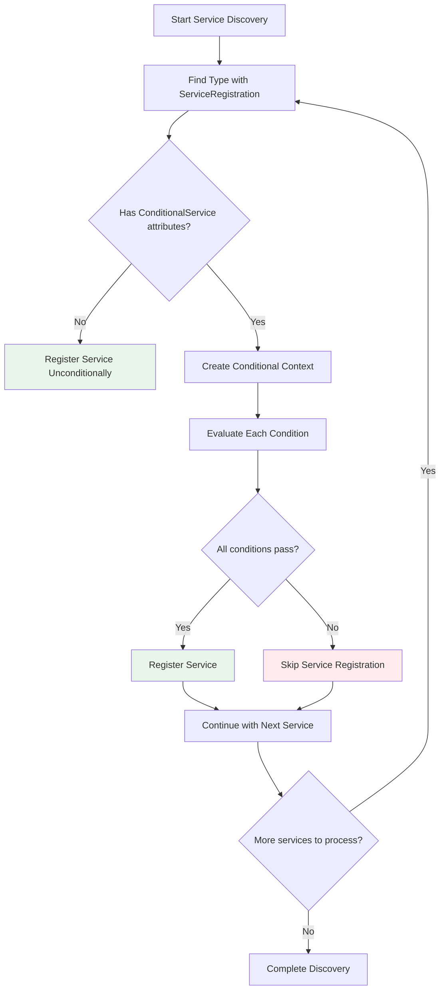

# Conditional Registration Guide

Imagine you're building a smart home system that needs to behave differently depending on whether you're in "vacation mode" or "at home mode." Your application services need similar intelligence - they should adapt their behavior based on the environment they're running in, the features that are enabled, and the configuration values that are set. This is exactly what conditional registration accomplishes for your dependency injection container.

Think of conditional registration as teaching your application to make intelligent decisions about which services to activate. Just as you wouldn't turn on the air conditioning when nobody's home, your application shouldn't register expensive services when they're not needed or appropriate for the current environment.

## 🎯 Understanding the Concept

Before we dive into the mechanics, let's establish a clear mental model. Conditional registration works like a sophisticated bouncer at an exclusive club. The bouncer (conditional logic) checks multiple criteria (environment, configuration, feature flags) before deciding whether to let someone (a service) enter the club (dependency injection container).

This decision-making process happens during application startup, which means your application only contains the services that are appropriate for its current context. This leads to faster startup times, lower memory usage, and fewer potential configuration errors.

Consider this fundamental question: Why would you want the same application to register different services in different situations? The answer lies in the reality of modern software deployment, where a single codebase needs to adapt to multiple environments, feature configurations, and operational requirements.

## 🌍 Environment-Based Registration

Let's start with the most common use case: registering different services based on the environment your application is running in. This pattern becomes essential when you consider that development, staging, and production environments have fundamentally different requirements.

### The Traditional Problem

In traditional dependency injection setups, you might have seen code like this scattered throughout your startup logic:

```csharp
// Traditional approach - manual conditional registration
if (builder.Environment.IsDevelopment())
{
    builder.Services.AddScoped<IEmailService, MockEmailService>();
}
else
{
    builder.Services.AddScoped<IEmailService, SmtpEmailService>();
}

if (builder.Environment.IsProduction())
{
    builder.Services.AddSingleton<ICacheService, RedisCacheService>();
}
else
{
    builder.Services.AddSingleton<ICacheService, MemoryCacheService>();
}
```

This approach works, but it has several drawbacks that become problematic as your application grows. First, your startup code becomes cluttered with conditional logic that's difficult to test and maintain. Second, the conditional logic is separated from the service implementation, making it hard to understand why certain services are registered. Third, as you add more environments and conditions, the complexity grows exponentially.

### The Profile-Based Solution

Profile-based registration solves these problems by moving the conditional logic closer to the service itself. Instead of centralizing all decisions in your startup code, each service declares its own appropriate contexts:

```csharp
// Development environment gets a mock email service for testing
[ServiceRegistration(ServiceLifetime.Transient, Profile = "Development")]
public class MockEmailService : IEmailService
{
    private readonly ILogger<MockEmailService> _logger;

    public MockEmailService(ILogger<MockEmailService> logger)
    {
        _logger = logger;
    }

    public async Task SendEmailAsync(string to, string subject, string body)
    {
        // In development, we don't want to actually send emails
        // Instead, we log what would have been sent
        _logger.LogInformation("MOCK EMAIL: To={To}, Subject={Subject}, Body={Body}", to, subject, body);
        
        // Simulate the async operation without actually doing anything
        await Task.Delay(10);
    }
}

// Production environment gets the real email service
[ServiceRegistration(ServiceLifetime.Transient, Profile = "Production")]
public class SmtpEmailService : IEmailService
{
    private readonly SmtpClient _smtpClient;
    private readonly ILogger<SmtpEmailService> _logger;

    public SmtpEmailService(IConfiguration configuration, ILogger<SmtpEmailService> logger)
    {
        _logger = logger;
        
        // In production, we configure a real SMTP client
        var smtpSettings = configuration.GetSection("Email:Smtp");
        _smtpClient = new SmtpClient(smtpSettings["Host"])
        {
            Port = smtpSettings.GetValue<int>("Port"),
            Credentials = new NetworkCredential(
                smtpSettings["Username"], 
                smtpSettings["Password"]),
            EnableSsl = smtpSettings.GetValue<bool>("EnableSsl")
        };
    }

    public async Task SendEmailAsync(string to, string subject, string body)
    {
        try
        {
            var message = new MailMessage("noreply@myapp.com", to, subject, body);
            await _smtpClient.SendMailAsync(message);
            _logger.LogInformation("Email sent successfully to {To}", to);
        }
        catch (Exception ex)
        {
            _logger.LogError(ex, "Failed to send email to {To}", to);
            throw;
        }
    }
}
```

Now your startup code becomes much simpler and more declarative:

```csharp
builder.Services.AddAutoServices(options =>
{
    // Tell the system which profile is active
    options.Profile = builder.Environment.EnvironmentName;
    options.Configuration = builder.Configuration;
});
```

The beauty of this approach is that each service declares its own context requirements. When you look at `MockEmailService`, you immediately understand that it's meant for development environments. The conditional logic is co-located with the service it affects, making your codebase more maintainable and self-documenting.

### Advanced Environment Patterns

As your application matures, you might need more sophisticated environment handling. Consider this scenario where you have multiple types of production environments:

```csharp
// Different cache implementations for different scales
[ServiceRegistration(ServiceLifetime.Singleton, Profile = "Development")]
public class InMemoryCacheService : ICacheService
{
    // Simple in-memory cache for development - no external dependencies
}

[ServiceRegistration(ServiceLifetime.Singleton, Profile = "Staging")]
public class LocalRedisCacheService : ICacheService
{
    // Redis cache for staging - single instance for integration testing
}

[ServiceRegistration(ServiceLifetime.Singleton, Profile = "Production")]
public class DistributedRedisCacheService : ICacheService
{
    // Distributed Redis cache for production - handles failover and clustering
}

[ServiceRegistration(ServiceLifetime.Singleton, Profile = "LoadTesting")]
public class HighPerformanceCacheService : ICacheService
{
    // Optimized cache for load testing scenarios
}
```

This pattern allows you to have specialized implementations for each environment type, ensuring that each environment gets the services that are most appropriate for its specific requirements and constraints.

## ⚙️ Configuration-Based Conditions

While environment-based registration handles broad categories of deployment contexts, configuration-based conditions allow for more granular control based on specific application settings. This is where feature flags and dynamic configuration come into play.

### Simple Configuration Conditions

Let's start with a straightforward example that demonstrates the basic concept:

```csharp
// This service is only registered when logging is enabled in configuration
[ConditionalService("Features:EnableAdvancedLogging", "true")]
[ServiceRegistration(ServiceLifetime.Singleton)]
public class AdvancedLoggingService : ILoggingService
{
    private readonly ILogger<AdvancedLoggingService> _logger;
    private readonly IConfiguration _configuration;

    public AdvancedLoggingService(ILogger<AdvancedLoggingService> logger, IConfiguration configuration)
    {
        _logger = logger;
        _configuration = configuration;
        
        // This service provides additional logging capabilities
        // that might not be needed in all deployments
        _logger.LogInformation("Advanced logging service initialized");
    }

    public void LogPerformanceMetrics(string operation, TimeSpan duration, Dictionary<string, object> metrics)
    {
        // Detailed performance logging that generates a lot of data
        var logData = new
        {
            Operation = operation,
            DurationMs = duration.TotalMilliseconds,
            Metrics = metrics,
            Timestamp = DateTime.UtcNow
        };
        
        _logger.LogInformation("PERF: {@PerformanceData}", logData);
    }
}
```

The corresponding configuration in your `appsettings.json` would look like this:

```json
{
  "Features": {
    "EnableAdvancedLogging": "true",
    "EnableCaching": "false",
    "EnableMetrics": "true"
  }
}
```

When `EnableAdvancedLogging` is set to `"true"`, the `AdvancedLoggingService` gets registered. When it's `"false"` or missing entirely, the service is not registered, and any code that depends on `ILoggingService` would either receive a different implementation or get a registration error that helps you identify the missing dependency.

### Multiple Conditional Criteria

Real-world scenarios often require checking multiple conditions. The conditional registration system supports this through multiple `[ConditionalService]` attributes, which use AND logic - all conditions must be satisfied for the service to be registered:

```csharp
// This service requires multiple conditions to be met
[ConditionalService("Features:EnableCaching", "true")]
[ConditionalService("Cache:Provider", "Redis")]
[ConditionalService("Environment", "Production")]
[ServiceRegistration(ServiceLifetime.Singleton)]
public class ProductionRedisCacheService : ICacheService
{
    private readonly ILogger<ProductionRedisCacheService> _logger;
    private readonly string _connectionString;

    public ProductionRedisCacheService(IConfiguration configuration, ILogger<ProductionRedisCacheService> logger)
    {
        _logger = logger;
        
        // This service only gets created when ALL conditions are met:
        // 1. Caching feature is enabled
        // 2. Redis is selected as the cache provider
        // 3. Environment is Production
        
        _connectionString = configuration.GetConnectionString("Redis") 
            ?? throw new InvalidOperationException("Redis connection string is required");
            
        _logger.LogInformation("Production Redis cache service initialized with connection: {ConnectionString}", 
            _connectionString);
    }
}

// Alternative implementation for different conditions
[ConditionalService("Features:EnableCaching", "true")]
[ConditionalService("Cache:Provider", "Memory")]
[ServiceRegistration(ServiceLifetime.Singleton)]
public class InMemoryCacheService : ICacheService
{
    private readonly ConcurrentDictionary<string, object> _cache = new();
    private readonly ILogger<InMemoryCacheService> _logger;

    public InMemoryCacheService(ILogger<InMemoryCacheService> logger)
    {
        _logger = logger;
        // This service gets registered when caching is enabled but Memory provider is selected
        _logger.LogInformation("In-memory cache service initialized");
    }
}
```

This pattern allows you to have multiple implementations of the same interface, each with different sets of requirements. The discovery system will register only the implementation whose conditions are satisfied, ensuring that you always get the most appropriate service for your current configuration.

## 🎨 Expression-Based Conditional Logic

While string-based configuration checks cover many scenarios, sometimes you need more sophisticated conditional logic. This is where expression-based conditions shine, providing compile-time safety and IntelliSense support for complex conditional scenarios.

### Understanding the Expression Context

Expression-based conditions receive a rich context object that provides access to environment information, configuration values, and helper methods. Think of this context as a comprehensive dashboard that your conditional expressions can consult to make intelligent decisions:

```csharp
// This service uses sophisticated conditional logic
[ConditionalService(ctx => 
    ctx.Environment.IsProduction() && 
    ctx.FeatureEnabled("AdvancedReporting") &&
    !ctx.Configuration.GetValue<bool>("MaintenanceMode") &&
    ctx.GetConfigValue<int>("MaxConcurrentUsers") > 100)]
[ServiceRegistration(ServiceLifetime.Scoped)]
public class HighVolumeReportingService : IReportingService
{
    // This service is only registered when:
    // 1. We're in production environment
    // 2. Advanced reporting feature is enabled
    // 3. The system is NOT in maintenance mode
    // 4. The application is configured for more than 100 concurrent users
}
```

Let's break down what's happening in this expression to understand how each part contributes to the overall conditional logic:

- `ctx.Environment.IsProduction()` - Checks the current environment using a type-safe method
- `ctx.FeatureEnabled("AdvancedReporting")` - Looks up a feature flag in the configuration
- `!ctx.Configuration.GetValue<bool>("MaintenanceMode")` - Ensures the system isn't in maintenance mode
- `ctx.GetConfigValue<int>("MaxConcurrentUsers") > 100` - Checks a numeric configuration value

The power of expression-based conditions lies in their ability to combine multiple types of checks using familiar C# operators and syntax. You get IntelliSense support, compile-time type checking, and the ability to express complex business rules naturally.

### Complex Business Logic in Conditions

Expression-based conditions can encode sophisticated business rules that would be difficult or impossible to express with simple string-based checks:

```csharp
[ConditionalService(ctx => 
    (ctx.Environment.IsProduction() || ctx.Environment.IsStaging()) &&
    ctx.FeatureEnabled("PaymentProcessing") &&
    IsValidPaymentConfiguration(ctx))]
[ServiceRegistration(ServiceLifetime.Scoped)]
public class StripePaymentProcessor : IPaymentProcessor
{
    // Complex payment processor that requires specific configuration
    
    // Helper method to validate payment configuration
    private static bool IsValidPaymentConfiguration(IConditionalContext ctx)
    {
        var stripeKey = ctx.Configuration?.GetValue<string>("Stripe:SecretKey");
        var webhookSecret = ctx.Configuration?.GetValue<string>("Stripe:WebhookSecret");
        
        return !string.IsNullOrEmpty(stripeKey) && 
               !string.IsNullOrEmpty(webhookSecret) &&
               stripeKey.StartsWith("sk_"); // Stripe secret keys start with 'sk_'
    }
}
```

Notice how we can call helper methods within our conditional expressions. This allows you to encapsulate complex validation logic in separate methods while still keeping the overall conditional expression readable and maintainable.

### Custom Conditional Extensions

For frequently used conditional patterns, you can create extension methods that make your expressions more readable and reusable:

```csharp
public static class ConditionalExtensions
{
    public static bool IsProductionOrStaging(this IEnvironmentContext environment)
    {
        return environment.IsProduction() || environment.IsStaging();
    }
    
    public static bool HasValidDatabaseConfiguration(this IConditionalContext ctx)
    {
        var connectionString = ctx.Configuration?.GetConnectionString("DefaultConnection");
        return !string.IsNullOrEmpty(connectionString) && 
               connectionString.Contains("Server=") &&
               !connectionString.Contains("localhost"); // Avoid local db in production
    }
    
    public static bool IsHighAvailabilityMode(this IConditionalContext ctx)
    {
        return ctx.Environment.IsProduction() &&
               ctx.GetConfigValue<bool>("HighAvailability:Enabled") &&
               ctx.GetConfigValue<int>("HighAvailability:MinInstances") >= 2;
    }
}
```

Now your conditional expressions become much more readable and self-documenting:

```csharp
[ConditionalService(ctx => 
    ctx.Environment.IsProductionOrStaging() &&
    ctx.HasValidDatabaseConfiguration() &&
    ctx.IsHighAvailabilityMode())]
[ServiceRegistration(ServiceLifetime.Singleton)]
public class HighAvailabilityDatabaseService : IDatabaseService
{
    // This service is only registered in high-availability production scenarios
}
```

## 🔄 The Conditional Evaluation Process

Understanding how the system evaluates conditional logic helps you write more effective conditions and troubleshoot issues when services aren't registering as expected. Let's walk through the complete evaluation process step by step:



The evaluation process follows a logical sequence that ensures consistent and predictable behavior. Here's what happens at each step, with explanations to help you understand the reasoning behind each decision:

### Step 1: Conditional Context Creation

Before evaluating any conditions, the system creates a rich context object that provides access to all the information your conditions might need. Think of this as setting up a comprehensive information booth that your conditions can consult:

```csharp
// The system automatically creates this context for each evaluation
var context = new ConditionalContext(
    configuration: builder.Configuration,           // Access to app settings
    environmentName: builder.Environment.EnvironmentName // Current environment
);

// Additional context setup happens automatically
context.RegisterCustomCondition("DatabaseHealthy", () => /* health check logic */);
context.RegisterCustomCondition("ExternalApiAvailable", () => /* api check logic */);
```

### Step 2: Condition Evaluation

Each conditional attribute is evaluated independently, with detailed logging available to help you understand what's happening:

```csharp
[ConditionalService("Features:EnableReporting", "true")]
[ConditionalService(ctx => ctx.Environment.IsProduction())]
[ServiceRegistration(ServiceLifetime.Scoped)]
public class ReportingService : IReportingService
{
    // Both conditions must pass for this service to be registered:
    // 1. Configuration check: Features:EnableReporting = "true"
    // 2. Expression check: Environment is Production
}
```

When you enable logging, you'll see output like this during startup:

```
Evaluating conditions for ReportingService:
  ✓ Condition 1 (Configuration): Features:EnableReporting = "true" → PASS
  ✓ Condition 2 (Expression): Environment.IsProduction() → PASS
  → ReportingService registered successfully
```

### Step 3: Error Handling and Fallbacks

The conditional evaluation system is designed to be robust and handle errors gracefully. If a condition evaluation fails due to an exception, the system logs the error and treats the condition as failed rather than crashing the entire discovery process:

```csharp
[ConditionalService(ctx => ctx.GetConfigValue<int>("SomeNumericValue") > 100)]
[ServiceRegistration(ServiceLifetime.Scoped)]
public class ConditionalService : IService
{
    // If GetConfigValue throws an exception (e.g., invalid format),
    // the condition is treated as failed and the service isn't registered
}
```

This graceful error handling ensures that a single misconfigured condition doesn't break your entire application startup.

## 🧪 Testing Conditional Services

Testing applications that use conditional registration requires special consideration because the set of registered services changes based on configuration and environment. Here are effective strategies for testing these scenarios:

### Strategy 1: Explicit Test Configuration

Create specific test configurations that enable or disable services as needed for each test scenario:

```csharp
[Test]
public void EmailService_ShouldBeMockInTestEnvironment()
{
    // Arrange
    var services = new ServiceCollection();
    var configuration = new ConfigurationBuilder()
        .AddInMemoryCollection(new[]
        {
            new KeyValuePair<string, string>("Features:EnableRealEmail", "false"),
            new KeyValuePair<string, string>("Environment", "Testing")
        })
        .Build();

    // Act
    services.AddAutoServices(options =>
    {
        options.Configuration = configuration;
        options.Profile = "Testing";
        options.IsTestEnvironment = true;
    });

    var serviceProvider = services.BuildServiceProvider();

    // Assert
    var emailService = serviceProvider.GetRequiredService<IEmailService>();
    Assert.IsType<MockEmailService>(emailService);
}
```

### Strategy 2: Environment-Specific Test Classes

Organize your tests to mirror your deployment environments:

```csharp
[TestClass]
public class DevelopmentEnvironmentTests
{
    private ServiceProvider _serviceProvider;

    [TestInitialize]
    public void Setup()
    {
        var services = new ServiceCollection();
        services.AddAutoServices(options =>
        {
            options.Profile = "Development";
            options.IsTestEnvironment = false;
        });
        _serviceProvider = services.BuildServiceProvider();
    }

    [TestMethod]
    public void ShouldUseMockEmailService()
    {
        var emailService = _serviceProvider.GetRequiredService<IEmailService>();
        Assert.IsType<MockEmailService>(emailService);
    }
}

[TestClass]
public class ProductionEnvironmentTests
{
    private ServiceProvider _serviceProvider;

    [TestInitialize]
    public void Setup()
    {
        var configuration = new ConfigurationBuilder()
            .AddInMemoryCollection(new[]
            {
                new KeyValuePair<string, string>("Email:Smtp:Host", "smtp.test.com"),
                new KeyValuePair<string, string>("Email:Smtp:Port", "587")
            })
            .Build();

        var services = new ServiceCollection();
        services.AddAutoServices(options =>
        {
            options.Profile = "Production";
            options.Configuration = configuration;
            options.IsTestEnvironment = false;
        });
        _serviceProvider = services.BuildServiceProvider();
    }

    [TestMethod]
    public void ShouldUseRealEmailService()
    {
        var emailService = _serviceProvider.GetRequiredService<IEmailService>();
        Assert.IsType<SmtpEmailService>(emailService);
    }
}
```

## 🎯 Advanced Patterns and Best Practices

As you become more comfortable with conditional registration, these advanced patterns will help you handle complex scenarios and maintain clean, testable code:

### Pattern 1: Layered Conditional Registration

Use multiple layers of conditions to create sophisticated service hierarchies:

```csharp
// Base condition: Feature must be enabled
[ConditionalService("Features:EnablePayments", "true")]
[ServiceRegistration(ServiceLifetime.Scoped)]
public abstract class BasePaymentProcessor : IPaymentProcessor
{
    // Common payment processing logic
}

// More specific condition: Stripe provider + Production environment
[ConditionalService("Features:EnablePayments", "true")]
[ConditionalService("Payments:Provider", "Stripe")]
[ConditionalService(ctx => ctx.Environment.IsProduction())]
[ServiceRegistration(ServiceLifetime.Scoped)]
public class StripePaymentProcessor : BasePaymentProcessor
{
    // Stripe-specific implementation for production
}

// Alternative condition: PayPal provider + any environment
[ConditionalService("Features:EnablePayments", "true")]
[ConditionalService("Payments:Provider", "PayPal")]
[ServiceRegistration(ServiceLifetime.Scoped)]
public class PayPalPaymentProcessor : BasePaymentProcessor
{
    // PayPal-specific implementation
}
```

### Pattern 2: Conditional Service Factories

For scenarios where you need different implementations based on runtime conditions that aren't available at startup:

```csharp
[ServiceRegistration(ServiceLifetime.Singleton)]
public class PaymentProcessorFactory : IPaymentProcessorFactory
{
    private readonly IServiceProvider _serviceProvider;
    private readonly IConfiguration _configuration;

    public PaymentProcessorFactory(IServiceProvider serviceProvider, IConfiguration configuration)
    {
        _serviceProvider = serviceProvider;
        _configuration = configuration;
    }

    public IPaymentProcessor CreateProcessor(string paymentMethod)
    {
        // Runtime decision based on payment method
        return paymentMethod.ToLower() switch
        {
            "stripe" => _serviceProvider.GetRequiredService<StripePaymentProcessor>(),
            "paypal" => _serviceProvider.GetRequiredService<PayPalPaymentProcessor>(),
            _ => throw new NotSupportedException($"Payment method {paymentMethod} is not supported")
        };
    }
}
```

### Pattern 3: Configuration Validation with Conditions

Use conditional registration to ensure that services are only registered when their dependencies are properly configured:

```csharp
[ConditionalService(ctx => ValidateRedisConfiguration(ctx))]
[ServiceRegistration(ServiceLifetime.Singleton)]
public class RedisCacheService : ICacheService
{
    private static bool ValidateRedisConfiguration(IConditionalContext ctx)
    {
        var connectionString = ctx.Configuration?.GetConnectionString("Redis");
        
        if (string.IsNullOrEmpty(connectionString))
            return false;
            
        // Additional validation logic
        try
        {
            var config = ConfigurationOptions.Parse(connectionString);
            return config.EndPoints.Count > 0;
        }
        catch
        {
            return false;
        }
    }
}
```

This pattern ensures that services with complex configuration requirements are only registered when their configuration is valid, preventing runtime errors and making configuration issues visible at startup.

## 🔗 Integration with Other Features

Conditional registration works seamlessly with other features of the discovery system. Understanding these integrations helps you create more sophisticated and maintainable service configurations:

### Integration with Performance Optimization

When using performance optimizations, conditional evaluation is cached to avoid repeated computation:

```csharp
builder.Services.AddAutoServicesWithPerformanceOptimizations(options =>
{
    options.Configuration = builder.Configuration;
    options.Profile = builder.Environment.EnvironmentName;
    options.EnableParallelProcessing = true; // Conditions evaluated in parallel
});
```

### Integration with Plugin Architecture

Custom plugins can also use conditional registration to determine when they should be active:

```csharp
public class ConditionalPlugin : IServiceDiscoveryPlugin
{
    public bool CanProcessAssembly(Assembly assembly)
    {
        // Only process assemblies when certain conditions are met
        return Environment.GetEnvironmentVariable("ENABLE_CUSTOM_PLUGIN") == "true";
    }
}
```

## 🎓 Key Takeaways for Mastery

As we conclude this deep dive into conditional registration, let's consolidate the key concepts that will serve you well as you apply these techniques in your own applications:

**Mental Model**: Think of conditional registration as a sophisticated admission system for your dependency injection container. Just as a security system checks multiple credentials before granting access, conditional registration evaluates multiple criteria before allowing service registration.

**Design Principle**: Keep conditional logic close to the services it affects. This co-location makes your code more maintainable and self-documenting, reducing the cognitive load for future developers (including yourself).

**Error Handling**: Design your conditions to fail gracefully. A failed condition should result in a missing service registration that can be detected and debugged, not an application crash during startup.

**Testing Strategy**: Create explicit test scenarios for each combination of conditions you use. This ensures that your conditional logic works correctly across all deployment scenarios.

The power of conditional registration lies not just in its ability to register different services, but in its capacity to make your application adaptable and context-aware. As you continue to explore this system, you'll discover that well-designed conditional logic makes your application more robust, maintainable, and suitable for modern deployment practices.

## 🔗 Next Steps

Now that you understand conditional registration thoroughly, you're ready to explore how it integrates with other advanced features:

1. **[Expression-Based Conditions](ExpressionBasedConditions.md)** - Deep dive into the expression system and custom context creation
2. **[Fluent Configuration](FluentConfiguration.md)** - Learn how to use the chainable configuration API with conditional logic
3. **[Performance Optimization](PerformanceOptimization.md)** - Understand how conditional evaluation is optimized for large applications

Conditional registration provides the foundation for building applications that can adapt intelligently to their deployment context. Master these concepts, and you'll have powerful tools for creating flexible, maintainable service architectures.