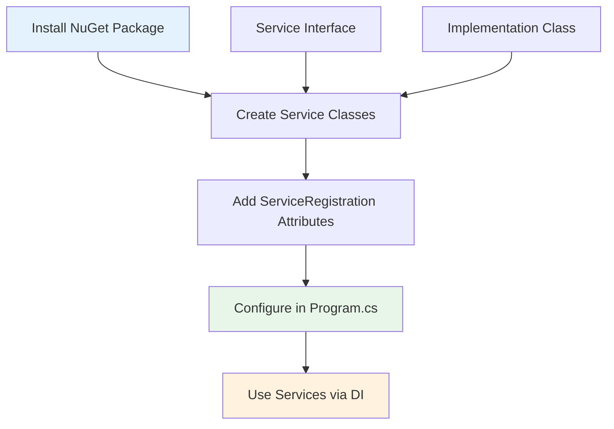
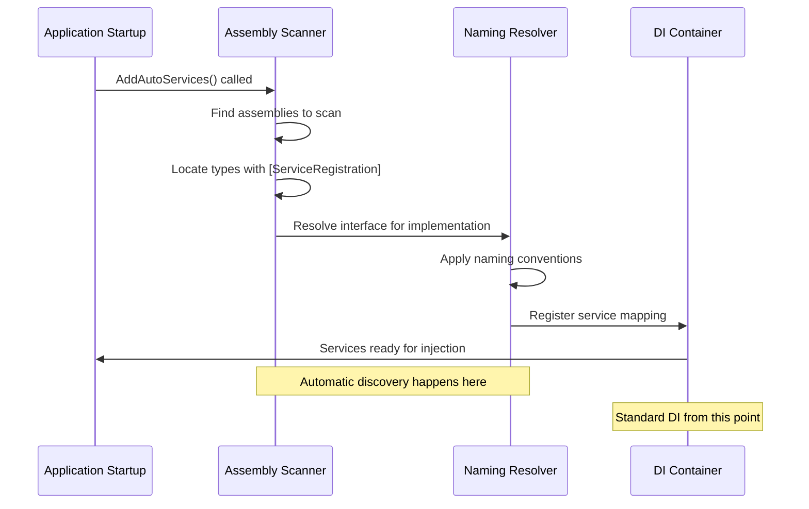

# Getting Started with FS.AutoServiceDiscovery.Extensions

This comprehensive guide will walk you through everything you need to know to start using FS.AutoServiceDiscovery.Extensions in your .NET 9.0 application. Think of this as your step-by-step roadmap from installation to advanced usage.

## 📋 Prerequisites

Before we begin, ensure you have the following:

- **.NET 9.0 SDK** or later installed
- Basic understanding of **Dependency Injection** concepts
- Familiarity with **.NET attributes** and **reflection**

## 🚀 Installation

### Step 1: Install the NuGet Package

```bash
# Using .NET CLI
dotnet add package FS.AutoServiceDiscovery.Extensions

# Using Package Manager Console in Visual Studio
Install-Package FS.AutoServiceDiscovery.Extensions

# Using PackageReference in your .csproj file
<PackageReference Include="FS.AutoServiceDiscovery.Extensions" Version="9.0.0" />
```

### Step 2: Verify Installation

After installation, verify that the package is properly referenced in your project:

```xml
<Project Sdk="Microsoft.NET.Sdk.Web">
  <PropertyGroup>
    <TargetFramework>net9.0</TargetFramework>
  </PropertyGroup>
  
  <ItemGroup>
    <PackageReference Include="FS.AutoServiceDiscovery.Extensions" Version="9.0.0" />
  </ItemGroup>
</Project>
```

## 🏗️ Basic Setup Flow



## 📝 Your First Service

Let's create a simple service to understand the basic workflow:

### Step 1: Define Your Service Interface

```csharp
// Services/IUserService.cs
namespace MyApp.Services;

public interface IUserService
{
    Task<User> GetUserByIdAsync(int id);
    Task<IEnumerable<User>> GetAllUsersAsync();
    Task<User> CreateUserAsync(CreateUserRequest request);
}

// Models/User.cs
public class User
{
    public int Id { get; set; }
    public string Name { get; set; } = string.Empty;
    public string Email { get; set; } = string.Empty;
    public DateTime CreatedAt { get; set; }
}

public class CreateUserRequest
{
    public string Name { get; set; } = string.Empty;
    public string Email { get; set; } = string.Empty;
}
```

### Step 2: Create the Service Implementation

```csharp
// Services/UserService.cs
using FS.AutoServiceDiscovery.Extensions.Attributes;
using Microsoft.Extensions.DependencyInjection;

namespace MyApp.Services;

[ServiceRegistration(ServiceLifetime.Scoped)]
public class UserService : IUserService
{
    private readonly ILogger<UserService> _logger;
    private readonly List<User> _users; // In-memory storage for demo

    public UserService(ILogger<UserService> logger)
    {
        _logger = logger;
        _users = new List<User>
        {
            new() { Id = 1, Name = "John Doe", Email = "john@example.com", CreatedAt = DateTime.UtcNow.AddDays(-30) },
            new() { Id = 2, Name = "Jane Smith", Email = "jane@example.com", CreatedAt = DateTime.UtcNow.AddDays(-15) }
        };
    }

    public async Task<User> GetUserByIdAsync(int id)
    {
        _logger.LogInformation("Getting user with ID: {UserId}", id);
        
        // Simulate async operation
        await Task.Delay(10);
        
        var user = _users.FirstOrDefault(u => u.Id == id);
        if (user == null)
        {
            throw new KeyNotFoundException($"User with ID {id} not found");
        }
        
        return user;
    }

    public async Task<IEnumerable<User>> GetAllUsersAsync()
    {
        _logger.LogInformation("Getting all users");
        
        // Simulate async operation
        await Task.Delay(5);
        
        return _users.AsEnumerable();
    }

    public async Task<User> CreateUserAsync(CreateUserRequest request)
    {
        _logger.LogInformation("Creating user: {UserName}", request.Name);
        
        var user = new User
        {
            Id = _users.Count + 1,
            Name = request.Name,
            Email = request.Email,
            CreatedAt = DateTime.UtcNow
        };
        
        _users.Add(user);
        
        // Simulate async operation
        await Task.Delay(20);
        
        return user;
    }
}
```

### Step 3: Configure Auto Discovery in Program.cs

```csharp
// Program.cs
using FS.AutoServiceDiscovery.Extensions;

var builder = WebApplication.CreateBuilder(args);

// Add services to the container
builder.Services.AddControllers();
builder.Services.AddEndpointsApiExplorer();
builder.Services.AddSwaggerGen();

// 🎯 This is the magic line - automatically discovers and registers all services
builder.Services.AddAutoServices();

var app = builder.Build();

// Configure the HTTP request pipeline
if (app.Environment.IsDevelopment())
{
    app.UseSwagger();
    app.UseSwaggerUI();
}

app.UseHttpsRedirection();
app.UseAuthorization();
app.MapControllers();

app.Run();
```

### Step 4: Use the Service in a Controller

```csharp
// Controllers/UsersController.cs
using Microsoft.AspNetCore.Mvc;
using MyApp.Services;

namespace MyApp.Controllers;

[ApiController]
[Route("api/[controller]")]
public class UsersController : ControllerBase
{
    private readonly IUserService _userService;

    // The IUserService is automatically injected thanks to auto-discovery
    public UsersController(IUserService userService)
    {
        _userService = userService;
    }

    [HttpGet]
    public async Task<ActionResult<IEnumerable<User>>> GetAllUsers()
    {
        try
        {
            var users = await _userService.GetAllUsersAsync();
            return Ok(users);
        }
        catch (Exception ex)
        {
            return StatusCode(500, new { error = ex.Message });
        }
    }

    [HttpGet("{id}")]
    public async Task<ActionResult<User>> GetUser(int id)
    {
        try
        {
            var user = await _userService.GetUserByIdAsync(id);
            return Ok(user);
        }
        catch (KeyNotFoundException)
        {
            return NotFound(new { error = $"User with ID {id} not found" });
        }
        catch (Exception ex)
        {
            return StatusCode(500, new { error = ex.Message });
        }
    }

    [HttpPost]
    public async Task<ActionResult<User>> CreateUser([FromBody] CreateUserRequest request)
    {
        try
        {
            if (string.IsNullOrWhiteSpace(request.Name) || string.IsNullOrWhiteSpace(request.Email))
            {
                return BadRequest(new { error = "Name and Email are required" });
            }

            var user = await _userService.CreateUserAsync(request);
            return CreatedAtAction(nameof(GetUser), new { id = user.Id }, user);
        }
        catch (Exception ex)
        {
            return StatusCode(500, new { error = ex.Message });
        }
    }
}
```

## 🔄 Service Registration Lifecycle

Understanding how the automatic discovery works helps you troubleshoot and optimize your services:



## 🎛️ Basic Configuration Options

You can customize the discovery behavior using configuration options:

```csharp
// Program.cs - Basic configuration
builder.Services.AddAutoServices(options =>
{
    options.EnableLogging = true;           // See what's being registered
    options.Profile = builder.Environment.EnvironmentName; // Environment-based registration
    options.Configuration = builder.Configuration;         // Enable conditional registration
    options.IsTestEnvironment = false;     // Exclude test-only services
});
```

### Configuration Output Example

When `EnableLogging = true`, you'll see output like this during startup:

```
Starting optimized service discovery for 1 assemblies...
Scanned MyApp in 15.2ms, found 3 services
Registered: IUserService -> UserService (Scoped, Order: 0)
Registered: IEmailService -> EmailService (Transient, Order: 0)
Registered: ICacheService -> CacheService (Singleton, Order: 1)
Service discovery completed. Total services registered: 3
```

## 🧪 Testing Your Setup

Create a simple test to verify everything is working:

```csharp
// Tests/ServiceRegistrationTests.cs
using Microsoft.Extensions.DependencyInjection;
using Microsoft.Extensions.Hosting;
using MyApp.Services;
using Xunit;

namespace MyApp.Tests;

public class ServiceRegistrationTests
{
    [Fact]
    public void UserService_Should_Be_Registered_Automatically()
    {
        // Arrange
        var services = new ServiceCollection();
        services.AddLogging();
        
        // Act - This should automatically register IUserService
        services.AddAutoServices();
        var serviceProvider = services.BuildServiceProvider();
        
        // Assert
        var userService = serviceProvider.GetService<IUserService>();
        Assert.NotNull(userService);
        Assert.IsType<UserService>(userService);
    }
    
    [Fact]
    public async void UserService_Should_Return_Users()
    {
        // Arrange
        var services = new ServiceCollection();
        services.AddLogging();
        services.AddAutoServices();
        var serviceProvider = services.BuildServiceProvider();
        
        // Act
        var userService = serviceProvider.GetRequiredService<IUserService>();
        var users = await userService.GetAllUsersAsync();
        
        // Assert
        Assert.NotNull(users);
        Assert.True(users.Any());
    }
}
```

## 🚨 Common First-Time Issues

### Issue 1: Services Not Being Discovered

**Problem:** Your service isn't being registered automatically.

**Solution Checklist:**
1. ✅ Does your class have the `[ServiceRegistration]` attribute?
2. ✅ Is your class `public` and not `abstract`?
3. ✅ Does your interface follow the `I{ClassName}` convention?
4. ✅ Is the assembly being scanned? (Check with `EnableLogging = true`)

```csharp
// ❌ Won't work - missing attribute
public class UserService : IUserService { }

// ✅ Will work - has attribute
[ServiceRegistration(ServiceLifetime.Scoped)]
public class UserService : IUserService { }
```

### Issue 2: Wrong Service Lifetime

**Problem:** Your service has the wrong lifetime behavior.

**Solution:** Be explicit about lifetime requirements:

```csharp
// For services that should be created once per request
[ServiceRegistration(ServiceLifetime.Scoped)]
public class UserService : IUserService { }

// For services that should be created once per application
[ServiceRegistration(ServiceLifetime.Singleton)]
public class CacheService : ICacheService { }

// For lightweight services that should be created every time
[ServiceRegistration(ServiceLifetime.Transient)]
public class EmailService : IEmailService { }
```

### Issue 3: Interface Not Found

**Problem:** Multiple interfaces implemented, wrong one chosen.

**Solution:** Specify the service type explicitly:

```csharp
// ❌ Ambiguous - implements multiple interfaces
[ServiceRegistration(ServiceLifetime.Scoped)]
public class UserService : IUserService, IDisposable, IAsyncDisposable { }

// ✅ Explicit - specifies which interface to use
[ServiceRegistration(ServiceLifetime.Scoped, ServiceType = typeof(IUserService))]
public class UserService : IUserService, IDisposable, IAsyncDisposable { }
```

## 🎯 Next Steps

Now that you have the basics working, explore these advanced features:

1. **[Environment-Specific Services](ConditionalRegistration.md)** - Register different implementations per environment
2. **[Fluent Configuration](FluentConfiguration.md)** - Use the chainable configuration API
3. **[Performance Optimization](PerformanceOptimization.md)** - Enable caching and parallel processing
4. **[Custom Naming Conventions](CustomNamingConventions.md)** - Create your own resolution rules

## 💡 Best Practices for Beginners

### 1. Start Simple, Add Complexity Gradually

Begin with basic `[ServiceRegistration]` attributes and add advanced features as needed:

```csharp
// Start with this
[ServiceRegistration(ServiceLifetime.Scoped)]
public class UserService : IUserService { }

// Add environment awareness later
[ServiceRegistration(ServiceLifetime.Scoped, Profile = "Production")]
public class ProductionUserService : IUserService { }
```

### 2. Use Descriptive Service Names

Follow clear naming conventions to make auto-discovery predictable:

```csharp
// ✅ Good - clear naming convention
public interface IUserService { }
public class UserService : IUserService { }

// ❌ Confusing - doesn't follow conventions
public interface IUserOps { }
public class UserManager : IUserOps { }
```

### 3. Enable Logging During Development

Always use logging during development to understand what's happening:

```csharp
#if DEBUG
builder.Services.AddAutoServices(options =>
{
    options.EnableLogging = true; // Only in debug builds
});
#else
builder.Services.AddAutoServices();
#endif
```

### 4. Organize Services by Feature

Group related services together for better maintainability:

```
MyApp/
├── Features/
│   ├── Users/
│   │   ├── IUserService.cs
│   │   └── UserService.cs
│   ├── Orders/
│   │   ├── IOrderService.cs
│   │   └── OrderService.cs
│   └── Inventory/
│       ├── IInventoryService.cs
│       └── InventoryService.cs
```

## 🎉 Conclusion

You've successfully set up automatic service discovery! Your services are now being discovered and registered automatically, eliminating manual DI configuration and reducing boilerplate code.

The key takeaways from this guide:

- **Attribute-Driven**: Use `[ServiceRegistration]` to mark services for automatic discovery
- **Convention-Based**: Follow `I{ServiceName}` naming for automatic interface resolution
- **Zero Configuration**: Works out-of-the-box with sensible defaults
- **Extensible**: Can be customized and extended as your application grows

Continue with the other documentation guides to unlock the full power of this library!