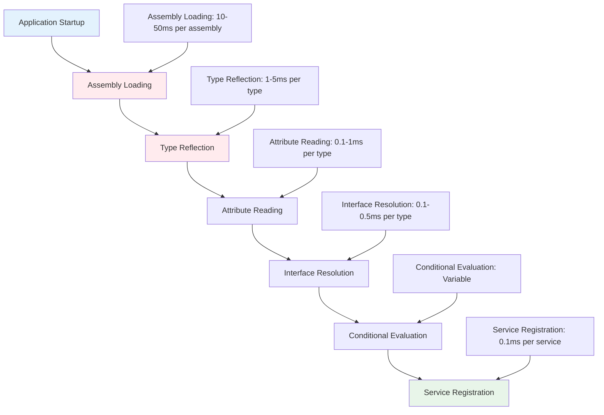

# Performance Optimization Guide

Imagine you're organizing a massive library with millions of books, and you need to create a card catalog system that helps visitors find any book instantly. You could go through every book one by one each time someone asks for something, but that would take forever. Instead, you'd create smart indexing systems, organize books by category, and maybe even cache information about the most popular books for instant access. Performance optimization in service discovery works exactly the same way - it's about making smart decisions upfront so that the expensive work of finding and registering services happens as efficiently as possible.

The performance optimization system transforms service discovery from a potentially slow, resource-intensive process into a fast, intelligent operation that scales gracefully from small applications with a few services to enterprise systems with thousands of services across hundreds of assemblies.

## 🎯 Understanding Performance Challenges

Before diving into the optimizations, it's crucial to understand what makes service discovery potentially expensive and why optimization matters so much in real-world applications.

### The Fundamental Performance Challenge

Service discovery involves several inherently expensive operations:



When you multiply these times across large applications, the cumulative effect can become significant:

- **Small Application**: 5 assemblies × 50 types = ~300ms startup overhead
- **Medium Application**: 20 assemblies × 200 types = ~2-3 seconds startup overhead
- **Large Enterprise Application**: 100 assemblies × 1000 types = ~10-15 seconds startup overhead

These numbers might seem acceptable for development, but they become problematic in production scenarios where:
- Container startup time affects scaling responsiveness
- Application restarts impact user experience
- Cold start latency affects serverless deployments
- Development feedback loops slow down productivity

### Performance Impact Scenarios

Let's examine specific scenarios where performance optimization becomes critical:

**Scenario 1: Microservice Cold Starts**
```csharp
// Without optimization - can take 3-5 seconds for a typical microservice
builder.Services.AddAutoServices();

// With optimization - reduces to 200-500ms
builder.Services.AddAutoServicesWithPerformanceOptimizations();
```

**Scenario 2: Integration Test Suites**
```csharp
// Running 100 integration tests without optimization
// Each test creates a new service provider: 100 × 2s = 200 seconds total

// With caching enabled, only the first test pays the full cost:
// First test: 2s, remaining 99 tests: 99 × 50ms = ~7 seconds total
```

**Scenario 3: Development Inner Loop**
```csharp
// Developer makes a code change and rebuilds
// Without optimization: Full discovery runs every time
// With incremental discovery: Only changed assemblies are re-processed
```

## 🚀 Core Optimization Strategies

The performance optimization system implements several complementary strategies that work together to achieve maximum efficiency.

### Strategy 1: Assembly Scan Caching

The most impactful optimization is caching the results of assembly scanning. Since assemblies don't change during a single application run (and change infrequently between runs), we can cache their discovery results:

```csharp
public class CacheOptimizedExample
{
    public void ConfigureServices(IServiceCollection services)
    {
        // Enable performance optimizations with caching
        services.AddAutoServicesWithPerformanceOptimizations(options =>
        {
            options.EnablePerformanceOptimizations = true;
            options.EnableParallelProcessing = true;
            options.EnablePerformanceMetrics = true; // Track cache effectiveness
        });
    }
}
```

The caching system works by creating a fingerprint of each assembly (based on file size, timestamp, and hash) and storing the discovery results. On subsequent runs, if the assembly hasn't changed, the cached results are used instantly:

```csharp
// First run: Full discovery
Assembly scanning UserService.dll... (45ms)
  Found 23 services in UserService.dll
  Cached results for UserService.dll

// Second run: Cache hit
Assembly scanning UserService.dll... (2ms - from cache)
  Retrieved 23 services from cache
```

### Strategy 2: Parallel Assembly Processing

When multiple assemblies need to be processed, the system can scan them in parallel rather than sequentially:

```csharp
// Sequential processing (default for small applications)
Time: Assembly1 (50ms) → Assembly2 (40ms) → Assembly3 (30ms) = 120ms total

// Parallel processing (enabled with performance optimizations)
Time: Max(Assembly1 (50ms), Assembly2 (40ms), Assembly3 (30ms)) = 50ms total
```

The system automatically determines when parallel processing is beneficial:

```csharp
services.AddAutoServicesWithPerformanceOptimizations(options =>
{
    options.EnableParallelProcessing = true;
    options.MaxDegreeOfParallelism = Environment.ProcessorCount; // Use all available cores
});
```

### Strategy 3: Intelligent Type Filtering

Rather than examining every type in every assembly, the optimization system uses multiple layers of filtering to quickly exclude types that can't possibly be services:

```csharp
public class OptimizedTypeScanner
{
    public IEnumerable<ServiceRegistrationInfo> ScanAssembly(Assembly assembly)
    {
        // Layer 1: Quick assembly-level filter
        if (!CouldContainServices(assembly)) 
            return Enumerable.Empty<ServiceRegistrationInfo>();

        // Layer 2: Bulk type filtering
        var candidateTypes = assembly.GetTypes()
            .Where(FastTypeFilter)  // Quick checks: IsClass, !IsAbstract, etc.
            .ToList();

        if (candidateTypes.Count == 0)
            return Enumerable.Empty<ServiceRegistrationInfo>();

        // Layer 3: Detailed examination only for candidates
        return candidateTypes
            .Where(DetailedTypeFilter)  // Expensive checks: attribute presence, etc.
            .Select(CreateServiceInfo);
    }

    private bool FastTypeFilter(Type type)
    {
        // Quick checks that don't require reflection
        return type.IsClass && 
               !type.IsAbstract && 
               !type.IsGenericTypeDefinition &&
               !type.IsNested;
    }

    private bool DetailedTypeFilter(Type type)
    {
        // More expensive checks only for types that passed fast filter
        return type.GetCustomAttributes<ServiceRegistrationAttribute>().Any();
    }
}
```

This layered approach ensures that expensive reflection operations are only performed on types that have a high probability of being services.

### Strategy 4: Metadata Caching

Beyond assembly-level caching, the system caches expensive reflection operations at the type level:

```csharp
public class TypeMetadataCache
{
    private static readonly ConcurrentDictionary<Type, TypeMetadata> _cache = new();

    public static TypeMetadata GetMetadata(Type type)
    {
        return _cache.GetOrAdd(type, CreateMetadata);
    }

    private static TypeMetadata CreateMetadata(Type type)
    {
        // Expensive reflection operations performed once and cached
        return new TypeMetadata
        {
            ServiceRegistrationAttribute = type.GetCustomAttribute<ServiceRegistrationAttribute>(),
            ConditionalAttributes = type.GetCustomAttributes<ConditionalServiceAttribute>().ToArray(),
            ImplementedInterfaces = type.GetInterfaces()
                .Where(i => !i.Name.StartsWith("System."))
                .ToArray(),
            IsServiceCandidate = type.GetCustomAttributes<ServiceRegistrationAttribute>().Any()
        };
    }
}
```

## 🏎️ Advanced Performance Features

For applications with demanding performance requirements, several advanced optimization features are available.

### Incremental Discovery

Incremental discovery addresses the scenario where only some assemblies have changed between application runs:

```csharp
services.AddAutoServicesWithPerformanceOptimizations(options =>
{
    options.EnableIncrementalDiscovery = true; // Future feature
    options.IncrementalCacheLocation = Path.Combine(Environment.CurrentDirectory, ".discovery-cache");
});
```

The incremental discovery process works by:

1. **Change Detection**: Comparing assembly metadata with previous runs
2. **Selective Processing**: Only re-scanning assemblies that have changed
3. **Result Merging**: Combining new results with cached results from unchanged assemblies
4. **Dependency Analysis**: Ensuring that changes in one assembly don't invalidate cached results from dependent assemblies

### Assembly Preloading

For applications where predictable startup performance is more important than initial startup speed, assembly preloading can be used:

```csharp
// Preload discovery results during application idle time
var preloadTask = BackgroundTaskService.Run(async () =>
{
    var assemblies = AppDomain.CurrentDomain.GetAssemblies()
        .Where(a => ShouldPreload(a));
    
    await discoveryService.PreloadAssembliesAsync(assemblies, options);
});
```

This approach trades some memory usage and initial CPU time for guaranteed fast discovery on subsequent operations.

### Adaptive Optimization

The system can learn from usage patterns and adapt its optimization strategies:

```csharp
public class AdaptiveOptimizer
{
    private readonly ConcurrentDictionary<string, AssemblyStats> _assemblyStats = new();

    public void RecordAssemblyPerformance(string assemblyName, TimeSpan scanTime, int servicesFound)
    {
        _assemblyStats.AddOrUpdate(assemblyName, 
            new AssemblyStats { ScanTime = scanTime, ServicesFound = servicesFound, ScanCount = 1 },
            (key, existing) => new AssemblyStats 
            { 
                ScanTime = TimeSpan.FromMilliseconds((existing.ScanTime.TotalMilliseconds + scanTime.TotalMilliseconds) / 2),
                ServicesFound = servicesFound,
                ScanCount = existing.ScanCount + 1
            });
    }

    public IEnumerable<string> GetHighPriorityAssemblies()
    {
        // Prioritize assemblies that are frequently scanned and contain many services
        return _assemblyStats
            .Where(kvp => kvp.Value.ScanCount > 5 && kvp.Value.ServicesFound > 10)
            .OrderByDescending(kvp => kvp.Value.ServicesFound)
            .Select(kvp => kvp.Key);
    }
}
```

## 📊 Performance Monitoring and Metrics

Understanding how well your optimizations are working requires comprehensive monitoring. The performance optimization system includes detailed metrics collection:

### Basic Performance Metrics

```csharp
// Enable metrics collection
services.AddAutoServicesWithPerformanceOptimizations(options =>
{
    options.EnablePerformanceMetrics = true;
});

// Access metrics after discovery
var stats = PerformanceServiceCollectionExtensions.GetCacheStatistics();
Console.WriteLine($"Cache Hit Ratio: {stats.HitRatio:F1}%");
Console.WriteLine($"Total Assemblies Cached: {stats.CachedAssembliesCount}");
Console.WriteLine($"Total Cache Requests: {stats.TotalRequests}");
```

### Detailed Performance Analysis

For deeper performance analysis, you can access comprehensive metrics:

```csharp
public class PerformanceAnalysisController : ControllerBase
{
    private readonly IOptimizedDiscoveryService _discoveryService;

    public PerformanceAnalysisController(IOptimizedDiscoveryService discoveryService)
    {
        _discoveryService = discoveryService;
    }

    [HttpGet("performance-report")]
    public IActionResult GetPerformanceReport()
    {
        var stats = _discoveryService.GetPerformanceStatistics();
        
        return Ok(new
        {
            AssemblyMetrics = stats.AssemblyMetrics.Select(a => new
            {
                a.AssemblyName,
                a.ScanCount,
                a.AverageScanTimeMs,
                a.TotalServicesFound,
                a.SuccessRate,
                CacheEffectiveness = CalculateCacheEffectiveness(a)
            }),
            
            CacheMetrics = stats.CacheMetrics.Select(c => new
            {
                c.OperationType,
                c.OperationCount,
                c.HitRate,
                c.AverageOperationTimeMs,
                Effectiveness = c.HitRate > 80 ? "Excellent" : c.HitRate > 60 ? "Good" : "Poor"
            }),
            
            OverallPerformance = new
            {
                TotalServiceRegistrations = stats.TotalServiceRegistrations,
                AverageRegistrationTimeMs = stats.AverageRegistrationTimeMs,
                CollectionDuration = stats.CollectionDuration.TotalMinutes,
                RecommendedOptimizations = GenerateOptimizationRecommendations(stats)
            }
        });
    }

    private string CalculateCacheEffectiveness(AssemblySummary assembly)
    {
        if (assembly.ScanCount <= 1) return "No cache benefit";
        if (assembly.AverageScanTimeMs < 10) return "Excellent cache performance";
        if (assembly.AverageScanTimeMs < 50) return "Good cache performance";
        return "Poor cache performance - investigate";
    }

    private string[] GenerateOptimizationRecommendations(PerformanceMetricsSummary stats)
    {
        var recommendations = new List<string>();
        
        if (stats.CacheMetrics.Any(c => c.HitRate < 50))
            recommendations.Add("Consider increasing cache retention time or improving cache invalidation logic");
        
        if (stats.AssemblyMetrics.Any(a => a.AverageScanTimeMs > 100))
            recommendations.Add("Some assemblies are slow to scan - consider assembly filtering or type exclusions");
        
        if (stats.AssemblyMetrics.Count() > 50)
            recommendations.Add("Large number of assemblies detected - consider enabling parallel processing");
        
        return recommendations.ToArray();
    }
}
```

### Real-Time Performance Monitoring

For production applications, you can integrate performance monitoring with your existing observability stack:

```csharp
public class PerformanceMetricsService : BackgroundService
{
    private readonly IOptimizedDiscoveryService _discoveryService;
    private readonly ILogger<PerformanceMetricsService> _logger;

    protected override async Task ExecuteAsync(CancellationToken stoppingToken)
    {
        while (!stoppingToken.IsCancellationRequested)
        {
            var stats = _discoveryService.GetPerformanceStatistics();
            
            // Export metrics to your monitoring system (Prometheus, Application Insights, etc.)
            MetricsCollector.RecordGauge("discovery_cache_hit_ratio", 
                stats.CacheMetrics.Average(c => c.HitRate));
            
            MetricsCollector.RecordGauge("discovery_average_scan_time_ms", 
                stats.AssemblyMetrics.Average(a => a.AverageScanTimeMs));
            
            MetricsCollector.RecordCounter("discovery_total_services", 
                stats.TotalServiceRegistrations);
            
            await Task.Delay(TimeSpan.FromMinutes(5), stoppingToken);
        }
    }
}
```

## 🔧 Configuration for Different Scenarios

Different application scenarios benefit from different optimization strategies. Here are proven configurations for common scenarios:

### Development Environment Optimization

In development, prioritize debugging capabilities over raw performance:

```csharp
if (builder.Environment.IsDevelopment())
{
    services.AddAutoServices(options =>
    {
        options.EnableLogging = true;              // Full logging for debugging
        options.EnablePerformanceOptimizations = false;  // Disable optimizations for clearer error messages
        options.IsTestEnvironment = false;
    });
}
```

### Production Environment Optimization

In production, prioritize performance and reliability:

```csharp
if (builder.Environment.IsProduction())
{
    services.AddAutoServicesWithPerformanceOptimizations(options =>
    {
        options.EnableParallelProcessing = true;
        options.MaxDegreeOfParallelism = Environment.ProcessorCount;
        options.EnablePerformanceMetrics = true;
        options.EnableLogging = false;             // Minimal logging for performance
    });
}
```

### Microservice Optimization

Microservices need fast startup times and efficient resource usage:

```csharp
// Microservice configuration optimized for container startup speed
services.AddAutoServicesWithPerformanceOptimizations(options =>
{
    options.EnableParallelProcessing = true;
    options.EnablePerformanceMetrics = false;     // Reduce memory overhead
    options.EnableLogging = false;
    options.CustomCache = new OptimizedMemoryCache(); // Lightweight cache implementation
});
```

### Large Enterprise Application Optimization

Large applications benefit from maximum optimization features:

```csharp
// Enterprise application with extensive optimization
services.AddAutoServicesWithPerformanceOptimizations(options =>
{
    options.EnableParallelProcessing = true;
    options.MaxDegreeOfParallelism = Math.Min(Environment.ProcessorCount, 8); // Cap parallelism
    options.EnablePerformanceMetrics = true;
    options.EnableLogging = builder.Environment.IsDevelopment();
    options.CustomCache = new DistributedAssemblyCache(); // Shared cache across instances
});
```

### Testing Environment Optimization

Test environments need fast, predictable discovery with good isolation:

```csharp
// Test environment configuration
services.AddAutoServices(options =>
{
    options.EnablePerformanceOptimizations = true;
    options.EnableParallelProcessing = false;    // Avoid test interference
    options.EnableLogging = false;               // Reduce test output noise
    options.IsTestEnvironment = true;
    options.CustomCache = new InMemoryTestCache(); // Isolated cache per test
});
```

## 🎯 Performance Tuning Strategies

When standard optimizations aren't sufficient, these advanced tuning strategies can help you achieve better performance:

### Assembly Filtering Optimization

Aggressive assembly filtering can significantly reduce discovery time:

```csharp
services.ConfigureAutoServices()
    .FromCurrentDomain(assembly => 
    {
        var name = assembly.FullName ?? "";
        
        // Include only assemblies that are likely to contain services
        return name.StartsWith("MyCompany.") ||
               name.StartsWith("MyApp.") ||
               (name.Contains("Service") && !name.Contains("Microsoft"));
    })
    .ExcludeNamespaces(
        "*.Tests.*",
        "*.TestUtilities.*",
        "*.Migrations.*",
        "*.Generated.*")
    .WithPerformanceOptimizations()
    .Apply();
```

### Type-Level Optimization

For very large assemblies, you can optimize at the type level:

```csharp
services.ConfigureAutoServices()
    .FromCurrentDomain()
    .IncludeOnlyTypes(type =>
    {
        // Quick checks that avoid expensive reflection
        var name = type.Name;
        var ns = type.Namespace ?? "";
        
        return (name.EndsWith("Service") || 
                name.EndsWith("Repository") || 
                name.EndsWith("Controller")) &&
               ns.Contains("MyApp") &&
               !ns.Contains("Test");
    })
    .WithPerformanceOptimizations()
    .Apply();
```

### Custom Cache Implementation

For specialized scenarios, you can implement custom caching strategies:

```csharp
public class HighPerformanceCache : IAssemblyScanCache
{
    private readonly ConcurrentDictionary<string, CacheEntry> _cache = new();
    private readonly SemaphoreSlim _cacheLock = new(1, 1);

    public bool TryGetCachedResults(Assembly assembly, out IEnumerable<ServiceRegistrationInfo>? cachedResults)
    {
        cachedResults = null;
        
        var cacheKey = GenerateOptimizedCacheKey(assembly);
        if (!_cache.TryGetValue(cacheKey, out var entry))
            return false;

        // Optimized validation that checks only essential metadata
        if (IsStillValid(assembly, entry))
        {
            cachedResults = entry.Results;
            Interlocked.Increment(ref entry.HitCount); // Track usage for LRU eviction
            return true;
        }

        // Remove invalid entry
        _cache.TryRemove(cacheKey, out _);
        return false;
    }

    private bool IsStillValid(Assembly assembly, CacheEntry entry)
    {
        // Optimized validation - only check file timestamp, not full metadata
        if (assembly.IsDynamic) return true;
        
        try
        {
            var fileInfo = new FileInfo(assembly.Location);
            return fileInfo.LastWriteTimeUtc == entry.LastWriteTime;
        }
        catch
        {
            return false; // If we can't validate, assume invalid
        }
    }
}
```

## 🧪 Performance Testing and Benchmarking

To validate that your optimizations are working effectively, implement systematic performance testing:

### Startup Performance Benchmarks

```csharp
[MemoryDiagnoser]
[SimpleJob(RuntimeMoniker.Net90)]
public class ServiceDiscoveryBenchmarks
{
    private Assembly[] _testAssemblies;
    private ServiceCollection _services;

    [GlobalSetup]
    public void Setup()
    {
        _testAssemblies = AppDomain.CurrentDomain.GetAssemblies()
            .Where(a => a.FullName?.StartsWith("MyApp") == true)
            .ToArray();
        _services = new ServiceCollection();
    }

    [Benchmark(Baseline = true)]
    public ServiceProvider BasicDiscovery()
    {
        var services = new ServiceCollection();
        services.AddAutoServices();
        return services.BuildServiceProvider();
    }

    [Benchmark]
    public ServiceProvider OptimizedDiscovery()
    {
        var services = new ServiceCollection();
        services.AddAutoServicesWithPerformanceOptimizations();
        return services.BuildServiceProvider();
    }

    [Benchmark]
    public ServiceProvider CachedDiscovery()
    {
        var services = new ServiceCollection();
        services.AddAutoServicesWithPerformanceOptimizations();
        
        // Simulate second run with cached results
        return services.BuildServiceProvider();
    }
}
```

### Memory Usage Analysis

```csharp
public class MemoryUsageAnalyzer
{
    public static void AnalyzeMemoryUsage()
    {
        var initialMemory = GC.GetTotalMemory(true);
        
        var services = new ServiceCollection();
        services.AddAutoServicesWithPerformanceOptimizations();
        var serviceProvider = services.BuildServiceProvider();
        
        var postDiscoveryMemory = GC.GetTotalMemory(true);
        var memoryUsed = postDiscoveryMemory - initialMemory;
        
        Console.WriteLine($"Memory used by service discovery: {memoryUsed / 1024:N0} KB");
        
        // Analyze cache memory usage
        var cacheStats = PerformanceServiceCollectionExtensions.GetCacheStatistics();
        Console.WriteLine($"Cached assemblies: {cacheStats.CachedAssembliesCount}");
        Console.WriteLine($"Total cached services: {cacheStats.TotalCachedServices}");
        
        // Estimate memory per cached service
        var memoryPerService = memoryUsed / Math.Max(cacheStats.TotalCachedServices, 1);
        Console.WriteLine($"Estimated memory per cached service: {memoryPerService:N0} bytes");
    }
}
```

### Load Testing Discovery Performance

```csharp
public class LoadTestingService
{
    public async Task<LoadTestResults> RunLoadTest(int iterations = 100)
    {
        var results = new List<TimeSpan>();
        var services = new ServiceCollection();
        
        for (int i = 0; i < iterations; i++)
        {
            var stopwatch = Stopwatch.StartNew();
            
            services.Clear();
            services.AddAutoServicesWithPerformanceOptimizations();
            var serviceProvider = services.BuildServiceProvider();
            
            stopwatch.Stop();
            results.Add(stopwatch.Elapsed);
            
            serviceProvider.Dispose();
            
            // Allow GC between iterations
            if (i % 10 == 0)
            {
                GC.Collect();
                GC.WaitForPendingFinalizers();
                await Task.Delay(10);
            }
        }
        
        return new LoadTestResults
        {
            AverageTime = TimeSpan.FromMilliseconds(results.Average(r => r.TotalMilliseconds)),
            MinTime = results.Min(),
            MaxTime = results.Max(),
            Percentile95 = results.OrderBy(r => r).Skip((int)(results.Count * 0.95)).First(),
            StandardDeviation = CalculateStandardDeviation(results)
        };
    }
}
```

## 💡 Best Practices and Common Pitfalls

Based on extensive experience optimizing service discovery in production applications, here are key practices that lead to reliable performance gains:

### 1. Measure Before Optimizing

Always establish baseline performance before applying optimizations:

```csharp
// ✅ Good - measure baseline performance
var stopwatch = Stopwatch.StartNew();
services.AddAutoServices(); // Baseline configuration
var baselineTime = stopwatch.Elapsed;

stopwatch.Restart();
services.AddAutoServicesWithPerformanceOptimizations(); // Optimized configuration
var optimizedTime = stopwatch.Elapsed;

Console.WriteLine($"Performance improvement: {(baselineTime.TotalMilliseconds / optimizedTime.TotalMilliseconds):F2}x faster");
```

### 2. Choose Appropriate Optimization Levels

Don't over-optimize for scenarios that don't need it:

```csharp
// ✅ Small application - simple optimization
if (assemblies.Length <= 5)
{
    services.AddAutoServices(options =>
    {
        options.EnableLogging = !environment.IsProduction();
    });
}
// ✅ Large application - full optimization
else
{
    services.AddAutoServicesWithPerformanceOptimizations(options =>
    {
        options.EnableParallelProcessing = true;
        options.EnablePerformanceMetrics = true;
    });
}
```

### 3. Monitor Cache Effectiveness

Poor cache hit rates indicate optimization problems:

```csharp
// Monitor cache performance in production
var cacheStats = GetCacheStatistics();
if (cacheStats.HitRatio < 50)
{
    logger.LogWarning("Cache hit ratio is {HitRatio:F1}% - investigate cache invalidation", cacheStats.HitRatio);
}
```

### 4. Avoid Common Pitfalls

**Pitfall 1**: Enabling parallel processing for small workloads
```csharp
// ❌ Bad - parallel overhead exceeds benefits
services.AddAutoServicesWithPerformanceOptimizations(options =>
{
    options.EnableParallelProcessing = true; // Don't enable for < 10 assemblies
});

// ✅ Good - conditional parallel processing
services.AddAutoServicesWithPerformanceOptimizations(options =>
{
    options.EnableParallelProcessing = assemblies.Length > 10;
});
```

**Pitfall 2**: Excessive performance metrics collection
```csharp
// ❌ Bad - metrics overhead in production
services.AddAutoServicesWithPerformanceOptimizations(options =>
{
    options.EnablePerformanceMetrics = true; // Always enabled
});

// ✅ Good - conditional metrics
services.AddAutoServicesWithPerformanceOptimizations(options =>
{
    options.EnablePerformanceMetrics = environment.IsDevelopment();
});
```

**Pitfall 3**: Ignoring memory vs. speed tradeoffs
```csharp
// ❌ Bad - unlimited cache growth
var cache = new UnboundedCache(); // Will consume unlimited memory

// ✅ Good - bounded cache with appropriate limits
var cache = new LRUCache(maxEntries: 100, maxMemoryMB: 50);
```

## 🔗 Next Steps

Performance optimization provides the foundation for scalable service discovery in production applications. Now that you understand how to optimize discovery performance, explore these related topics:

1. **[System Architecture](SystemArchitecture.md)** - Understand how optimization integrates with the overall system design
2. **[Performance Monitoring](PerformanceMonitoring.md)** - Deep dive into monitoring and alerting for discovery performance
3. **[Plugin Development](PluginDevelopment.md)** - Learn how to create performance-conscious plugins

The performance optimization system transforms service discovery from a potential bottleneck into a fast, efficient process that scales gracefully with application complexity. Master these concepts, and you'll be able to maintain excellent application startup performance even as your codebase grows to enterprise scale.