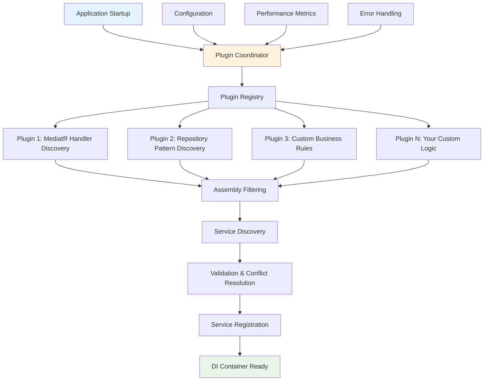
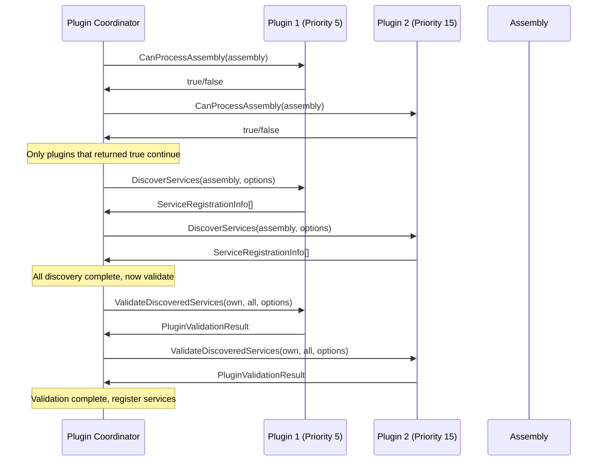

# Plugin Architecture Guide

Imagine you're building a house and you want to make it "future-proof" - capable of accommodating changes and additions you can't even imagine today. You would design it with standardized electrical outlets, plumbing connections, and structural mounting points that allow new devices and fixtures to be added later without rewiring the entire house. The plugin architecture works exactly this way: it provides standardized "connection points" that allow new service discovery strategies to be added to your application without modifying the core discovery system.

The plugin system transforms the discovery framework from a closed, predefined set of behaviors into an open, extensible platform where different teams, libraries, and even third-party vendors can contribute their own specialized discovery logic.

## 🎯 Understanding the Plugin Philosophy

Before diving into the technical details, let's establish the fundamental philosophy behind the plugin architecture. At its heart, this system is built on the recognition that different parts of your application - and different applications entirely - have fundamentally different needs when it comes to service discovery.

Consider these scenarios:
- A web application using MediatR needs to discover request handlers automatically
- A domain-driven design application wants to register aggregate roots as singleton services
- A microservice needs to register gRPC clients based on service discovery information
- A legacy application needs to wrap old-style factory classes as modern dependency injection services

Each of these scenarios requires different discovery logic, but they all share the same fundamental need: finding types in assemblies and registering them appropriately with the dependency injection container. The plugin architecture provides a standardized way to extend the discovery system for these specialized scenarios.

### The Plugin as a Specialist

Think of each plugin as a specialist consultant brought in to solve a specific problem. Just as you might hire a security expert to assess your building's vulnerabilities or an efficiency expert to optimize your workflows, each plugin brings specialized knowledge about how to discover and register a particular category of services.

The core discovery system acts as a coordinator that manages these specialists, ensuring they work together harmoniously and don't interfere with each other's work. This coordination is crucial because plugins need to:
- Process assemblies in the right order
- Avoid conflicts when multiple plugins want to register the same service
- Share information about what they've discovered
- Report problems and validation issues consistently

## 🏗️ Plugin Architecture Overview

The plugin system follows a sophisticated coordination pattern that balances flexibility with reliability. Let's explore how all the pieces fit together:



### The Coordination Process

The plugin coordinator manages a sophisticated workflow that ensures reliable, predictable behavior even when multiple independent plugins are working together:

1. **Registration Phase**: Plugins are registered with the coordinator, which organizes them by priority and validates their compatibility
2. **Discovery Phase**: Each plugin examines assemblies to determine if it can contribute to service discovery
3. **Processing Phase**: Plugins that can contribute are executed in priority order
4. **Validation Phase**: All discovered services are validated for conflicts and consistency
5. **Integration Phase**: Results from all plugins are merged into a unified set of service registrations

This workflow ensures that plugins can work independently while still participating in a coordinated discovery process.

## 🔌 Understanding Plugin Interfaces

The plugin system defines clear contracts that plugins must implement. Understanding these interfaces is key to both using existing plugins and creating your own.

### The Core Plugin Interface

Every plugin implements `IServiceDiscoveryPlugin`, which defines the essential behavior:

```csharp
public interface IServiceDiscoveryPlugin
{
    string Name { get; }                                    // Unique identifier for logging and debugging
    int Priority { get; }                                   // Execution order (lower = higher priority)
    bool CanProcessAssembly(Assembly assembly);             // Quick filter to avoid unnecessary work
    IEnumerable<ServiceRegistrationInfo> DiscoverServices( // Main discovery logic
        Assembly assembly, AutoServiceOptions options);
    PluginValidationResult ValidateDiscoveredServices(     // Post-discovery validation
        IEnumerable<ServiceRegistrationInfo> discoveredServices,
        IEnumerable<ServiceRegistrationInfo> allServices,
        AutoServiceOptions options);
}
```

Let's explore each method and understand how they work together to create reliable plugin behavior.

### Assembly Filtering: The Performance Gateway

The `CanProcessAssembly` method serves as a performance optimization and responsibility boundary. It allows plugins to quickly determine whether they should spend time examining an assembly:

```csharp
public class MediatRPlugin : IServiceDiscoveryPlugin
{
    public string Name => "MediatR Handler Discovery";
    public int Priority => 20; // Run after core discovery but before custom plugins

    public bool CanProcessAssembly(Assembly assembly)
    {
        // Quick check: does this assembly reference MediatR?
        return assembly.GetReferencedAssemblies()
            .Any(name => name.Name?.Equals("MediatR", StringComparison.OrdinalIgnoreCase) == true);
    }
    
    // ... other methods
}
```

This filtering approach provides several benefits:
- **Performance**: Plugins don't waste time examining assemblies they can't help with
- **Clarity**: The filtering logic documents what each plugin is responsible for
- **Reliability**: Plugins won't accidentally interfere with assemblies they don't understand

### Service Discovery: The Core Logic

The `DiscoverServices` method contains the main plugin logic. This is where the plugin examines types in an assembly and determines what services should be registered:

```csharp
public IEnumerable<ServiceRegistrationInfo> DiscoverServices(Assembly assembly, AutoServiceOptions options)
{
    var services = new List<ServiceRegistrationInfo>();
    
    try
    {
        // Get all types that implement IRequest or IRequestHandler interfaces
        var handlerTypes = assembly.GetTypes()
            .Where(type => 
                type.IsClass && 
                !type.IsAbstract &&
                IsMediatrHandler(type))
            .ToList();

        foreach (var handlerType in handlerTypes)
        {
            if (options.EnableLogging)
            {
                Console.WriteLine($"MediatR Plugin: Found handler {handlerType.Name}");
            }

            var serviceInfo = new ServiceRegistrationInfo
            {
                ServiceType = GetHandlerInterface(handlerType),
                ImplementationType = handlerType,
                Lifetime = ServiceLifetime.Scoped, // MediatR handlers are typically scoped
                Order = 0
            };

            services.Add(serviceInfo);
        }
    }
    catch (ReflectionTypeLoadException ex)
    {
        // Handle assembly loading issues gracefully
        if (options.EnableLogging)
        {
            Console.WriteLine($"MediatR Plugin: Could not load some types from {assembly.GetName().Name}: {ex.Message}");
        }
        
        // Continue with the types that did load
        var loadableTypes = ex.Types.Where(t => t != null);
        // Process loadable types...
    }

    return services;
}

private bool IsMediatrHandler(Type type)
{
    return type.GetInterfaces().Any(i => 
        i.IsGenericType && (
            i.GetGenericTypeDefinition() == typeof(IRequestHandler<>) ||
            i.GetGenericTypeDefinition() == typeof(IRequestHandler<,>) ||
            i.GetGenericTypeDefinition() == typeof(INotificationHandler<>)));
}

private Type GetHandlerInterface(Type handlerType)
{
    // Find the specific MediatR interface this handler implements
    return handlerType.GetInterfaces()
        .First(i => i.IsGenericType && 
                   i.GetGenericTypeDefinition().Name.Contains("Handler"));
}
```

This example demonstrates several important plugin patterns:
- **Error Handling**: The plugin handles reflection errors gracefully rather than crashing the entire discovery process
- **Logging Integration**: The plugin respects the global logging settings
- **Convention-Based Discovery**: The plugin uses MediatR's interface conventions to identify handlers

### Validation: Ensuring System Integrity

The validation phase allows plugins to check their discoveries and ensure they won't cause problems when integrated with the rest of the system:

```csharp
public PluginValidationResult ValidateDiscoveredServices(
    IEnumerable<ServiceRegistrationInfo> discoveredServices,
    IEnumerable<ServiceRegistrationInfo> allServices,
    AutoServiceOptions options)
{
    var result = PluginValidationResult.Success();
    var discoveredList = discoveredServices.ToList();

    // Check for duplicate handler registrations
    var duplicates = discoveredList
        .GroupBy(s => s.ServiceType)
        .Where(g => g.Count() > 1)
        .ToList();

    foreach (var duplicate in duplicates)
    {
        result.AddError($"Multiple handlers found for {duplicate.Key.Name}: {string.Join(", ", duplicate.Select(d => d.ImplementationType.Name))}");
    }

    // Check that request types have corresponding handlers
    var requestTypes = discoveredList
        .Select(s => s.ServiceType)
        .Where(t => t.IsGenericType && t.GetGenericArguments().Length > 0)
        .Select(t => t.GetGenericArguments()[0])
        .Distinct()
        .ToList();

    foreach (var requestType in requestTypes)
    {
        var hasHandler = discoveredList.Any(s => 
            s.ServiceType.IsGenericType && 
            s.ServiceType.GetGenericArguments().Contains(requestType));

        if (!hasHandler)
        {
            result.AddWarning($"Request type {requestType.Name} found but no corresponding handler discovered");
        }
    }

    // Provide summary information
    result.AddInformation($"MediatR Plugin discovered {discoveredList.Count} handlers for {requestTypes.Count} request types");

    return result;
}
```

The validation phase serves multiple important purposes:
- **Conflict Detection**: Identifies situations where multiple plugins might register conflicting services
- **Completeness Checking**: Ensures that discovered services have all their dependencies
- **Quality Assurance**: Validates that the discovered services follow expected patterns and conventions

## 🔧 Built-in Plugin Examples

To help you understand how plugins work in practice, let's examine some built-in plugins that handle common scenarios.

### MediatR Handler Discovery Plugin

MediatR is a popular library for implementing the mediator pattern in .NET applications. The MediatR plugin automatically discovers and registers request handlers:

```csharp
public class MediatRDiscoveryPlugin : IServiceDiscoveryPlugin
{
    public string Name => "MediatR Handler Discovery";
    public int Priority => 20;

    public bool CanProcessAssembly(Assembly assembly)
    {
        // Only process assemblies that reference MediatR
        return assembly.GetReferencedAssemblies()
            .Any(name => name.Name?.Contains("MediatR") == true);
    }

    public IEnumerable<ServiceRegistrationInfo> DiscoverServices(Assembly assembly, AutoServiceOptions options)
    {
        var services = new List<ServiceRegistrationInfo>();

        // Discover request handlers
        var requestHandlers = assembly.GetTypes()
            .Where(type => 
                type.IsClass && 
                !type.IsAbstract &&
                type.GetInterfaces().Any(i => 
                    i.IsGenericType && 
                    i.GetGenericTypeDefinition() == typeof(IRequestHandler<>)))
            .ToList();

        foreach (var handler in requestHandlers)
        {
            var handlerInterface = handler.GetInterfaces()
                .First(i => i.IsGenericType && i.GetGenericTypeDefinition() == typeof(IRequestHandler<>));

            services.Add(new ServiceRegistrationInfo
            {
                ServiceType = handlerInterface,
                ImplementationType = handler,
                Lifetime = ServiceLifetime.Scoped,
                Order = 0
            });
        }

        // Discover notification handlers
        var notificationHandlers = assembly.GetTypes()
            .Where(type => 
                type.IsClass && 
                !type.IsAbstract &&
                type.GetInterfaces().Any(i => 
                    i.IsGenericType && 
                    i.GetGenericTypeDefinition() == typeof(INotificationHandler<>)))
            .ToList();

        foreach (var handler in notificationHandlers)
        {
            var handlerInterface = handler.GetInterfaces()
                .First(i => i.IsGenericType && i.GetGenericTypeDefinition() == typeof(INotificationHandler<>));

            services.Add(new ServiceRegistrationInfo
            {
                ServiceType = handlerInterface,
                ImplementationType = handler,
                Lifetime = ServiceLifetime.Scoped,
                Order = 0
            });
        }

        return services;
    }

    public PluginValidationResult ValidateDiscoveredServices(
        IEnumerable<ServiceRegistrationInfo> discoveredServices,
        IEnumerable<ServiceRegistrationInfo> allServices,
        AutoServiceOptions options)
    {
        var result = PluginValidationResult.Success();
        
        // Validate that we don't have conflicting handler registrations
        var handlerGroups = discoveredServices
            .GroupBy(s => s.ServiceType)
            .Where(g => g.Count() > 1);

        foreach (var group in handlerGroups)
        {
            result.AddError($"Multiple handlers registered for {group.Key.Name}");
        }

        return result;
    }
}
```

### Repository Pattern Discovery Plugin

For applications using the repository pattern, this plugin automatically discovers and registers repositories:

```csharp
public class RepositoryDiscoveryPlugin : IServiceDiscoveryPlugin
{
    public string Name => "Repository Pattern Discovery";
    public int Priority => 25;

    public bool CanProcessAssembly(Assembly assembly)
    {
        // Look for types that follow repository naming conventions
        return assembly.GetTypes().Any(type => 
            type.Name.EndsWith("Repository") && 
            type.IsClass && 
            !type.IsAbstract);
    }

    public IEnumerable<ServiceRegistrationInfo> DiscoverServices(Assembly assembly, AutoServiceOptions options)
    {
        var services = new List<ServiceRegistrationInfo>();

        var repositoryTypes = assembly.GetTypes()
            .Where(type => 
                type.IsClass && 
                !type.IsAbstract &&
                type.Name.EndsWith("Repository") &&
                !type.GetCustomAttributes<ServiceRegistrationAttribute>().Any()) // Avoid duplicates
            .ToList();

        foreach (var repoType in repositoryTypes)
        {
            // Look for a matching interface (IUserRepository for UserRepository)
            var expectedInterfaceName = $"I{repoType.Name}";
            var repoInterface = repoType.GetInterfaces()
                .FirstOrDefault(i => i.Name == expectedInterfaceName);

            if (repoInterface != null)
            {
                services.Add(new ServiceRegistrationInfo
                {
                    ServiceType = repoInterface,
                    ImplementationType = repoType,
                    Lifetime = ServiceLifetime.Scoped, // Repositories are typically scoped
                    Order = 10 // Register repositories after basic services
                });

                if (options.EnableLogging)
                {
                    Console.WriteLine($"Repository Plugin: Registered {repoInterface.Name} -> {repoType.Name}");
                }
            }
        }

        return services;
    }

    public PluginValidationResult ValidateDiscoveredServices(
        IEnumerable<ServiceRegistrationInfo> discoveredServices,
        IEnumerable<ServiceRegistrationInfo> allServices,
        AutoServiceOptions options)
    {
        var result = PluginValidationResult.Success();
        
        // Check that repositories have appropriate dependencies
        foreach (var service in discoveredServices)
        {
            var constructors = service.ImplementationType.GetConstructors();
            var hasDbContext = constructors.Any(c => 
                c.GetParameters().Any(p => 
                    p.ParameterType.Name.Contains("DbContext") ||
                    p.ParameterType.Name.Contains("Database")));

            if (!hasDbContext)
            {
                result.AddWarning($"Repository {service.ImplementationType.Name} doesn't appear to have database dependencies");
            }
        }

        result.AddInformation($"Repository Plugin discovered {discoveredServices.Count()} repositories");
        return result;
    }
}
```

## 🚀 Creating Custom Plugins

Now that you understand how plugins work, let's create a custom plugin that solves a real-world problem. We'll build a plugin that automatically discovers and registers API client classes.

### Custom Plugin: API Client Discovery

Many applications need to communicate with external APIs and use client classes to encapsulate this communication. This plugin automatically discovers and registers these clients:

```csharp
public class ApiClientDiscoveryPlugin : IServiceDiscoveryPlugin
{
    public string Name => "API Client Discovery";
    public int Priority => 30; // Run after core services but before custom business logic

    public bool CanProcessAssembly(Assembly assembly)
    {
        // Look for classes that follow API client naming conventions
        return assembly.GetTypes().Any(type => 
            (type.Name.EndsWith("Client") || type.Name.EndsWith("ApiClient")) &&
            type.IsClass && 
            !type.IsAbstract);
    }

    public IEnumerable<ServiceRegistrationInfo> DiscoverServices(Assembly assembly, AutoServiceOptions options)
    {
        var services = new List<ServiceRegistrationInfo>();

        var clientTypes = assembly.GetTypes()
            .Where(type => 
                type.IsClass && 
                !type.IsAbstract &&
                (type.Name.EndsWith("Client") || type.Name.EndsWith("ApiClient")) &&
                HasHttpClientDependency(type))
            .ToList();

        foreach (var clientType in clientTypes)
        {
            // Determine the appropriate service interface
            var serviceInterface = DetermineServiceInterface(clientType);
            
            if (serviceInterface != null)
            {
                // API clients are typically registered as singletons for performance
                // since they're stateless and expensive to create
                services.Add(new ServiceRegistrationInfo
                {
                    ServiceType = serviceInterface,
                    ImplementationType = clientType,
                    Lifetime = ServiceLifetime.Singleton,
                    Order = 5 // Register early so other services can depend on them
                });

                if (options.EnableLogging)
                {
                    Console.WriteLine($"API Client Plugin: Registered {serviceInterface.Name} -> {clientType.Name}");
                }
            }
        }

        return services;
    }

    public PluginValidationResult ValidateDiscoveredServices(
        IEnumerable<ServiceRegistrationInfo> discoveredServices,
        IEnumerable<ServiceRegistrationInfo> allServices,
        AutoServiceOptions options)
    {
        var result = PluginValidationResult.Success();

        foreach (var service in discoveredServices)
        {
            // Validate that API clients have proper HttpClient dependencies
            if (!HasValidHttpClientConfiguration(service.ImplementationType))
            {
                result.AddWarning($"API Client {service.ImplementationType.Name} may not be properly configured for HttpClient injection");
            }

            // Check for proper error handling
            if (!HasProperErrorHandling(service.ImplementationType))
            {
                result.AddWarning($"API Client {service.ImplementationType.Name} should implement proper error handling for network failures");
            }
        }

        // Provide summary information
        result.AddInformation($"API Client Plugin discovered {discoveredServices.Count()} API clients");

        return result;
    }

    private bool HasHttpClientDependency(Type type)
    {
        return type.GetConstructors().Any(c => 
            c.GetParameters().Any(p => 
                p.ParameterType == typeof(HttpClient) ||
                p.ParameterType == typeof(IHttpClientFactory)));
    }

    private Type? DetermineServiceInterface(Type clientType)
    {
        // Look for matching interface (IUserApiClient for UserApiClient)
        var expectedInterfaceName = $"I{clientType.Name}";
        var matchingInterface = clientType.GetInterfaces()
            .FirstOrDefault(i => i.Name == expectedInterfaceName);

        if (matchingInterface != null)
            return matchingInterface;

        // Fallback: look for any interface that isn't a system interface
        return clientType.GetInterfaces()
            .FirstOrDefault(i => !i.Name.StartsWith("System."));
    }

    private bool HasValidHttpClientConfiguration(Type clientType)
    {
        // Check if the constructor properly accepts HttpClient or IHttpClientFactory
        var constructors = clientType.GetConstructors();
        return constructors.Any(c => 
            c.GetParameters().Any(p => 
                p.ParameterType == typeof(HttpClient) ||
                p.ParameterType == typeof(IHttpClientFactory)));
    }

    private bool HasProperErrorHandling(Type clientType)
    {
        // This is a simplified check - in practice you might look for specific methods or attributes
        var methods = clientType.GetMethods(BindingFlags.Public | BindingFlags.Instance);
        return methods.Any(m => 
            m.ReturnType.IsGenericType &&
            m.ReturnType.GetGenericTypeDefinition() == typeof(Task<>) &&
            m.GetParameters().Any(p => p.ParameterType == typeof(CancellationToken)));
    }
}
```

### Using Your Custom Plugin

Once you've created your plugin, using it is straightforward:

```csharp
// Register the plugin with the discovery system
builder.Services.AddServiceDiscoveryPlugin<ApiClientDiscoveryPlugin>();

// Or use it with fluent configuration
builder.Services.ConfigureAutoServices()
    .FromCurrentDomain()
    .WithPlugin<ApiClientDiscoveryPlugin>()
    .WithProfile("Production")
    .Apply();

// Or register a pre-configured instance
var apiPlugin = new ApiClientDiscoveryPlugin();
builder.Services.ConfigureAutoServices()
    .FromCurrentDomain()
    .WithPlugin(apiPlugin)
    .Apply();
```

## 🔄 Plugin Coordination and Lifecycle

Understanding how plugins are coordinated helps you write better plugins and troubleshoot issues when multiple plugins are working together.

### Plugin Execution Order

Plugins are executed in priority order, with lower numbers having higher priority:

```csharp
public class HighPriorityPlugin : IServiceDiscoveryPlugin
{
    public int Priority => 5; // Runs first
    // ...
}

public class MediumPriorityPlugin : IServiceDiscoveryPlugin  
{
    public int Priority => 15; // Runs second
    // ...
}

public class LowPriorityPlugin : IServiceDiscoveryPlugin
{
    public int Priority => 25; // Runs last
    // ...
}
```

### Plugin Lifecycle Phases

Each plugin goes through a well-defined lifecycle:



### Error Isolation and Recovery

The plugin system is designed to isolate errors so that one plugin's failure doesn't break the entire discovery process:

```csharp
public class RobustPlugin : IServiceDiscoveryPlugin
{
    public IEnumerable<ServiceRegistrationInfo> DiscoverServices(Assembly assembly, AutoServiceOptions options)
    {
        var services = new List<ServiceRegistrationInfo>();
        
        try
        {
            // Your discovery logic here
            var types = assembly.GetTypes(); // This might throw ReflectionTypeLoadException
            
            foreach (var type in types)
            {
                try
                {
                    // Process individual type
                    if (ShouldRegister(type))
                    {
                        services.Add(CreateServiceInfo(type));
                    }
                }
                catch (Exception ex)
                {
                    // Log individual type failures but continue processing
                    if (options.EnableLogging)
                    {
                        Console.WriteLine($"Plugin {Name}: Failed to process type {type.Name}: {ex.Message}");
                    }
                }
            }
        }
        catch (ReflectionTypeLoadException ex)
        {
            // Handle assembly loading issues gracefully
            if (options.EnableLogging)
            {
                Console.WriteLine($"Plugin {Name}: Could not load all types from {assembly.GetName().Name}");
            }
            
            // Process the types that did load successfully
            var loadableTypes = ex.Types.Where(t => t != null);
            foreach (var type in loadableTypes)
            {
                // Process available types...
            }
        }
        catch (Exception ex)
        {
            // For any other unexpected errors, log and return what we have
            if (options.EnableLogging)
            {
                Console.WriteLine($"Plugin {Name}: Unexpected error processing {assembly.GetName().Name}: {ex.Message}");
            }
        }
        
        return services;
    }
}
```

## 📊 Plugin Performance and Monitoring

When working with plugins, monitoring their performance and behavior becomes important, especially in production applications.

### Performance Metrics Integration

The plugin system automatically collects performance metrics for each plugin:

```csharp
public class MonitoredPlugin : IServiceDiscoveryPlugin
{
    private readonly ILogger<MonitoredPlugin> _logger;

    public MonitoredPlugin(ILogger<MonitoredPlugin> logger)
    {
        _logger = logger;
    }

    public IEnumerable<ServiceRegistrationInfo> DiscoverServices(Assembly assembly, AutoServiceOptions options)
    {
        var stopwatch = System.Diagnostics.Stopwatch.StartNew();
        
        try
        {
            var services = PerformDiscovery(assembly, options);
            
            stopwatch.Stop();
            _logger.LogInformation("Plugin {PluginName} processed {AssemblyName} in {ElapsedMs}ms, found {ServiceCount} services",
                Name, assembly.GetName().Name, stopwatch.ElapsedMilliseconds, services.Count());
            
            return services;
        }
        catch (Exception ex)
        {
            stopwatch.Stop();
            _logger.LogError(ex, "Plugin {PluginName} failed processing {AssemblyName} after {ElapsedMs}ms",
                Name, assembly.GetName().Name, stopwatch.ElapsedMilliseconds);
            throw;
        }
    }
    
    private List<ServiceRegistrationInfo> PerformDiscovery(Assembly assembly, AutoServiceOptions options)
    {
        // Your actual discovery logic here
        return new List<ServiceRegistrationInfo>();
    }
}
```

### Plugin Statistics and Debugging

You can access detailed statistics about plugin performance:

```csharp
// In a controller or diagnostic endpoint
public class PluginDiagnosticsController : ControllerBase
{
    private readonly IPluginCoordinator _coordinator;

    public PluginDiagnosticsController(IPluginCoordinator coordinator)
    {
        _coordinator = coordinator;
    }

    [HttpGet("plugin-stats")]
    public IActionResult GetPluginStatistics()
    {
        var stats = _coordinator.GetStatistics();
        
        return Ok(new
        {
            TotalExecutions = stats.TotalExecutions,
            SuccessfulExecutions = stats.SuccessfulExecutions,
            TotalPluginsExecuted = stats.TotalPluginsExecuted,
            TotalServicesDiscovered = stats.TotalServicesDiscovered,
            RegisteredPlugins = _coordinator.GetRegisteredPlugins().Select(p => new
            {
                p.Name,
                p.Priority,
                p.TypeName,
                p.IsActive
            })
        });
    }
}
```

## 🎯 Best Practices for Plugin Development

Based on extensive experience with plugin development, here are the key practices that lead to reliable, maintainable plugins:

### 1. Keep Plugins Focused and Single-Purpose

Each plugin should have a clear, single responsibility:

```csharp
// ✅ Good - focused on one specific framework
public class FluentValidationPlugin : IServiceDiscoveryPlugin
{
    // Only discovers FluentValidation validators
}

// ❌ Bad - tries to handle multiple unrelated concerns  
public class EverythingPlugin : IServiceDiscoveryPlugin
{
    // Discovers validators, handlers, repositories, clients, etc.
    // This becomes hard to maintain and debug
}
```

### 2. Use Defensive Programming Techniques

Always assume that assemblies and types might have unexpected characteristics:

```csharp
public IEnumerable<ServiceRegistrationInfo> DiscoverServices(Assembly assembly, AutoServiceOptions options)
{
    var services = new List<ServiceRegistrationInfo>();
    
    try
    {
        var types = assembly.GetTypes();
        
        foreach (var type in types.Where(t => t != null)) // Null check
        {
            if (type.IsClass && !type.IsAbstract && !type.IsGenericTypeDefinition) // Sanity checks
            {
                // Process type safely
                var serviceInfo = TryCreateServiceInfo(type);
                if (serviceInfo != null)
                {
                    services.Add(serviceInfo);
                }
            }
        }
    }
    catch (ReflectionTypeLoadException ex)
    {
        // Handle partial assembly loading
        ProcessLoadableTypes(ex.Types.Where(t => t != null), services);
    }
    
    return services;
}
```

### 3. Provide Clear, Actionable Validation Messages

When validation fails, provide specific information about what's wrong and how to fix it:

```csharp
public PluginValidationResult ValidateDiscoveredServices(...)
{
    var result = PluginValidationResult.Success();
    
    foreach (var service in discoveredServices)
    {
        if (HasConfigurationIssue(service))
        {
            // ✅ Specific, actionable error message
            result.AddError($"Service {service.ImplementationType.Name} is missing required configuration. " +
                          $"Add a connection string named '{GetRequiredConnectionStringName(service)}' to your appsettings.json");
        }
    }
    
    return result;
}
```

### 4. Use Appropriate Service Lifetimes

Different types of services have different appropriate lifetimes:

```csharp
private ServiceLifetime DetermineAppropriateLifetime(Type serviceType)
{
    // API clients are typically stateless and expensive to create
    if (serviceType.Name.EndsWith("Client") || serviceType.Name.EndsWith("ApiClient"))
        return ServiceLifetime.Singleton;
    
    // Repositories typically need request scope for transaction management
    if (serviceType.Name.EndsWith("Repository"))
        return ServiceLifetime.Scoped;
    
    // Event handlers are usually lightweight and stateless
    if (IsEventHandler(serviceType))
        return ServiceLifetime.Transient;
    
    // Default to scoped for business services
    return ServiceLifetime.Scoped;
}
```

## 🔗 Integration with Existing Systems

Plugins work seamlessly with other features of the discovery system, creating powerful combinations.

### Integration with Conditional Registration

Plugins can respect conditional registration attributes:

```csharp
public IEnumerable<ServiceRegistrationInfo> DiscoverServices(Assembly assembly, AutoServiceOptions options)
{
    var services = new List<ServiceRegistrationInfo>();
    
    foreach (var type in GetCandidateTypes(assembly))
    {
        // Check if the type has conditional registration requirements
        var conditionalAttributes = type.GetCustomAttributes<ConditionalServiceAttribute>();
        
        var serviceInfo = new ServiceRegistrationInfo
        {
            ServiceType = DetermineServiceType(type),
            ImplementationType = type,
            Lifetime = DetermineLifetime(type),
            ConditionalAttributes = conditionalAttributes.ToArray()
        };
        
        services.Add(serviceInfo);
    }
    
    return services;
}
```

### Integration with Performance Optimization

Plugins automatically benefit from performance optimizations like caching and parallel processing:

```csharp
// The plugin coordinator automatically handles performance optimization
builder.Services.AddAutoServicesWithPerformanceOptimizations(options =>
{
    options.EnableParallelProcessing = true; // Plugins run in parallel when beneficial
    options.EnablePerformanceMetrics = true; // Plugin performance is automatically tracked
});
```

## 🎓 Advanced Plugin Patterns

For complex scenarios, you can implement sophisticated plugin patterns that provide even more flexibility and power.

### Composable Plugin Pattern

Create plugins that can work together to solve complex problems:

```csharp
public class BaseInfrastructurePlugin : IServiceDiscoveryPlugin
{
    protected virtual bool IsInfrastructureType(Type type)
    {
        return type.Namespace?.Contains(".Infrastructure") == true;
    }
    
    // Shared infrastructure discovery logic
}

public class DatabasePlugin : BaseInfrastructurePlugin
{
    public IEnumerable<ServiceRegistrationInfo> DiscoverServices(Assembly assembly, AutoServiceOptions options)
    {
        return assembly.GetTypes()
            .Where(t => IsInfrastructureType(t) && IsDatabaseRelated(t))
            .Select(CreateDatabaseServiceInfo);
    }
}

public class CachePlugin : BaseInfrastructurePlugin  
{
    public IEnumerable<ServiceRegistrationInfo> DiscoverServices(Assembly assembly, AutoServiceOptions options)
    {
        return assembly.GetTypes()
            .Where(t => IsInfrastructureType(t) && IsCacheRelated(t))
            .Select(CreateCacheServiceInfo);
    }
}
```

### Configuration-Driven Plugin Pattern

Create plugins that adapt their behavior based on configuration:

```csharp
public class ConfigurableRepositoryPlugin : IServiceDiscoveryPlugin
{
    private readonly IConfiguration _configuration;

    public ConfigurableRepositoryPlugin(IConfiguration configuration)
    {
        _configuration = configuration;
    }

    public IEnumerable<ServiceRegistrationInfo> DiscoverServices(Assembly assembly, AutoServiceOptions options)
    {
        var repositoryConfig = _configuration.GetSection("RepositoryDiscovery");
        var includePatterns = repositoryConfig.GetSection("IncludePatterns").Get<string[]>() ?? new[] { "*Repository" };
        var excludePatterns = repositoryConfig.GetSection("ExcludePatterns").Get<string[]>() ?? new string[0];
        var defaultLifetime = repositoryConfig.GetValue<ServiceLifetime>("DefaultLifetime", ServiceLifetime.Scoped);

        return assembly.GetTypes()
            .Where(type => MatchesPatterns(type, includePatterns, excludePatterns))
            .Select(type => CreateServiceInfo(type, defaultLifetime));
    }
}
```

## 🔗 Next Steps

The plugin architecture provides powerful extensibility for specialized service discovery scenarios. Now that you understand how to create and use plugins effectively, explore these related topics:

1. **[Plugin Development](PluginDevelopment.md)** - Deep dive into creating sophisticated plugins
2. **[Performance Optimization](PerformanceOptimization.md)** - Understand how plugins integrate with performance features
3. **[Custom Naming Conventions](CustomNamingConventions.md)** - Create custom naming logic that works with plugins

The plugin system transforms the discovery framework from a fixed set of behaviors into an extensible platform. Master these concepts, and you'll be able to handle even the most specialized service discovery requirements while maintaining clean, maintainable code.