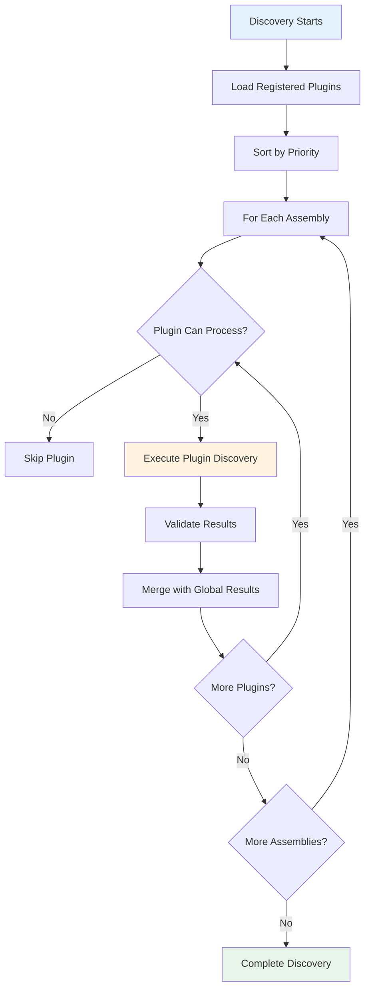

# Plugin Development Guide

Creating custom service discovery plugins enables you to extend the discovery system with specialized logic that goes beyond the standard attribute-based approach. Think of plugins as specialized experts you can bring into your discovery process - each one knows how to find and register a specific category of services that might not follow the standard patterns.

This guide will take you from understanding the plugin architecture to creating sophisticated, production-ready plugins that integrate seamlessly with the discovery system.

## 🎯 Understanding Plugin Development

Plugin development is about creating specialized discovery strategies that can identify and register services based on patterns that aren't covered by the standard `[ServiceRegistration]` attribute approach. Common scenarios include:

- **Framework Integration**: Discovering MediatR handlers, FluentValidation validators, or AutoMapper profiles
- **Convention-Based Discovery**: Finding services based on naming patterns or inheritance hierarchies
- **Configuration-Driven Discovery**: Registering services based on external configuration or metadata
- **Legacy System Integration**: Adapting old-style service patterns to modern dependency injection

### The Plugin Lifecycle

Understanding how plugins integrate into the discovery process helps you design effective plugins:



## 🏗️ Creating Your First Plugin

Let's start with a simple plugin that demonstrates the core concepts. We'll create a plugin that discovers services based on a specific interface pattern.

### Basic Plugin Structure

```csharp
using System.Reflection;
using FS.AutoServiceDiscovery.Extensions.Architecture;
using FS.AutoServiceDiscovery.Extensions.Configuration;

public class InterfacePatternPlugin : IServiceDiscoveryPlugin
{
    public string Name => "Interface Pattern Discovery";
    public int Priority => 20; // Higher numbers = lower priority

    public bool CanProcessAssembly(Assembly assembly)
    {
        // Quick check: does this assembly contain types that might match our pattern?
        return assembly.GetTypes().Any(type => 
            type.IsClass && 
            !type.IsAbstract && 
            type.GetInterfaces().Any(i => i.Name.EndsWith("Handler")));
    }

    public IEnumerable<ServiceRegistrationInfo> DiscoverServices(Assembly assembly, AutoServiceOptions options)
    {
        var services = new List<ServiceRegistrationInfo>();

        try
        {
            // Find all classes that implement interfaces ending with "Handler"
            var handlerTypes = assembly.GetTypes()
                .Where(type => 
                    type.IsClass && 
                    !type.IsAbstract &&
                    type.GetInterfaces().Any(i => i.Name.EndsWith("Handler")))
                .ToList();

            foreach (var handlerType in handlerTypes)
            {
                // Find the primary handler interface
                var handlerInterface = handlerType.GetInterfaces()
                    .FirstOrDefault(i => i.Name.EndsWith("Handler"));

                if (handlerInterface != null)
                {
                    services.Add(new ServiceRegistrationInfo
                    {
                        ServiceType = handlerInterface,
                        ImplementationType = handlerType,
                        Lifetime = ServiceLifetime.Scoped,
                        Order = 0
                    });

                    if (options.EnableLogging)
                    {
                        Console.WriteLine($"Interface Pattern Plugin: Found {handlerInterface.Name} -> {handlerType.Name}");
                    }
                }
            }
        }
        catch (ReflectionTypeLoadException ex)
        {
            // Handle assembly loading issues gracefully
            if (options.EnableLogging)
            {
                Console.WriteLine($"Interface Pattern Plugin: Could not load some types from {assembly.GetName().Name}: {ex.Message}");
            }
        }

        return services;
    }

    public PluginValidationResult ValidateDiscoveredServices(
        IEnumerable<ServiceRegistrationInfo> discoveredServices,
        IEnumerable<ServiceRegistrationInfo> allServices,
        AutoServiceOptions options)
    {
        var result = PluginValidationResult.Success();
        
        // Validate that we don't have conflicting registrations
        var duplicates = discoveredServices
            .GroupBy(s => s.ServiceType)
            .Where(g => g.Count() > 1)
            .ToList();

        foreach (var duplicate in duplicates)
        {
            result.AddError($"Multiple implementations found for {duplicate.Key.Name}");
        }

        result.AddInformation($"Interface Pattern Plugin discovered {discoveredServices.Count()} handler services");
        return result;
    }
}
```

### Registering and Using Your Plugin

```csharp
// Register the plugin with the discovery system
builder.Services.AddServiceDiscoveryPlugin<InterfacePatternPlugin>();

// Or use with fluent configuration
builder.Services.ConfigureAutoServices()
    .FromCurrentDomain()
    .WithPlugin<InterfacePatternPlugin>()
    .WithProfile("Production")
    .Apply();
```

## 🔧 Advanced Plugin Patterns

### Pattern 1: Framework Integration Plugin

This pattern shows how to create plugins that integrate with specific frameworks. Here's a comprehensive MediatR plugin:

```csharp
public class MediatRDiscoveryPlugin : IServiceDiscoveryPlugin
{
    public string Name => "MediatR Handler Discovery";
    public int Priority => 15; // Higher priority than generic plugins

    public bool CanProcessAssembly(Assembly assembly)
    {
        // Check if assembly references MediatR
        return assembly.GetReferencedAssemblies()
            .Any(name => name.Name?.Contains("MediatR") == true);
    }

    public IEnumerable<ServiceRegistrationInfo> DiscoverServices(Assembly assembly, AutoServiceOptions options)
    {
        var services = new List<ServiceRegistrationInfo>();

        // Discover different types of MediatR handlers
        services.AddRange(DiscoverRequestHandlers(assembly, options));
        services.AddRange(DiscoverNotificationHandlers(assembly, options));
        services.AddRange(DiscoverPipelineBehaviors(assembly, options));
        services.AddRange(DiscoverValidators(assembly, options));

        return services;
    }

    private IEnumerable<ServiceRegistrationInfo> DiscoverRequestHandlers(Assembly assembly, AutoServiceOptions options)
    {
        var requestHandlerInterface = typeof(IRequestHandler<>);
        var requestHandlerWithResponseInterface = typeof(IRequestHandler<,>);

        return assembly.GetTypes()
            .Where(type => type.IsClass && !type.IsAbstract)
            .SelectMany(type => type.GetInterfaces()
                .Where(i => i.IsGenericType && (
                    i.GetGenericTypeDefinition() == requestHandlerInterface ||
                    i.GetGenericTypeDefinition() == requestHandlerWithResponseInterface))
                .Select(handlerInterface => new ServiceRegistrationInfo
                {
                    ServiceType = handlerInterface,
                    ImplementationType = type,
                    Lifetime = ServiceLifetime.Scoped,
                    Order = 0
                }));
    }

    private IEnumerable<ServiceRegistrationInfo> DiscoverNotificationHandlers(Assembly assembly, AutoServiceOptions options)
    {
        var notificationHandlerInterface = typeof(INotificationHandler<>);

        return assembly.GetTypes()
            .Where(type => type.IsClass && !type.IsAbstract)
            .SelectMany(type => type.GetInterfaces()
                .Where(i => i.IsGenericType && i.GetGenericTypeDefinition() == notificationHandlerInterface)
                .Select(handlerInterface => new ServiceRegistrationInfo
                {
                    ServiceType = handlerInterface,
                    ImplementationType = type,
                    Lifetime = ServiceLifetime.Scoped,
                    Order = 0
                }));
    }

    private IEnumerable<ServiceRegistrationInfo> DiscoverPipelineBehaviors(Assembly assembly, AutoServiceOptions options)
    {
        var pipelineBehaviorInterface = typeof(IPipelineBehavior<,>);

        return assembly.GetTypes()
            .Where(type => type.IsClass && !type.IsAbstract)
            .Where(type => type.GetInterfaces()
                .Any(i => i.IsGenericType && i.GetGenericTypeDefinition() == pipelineBehaviorInterface))
            .Select(type => new ServiceRegistrationInfo
            {
                ServiceType = pipelineBehaviorInterface,
                ImplementationType = type,
                Lifetime = ServiceLifetime.Transient, // Behaviors are typically transient
                Order = -1 // Register before handlers
            });
    }

    private IEnumerable<ServiceRegistrationInfo> DiscoverValidators(Assembly assembly, AutoServiceOptions options)
    {
        // Look for FluentValidation validators that might be used with MediatR
        return assembly.GetTypes()
            .Where(type => type.IsClass && !type.IsAbstract)
            .Where(type => type.BaseType?.IsGenericType == true && 
                          type.BaseType.GetGenericTypeDefinition().Name.Contains("Validator"))
            .SelectMany(type => type.GetInterfaces()
                .Where(i => i.Name.Contains("Validator"))
                .Select(validatorInterface => new ServiceRegistrationInfo
                {
                    ServiceType = validatorInterface,
                    ImplementationType = type,
                    Lifetime = ServiceLifetime.Scoped,
                    Order = -2 // Register before handlers and behaviors
                }));
    }

    public PluginValidationResult ValidateDiscoveredServices(
        IEnumerable<ServiceRegistrationInfo> discoveredServices,
        IEnumerable<ServiceRegistrationInfo> allServices,
        AutoServiceOptions options)
    {
        var result = PluginValidationResult.Success();
        var servicesList = discoveredServices.ToList();

        // Validate handler-request relationships
        ValidateHandlerRequestRelationships(servicesList, result);
        
        // Validate pipeline behavior ordering
        ValidatePipelineBehaviorOrdering(servicesList, result);
        
        // Provide summary information
        var handlerCount = servicesList.Count(s => s.ServiceType.Name.Contains("Handler"));
        var behaviorCount = servicesList.Count(s => s.ServiceType.Name.Contains("Behavior"));
        
        result.AddInformation($"MediatR Plugin discovered {handlerCount} handlers and {behaviorCount} pipeline behaviors");

        return result;
    }

    private void ValidateHandlerRequestRelationships(List<ServiceRegistrationInfo> services, PluginValidationResult result)
    {
        // Group handlers by request type and validate relationships
        var requestHandlers = services
            .Where(s => s.ServiceType.Name.Contains("RequestHandler"))
            .GroupBy(s => s.ServiceType.GetGenericArguments().FirstOrDefault())
            .Where(g => g.Key != null);

        foreach (var group in requestHandlers)
        {
            if (group.Count() > 1)
            {
                result.AddWarning($"Multiple handlers found for request type {group.Key!.Name}");
            }
        }
    }

    private void ValidatePipelineBehaviorOrdering(List<ServiceRegistrationInfo> services, PluginValidationResult result)
    {
        var behaviors = services.Where(s => s.ServiceType.Name.Contains("Behavior")).ToList();
        
        if (behaviors.Count > 1)
        {
            var orderingIssues = behaviors
                .GroupBy(b => b.Order)
                .Where(g => g.Count() > 1)
                .ToList();

            foreach (var issue in orderingIssues)
            {
                result.AddWarning($"Multiple pipeline behaviors have the same order value ({issue.Key}). Consider adjusting Order values for proper execution sequence.");
            }
        }
    }
}
```

### Pattern 2: Configuration-Driven Plugin

This pattern shows how to create plugins that discover services based on external configuration:

```csharp
public class ConfigurationDrivenPlugin : IServiceDiscoveryPlugin
{
    private readonly IConfiguration _configuration;

    public ConfigurationDrivenPlugin(IConfiguration configuration)
    {
        _configuration = configuration;
    }

    public string Name => "Configuration-Driven Service Discovery";
    public int Priority => 25;

    public bool CanProcessAssembly(Assembly assembly)
    {
        // Check if there's configuration for this assembly
        var assemblyName = assembly.GetName().Name;
        return _configuration.GetSection($"ServiceDiscovery:Assemblies:{assemblyName}").Exists();
    }

    public IEnumerable<ServiceRegistrationInfo> DiscoverServices(Assembly assembly, AutoServiceOptions options)
    {
        var services = new List<ServiceRegistrationInfo>();
        var assemblyName = assembly.GetName().Name;
        var assemblyConfig = _configuration.GetSection($"ServiceDiscovery:Assemblies:{assemblyName}");

        // Get service patterns from configuration
        var servicePatterns = assemblyConfig.GetSection("ServicePatterns").Get<ServicePattern[]>() ?? Array.Empty<ServicePattern>();

        foreach (var pattern in servicePatterns)
        {
            var matchingTypes = assembly.GetTypes()
                .Where(type => MatchesPattern(type, pattern))
                .ToList();

            foreach (var type in matchingTypes)
            {
                var serviceType = DetermineServiceType(type, pattern);
                if (serviceType != null)
                {
                    services.Add(new ServiceRegistrationInfo
                    {
                        ServiceType = serviceType,
                        ImplementationType = type,
                        Lifetime = ParseLifetime(pattern.Lifetime),
                        Order = pattern.Order
                    });

                    if (options.EnableLogging)
                    {
                        Console.WriteLine($"Configuration Plugin: {serviceType.Name} -> {type.Name} (pattern: {pattern.Name})");
                    }
                }
            }
        }

        return services;
    }

    private bool MatchesPattern(Type type, ServicePattern pattern)
    {
        if (!type.IsClass || type.IsAbstract) return false;

        // Check namespace pattern
        if (!string.IsNullOrEmpty(pattern.NamespacePattern))
        {
            var namespaceRegex = new Regex(pattern.NamespacePattern.Replace("*", ".*"));
            if (!namespaceRegex.IsMatch(type.Namespace ?? ""))
                return false;
        }

        // Check class name pattern
        if (!string.IsNullOrEmpty(pattern.ClassNamePattern))
        {
            var nameRegex = new Regex(pattern.ClassNamePattern.Replace("*", ".*"));
            if (!nameRegex.IsMatch(type.Name))
                return false;
        }

        // Check interface requirements
        if (pattern.RequiredInterfaces?.Length > 0)
        {
            var typeInterfaces = type.GetInterfaces().Select(i => i.Name).ToHashSet();
            if (!pattern.RequiredInterfaces.All(required => typeInterfaces.Contains(required)))
                return false;
        }

        return true;
    }

    private Type? DetermineServiceType(Type implementationType, ServicePattern pattern)
    {
        if (!string.IsNullOrEmpty(pattern.InterfacePattern))
        {
            var interfaceRegex = new Regex(pattern.InterfacePattern.Replace("*", ".*"));
            var matchingInterface = implementationType.GetInterfaces()
                .FirstOrDefault(i => interfaceRegex.IsMatch(i.Name));
            
            if (matchingInterface != null)
                return matchingInterface;
        }

        // Fallback to standard convention
        var expectedInterfaceName = $"I{implementationType.Name}";
        return implementationType.GetInterfaces()
            .FirstOrDefault(i => i.Name == expectedInterfaceName) ?? implementationType;
    }

    private ServiceLifetime ParseLifetime(string? lifetime)
    {
        return lifetime?.ToLower() switch
        {
            "singleton" => ServiceLifetime.Singleton,
            "transient" => ServiceLifetime.Transient,
            _ => ServiceLifetime.Scoped
        };
    }

    public PluginValidationResult ValidateDiscoveredServices(
        IEnumerable<ServiceRegistrationInfo> discoveredServices,
        IEnumerable<ServiceRegistrationInfo> allServices,
        AutoServiceOptions options)
    {
        var result = PluginValidationResult.Success();
        
        // Validate configuration consistency
        var configuredPatterns = _configuration.GetSection("ServiceDiscovery:ServicePatterns").Get<ServicePattern[]>() ?? Array.Empty<ServicePattern>();
        
        foreach (var pattern in configuredPatterns)
        {
            var matchingServices = discoveredServices.Count(s => s.Order == pattern.Order);
            if (matchingServices == 0)
            {
                result.AddWarning($"Configuration pattern '{pattern.Name}' matched no services");
            }
        }

        result.AddInformation($"Configuration Plugin processed {configuredPatterns.Length} patterns and discovered {discoveredServices.Count()} services");
        return result;
    }

    public class ServicePattern
    {
        public string Name { get; set; } = string.Empty;
        public string? NamespacePattern { get; set; }
        public string? ClassNamePattern { get; set; }
        public string? InterfacePattern { get; set; }
        public string[]? RequiredInterfaces { get; set; }
        public string Lifetime { get; set; } = "Scoped";
        public int Order { get; set; } = 0;
    }
}
```

### Pattern 3: Dependency Injection Integration Plugin

This pattern shows how to create plugins that work with dependency injection features:

```csharp
public class DIIntegrationPlugin : IServiceDiscoveryPlugin
{
    private readonly IServiceCollection _services;

    public DIIntegrationPlugin(IServiceCollection services)
    {
        _services = services;
    }

    public string Name => "Dependency Injection Integration";
    public int Priority => 10; // High priority to influence other registrations

    public bool CanProcessAssembly(Assembly assembly)
    {
        // Look for types that use specific DI-related attributes or patterns
        return assembly.GetTypes().Any(type =>
            type.GetCustomAttributes().Any(attr => 
                attr.GetType().Name.Contains("Injectable") ||
                attr.GetType().Name.Contains("Service")));
    }

    public IEnumerable<ServiceRegistrationInfo> DiscoverServices(Assembly assembly, AutoServiceOptions options)
    {
        var services = new List<ServiceRegistrationInfo>();

        // Find types with factory methods
        services.AddRange(DiscoverFactoryServices(assembly, options));
        
        // Find types that need decorator patterns
        services.AddRange(DiscoverDecoratorServices(assembly, options));
        
        // Find types that need conditional registration
        services.AddRange(DiscoverConditionalServices(assembly, options));

        return services;
    }

    private IEnumerable<ServiceRegistrationInfo> DiscoverFactoryServices(Assembly assembly, AutoServiceOptions options)
    {
        return assembly.GetTypes()
            .Where(type => type.IsClass && !type.IsAbstract)
            .Where(type => type.GetMethods().Any(m => m.GetCustomAttribute<FactoryMethodAttribute>() != null))
            .Select(type => new ServiceRegistrationInfo
            {
                ServiceType = typeof(Func<>).MakeGenericType(type),
                ImplementationType = type,
                Lifetime = ServiceLifetime.Singleton,
                Order = -10 // Register factories early
            });
    }

    private IEnumerable<ServiceRegistrationInfo> DiscoverDecoratorServices(Assembly assembly, AutoServiceOptions options)
    {
        return assembly.GetTypes()
            .Where(type => type.IsClass && !type.IsAbstract)
            .Where(type => type.GetCustomAttribute<DecoratorAttribute>() != null)
            .Select(type =>
            {
                var decoratorAttr = type.GetCustomAttribute<DecoratorAttribute>()!;
                return new ServiceRegistrationInfo
                {
                    ServiceType = decoratorAttr.ServiceType,
                    ImplementationType = type,
                    Lifetime = ServiceLifetime.Scoped,
                    Order = decoratorAttr.Order
                };
            });
    }

    private IEnumerable<ServiceRegistrationInfo> DiscoverConditionalServices(Assembly assembly, AutoServiceOptions options)
    {
        return assembly.GetTypes()
            .Where(type => type.IsClass && !type.IsAbstract)
            .Where(type => type.GetCustomAttribute<ConditionalRegistrationAttribute>() != null)
            .Where(type => EvaluateCondition(type, options))
            .Select(type =>
            {
                var primaryInterface = type.GetInterfaces().FirstOrDefault() ?? type;
                return new ServiceRegistrationInfo
                {
                    ServiceType = primaryInterface,
                    ImplementationType = type,
                    Lifetime = ServiceLifetime.Scoped,
                    Order = 0
                };
            });
    }

    private bool EvaluateCondition(Type type, AutoServiceOptions options)
    {
        var conditionalAttr = type.GetCustomAttribute<ConditionalRegistrationAttribute>();
        if (conditionalAttr == null) return true;

        // Evaluate the condition based on current context
        return conditionalAttr.Condition switch
        {
            "Development" => options.Profile == "Development",
            "Production" => options.Profile == "Production",
            "Testing" => options.IsTestEnvironment,
            _ => true
        };
    }

    public PluginValidationResult ValidateDiscoveredServices(
        IEnumerable<ServiceRegistrationInfo> discoveredServices,
        IEnumerable<ServiceRegistrationInfo> allServices,
        AutoServiceOptions options)
    {
        var result = PluginValidationResult.Success();

        // Validate factory registrations
        var factoryServices = discoveredServices.Where(s => s.ServiceType.IsGenericType && 
                                                           s.ServiceType.GetGenericTypeDefinition() == typeof(Func<>));
        
        foreach (var factory in factoryServices)
        {
            var producedType = factory.ServiceType.GetGenericArguments()[0];
            var hasImplementation = allServices.Any(s => s.ImplementationType == producedType);
            
            if (!hasImplementation)
            {
                result.AddWarning($"Factory for {producedType.Name} registered but no implementation found");
            }
        }

        // Validate decorator chains
        var decorators = discoveredServices.Where(s => s.ImplementationType.GetCustomAttribute<DecoratorAttribute>() != null);
        ValidateDecoratorChains(decorators, allServices, result);

        result.AddInformation($"DI Integration Plugin discovered {discoveredServices.Count()} specialized registrations");
        return result;
    }

    private void ValidateDecoratorChains(IEnumerable<ServiceRegistrationInfo> decorators, 
                                       IEnumerable<ServiceRegistrationInfo> allServices, 
                                       PluginValidationResult result)
    {
        var decoratorGroups = decorators.GroupBy(d => d.ServiceType);
        
        foreach (var group in decoratorGroups)
        {
            var orderedDecorators = group.OrderBy(d => d.Order).ToList();
            
            // Check for gaps in ordering
            for (int i = 1; i < orderedDecorators.Count; i++)
            {
                if (orderedDecorators[i].Order - orderedDecorators[i-1].Order > 1)
                {
                    result.AddWarning($"Gap in decorator ordering for {group.Key.Name} between order {orderedDecorators[i-1].Order} and {orderedDecorators[i].Order}");
                }
            }
        }
    }

    // Supporting attributes for this plugin
    public class FactoryMethodAttribute : Attribute { }
    
    public class DecoratorAttribute : Attribute
    {
        public Type ServiceType { get; }
        public int Order { get; set; } = 0;
        
        public DecoratorAttribute(Type serviceType)
        {
            ServiceType = serviceType;
        }
    }
    
    public class ConditionalRegistrationAttribute : Attribute
    {
        public string Condition { get; }
        
        public ConditionalRegistrationAttribute(string condition)
        {
            Condition = condition;
        }
    }
}
```

## 🧪 Testing Your Plugins

### Unit Testing Strategy

```csharp
[TestClass]
public class InterfacePatternPluginTests
{
    private InterfacePatternPlugin _plugin;
    private AutoServiceOptions _options;

    [TestInitialize]
    public void Setup()
    {
        _plugin = new InterfacePatternPlugin();
        _options = new AutoServiceOptions { EnableLogging = false };
    }

    [TestMethod]
    public void CanProcessAssembly_ShouldReturnTrue_WhenAssemblyContainsHandlers()
    {
        // Arrange
        var assembly = Assembly.GetExecutingAssembly(); // This test assembly

        // Act
        var canProcess = _plugin.CanProcessAssembly(assembly);

        // Assert
        Assert.IsTrue(canProcess);
    }

    [TestMethod]
    public void DiscoverServices_ShouldFindHandlerServices()
    {
        // Arrange
        var assembly = Assembly.GetExecutingAssembly();

        // Act
        var services = _plugin.DiscoverServices(assembly, _options).ToList();

        // Assert
        Assert.IsTrue(services.Count > 0);
        Assert.IsTrue(services.All(s => s.ServiceType.Name.EndsWith("Handler")));
    }

    [TestMethod]
    public void ValidateDiscoveredServices_ShouldPassValidation()
    {
        // Arrange
        var assembly = Assembly.GetExecutingAssembly();
        var discoveredServices = _plugin.DiscoverServices(assembly, _options);

        // Act
        var validation = _plugin.ValidateDiscoveredServices(discoveredServices, discoveredServices, _options);

        // Assert
        Assert.IsTrue(validation.IsValid);
    }

    // Test service classes for the plugin to discover
    public interface ITestHandler
    {
        void Handle();
    }

    public class TestHandler : ITestHandler
    {
        public void Handle() { }
    }
}
```

### Integration Testing

```csharp
[TestClass]
public class PluginIntegrationTests
{
    [TestMethod]
    public void Plugin_ShouldIntegrateWithDiscoverySystem()
    {
        // Arrange
        var services = new ServiceCollection();
        var configuration = new ConfigurationBuilder().Build();

        // Act
        services.AddAutoServices(options =>
        {
            options.Configuration = configuration;
            options.EnablePlugins = true;
        });

        services.AddServiceDiscoveryPlugin<InterfacePatternPlugin>();
        
        var serviceProvider = services.BuildServiceProvider();

        // Assert
        var discoveredService = serviceProvider.GetService<ITestHandler>();
        Assert.IsNotNull(discoveredService);
        Assert.IsInstanceOfType(discoveredService, typeof(TestHandler));
    }
}
```

## 🎯 Best Practices for Plugin Development

### 1. Make Plugins Focused and Single-Purpose

```csharp
// ✅ Good - focused on one specific pattern
public class RepositoryPlugin : IServiceDiscoveryPlugin
{
    // Only discovers repository pattern services
}

// ❌ Bad - tries to handle too many different concerns
public class EverythingPlugin : IServiceDiscoveryPlugin
{
    // Discovers repositories, handlers, validators, services, etc.
    // This becomes hard to maintain and debug
}
```

### 2. Use Defensive Programming

```csharp
public IEnumerable<ServiceRegistrationInfo> DiscoverServices(Assembly assembly, AutoServiceOptions options)
{
    var services = new List<ServiceRegistrationInfo>();
    
    try
    {
        var types = assembly.GetTypes();
        
        foreach (var type in types.Where(t => t != null))
        {
            if (type.IsClass && !type.IsAbstract && !type.IsGenericTypeDefinition)
            {
                var serviceInfo = TryCreateServiceInfo(type);
                if (serviceInfo != null)
                {
                    services.Add(serviceInfo);
                }
            }
        }
    }
    catch (ReflectionTypeLoadException ex)
    {
        // Handle partial assembly loading gracefully
        ProcessLoadableTypes(ex.Types.Where(t => t != null), services);
    }
    catch (Exception ex)
    {
        if (options.EnableLogging)
        {
            Console.WriteLine($"Plugin {Name} encountered error: {ex.Message}");
        }
        // Return what we have rather than failing completely
    }
    
    return services;
}
```

### 3. Provide Meaningful Validation

```csharp
public PluginValidationResult ValidateDiscoveredServices(...)
{
    var result = PluginValidationResult.Success();
    
    foreach (var service in discoveredServices)
    {
        // ✅ Specific, actionable validation
        if (HasMissingDependency(service))
        {
            result.AddError($"Service {service.ImplementationType.Name} requires dependency " +
                          $"'{GetRequiredDependency(service)}' which is not registered. " +
                          $"Register this dependency or exclude this service from discovery.");
        }
        
        // ✅ Helpful warnings
        if (HasPerformanceConcern(service))
        {
            result.AddWarning($"Service {service.ImplementationType.Name} uses expensive initialization. " +
                            $"Consider using lazy initialization or reviewing the ServiceLifetime.");
        }
    }
    
    return result;
}
```

### 4. Document Plugin Behavior

```csharp
/// <summary>
/// Discovers services that implement the Repository pattern.
/// 
/// This plugin looks for classes that:
/// 1. Have names ending with "Repository"
/// 2. Implement interfaces starting with "I" and ending with "Repository"
/// 3. Are located in namespaces containing "Repository" or "Data"
/// 
/// Discovered services are registered with Scoped lifetime by default.
/// 
/// Configuration:
/// - Set "RepositoryDiscovery:DefaultLifetime" to override default lifetime
/// - Set "RepositoryDiscovery:NamespacePatterns" to customize namespace matching
/// 
/// Dependencies:
/// - Services may require IDbContext or similar data access dependencies
/// - Validation checks for common repository dependencies
/// </summary>
public class RepositoryDiscoveryPlugin : IServiceDiscoveryPlugin
{
    // Implementation...
}
```

## 🚀 Performance Considerations

### Efficient Assembly Filtering

```csharp
public bool CanProcessAssembly(Assembly assembly)
{
    // ✅ Fast string operations first
    var assemblyName = assembly.GetName().Name;
    if (assemblyName == null || assemblyName.StartsWith("System.")) 
        return false;
    
    // ✅ Quick reference checks
    if (!assembly.GetReferencedAssemblies()
        .Any(name => name.Name?.Contains("YourFramework") == true))
        return false;
    
    // ❌ Avoid expensive operations here
    // Don't call GetTypes() or examine every type in CanProcessAssembly
    
    return true;
}
```

### Optimize Type Scanning

```csharp
public IEnumerable<ServiceRegistrationInfo> DiscoverServices(Assembly assembly, AutoServiceOptions options)
{
    var services = new List<ServiceRegistrationInfo>();
    
    try
    {
        // ✅ Get types once and filter efficiently
        var candidateTypes = assembly.GetTypes()
            .Where(FastFilter)  // Quick checks first
            .ToList();
        
        if (candidateTypes.Count == 0)
            return services;
        
        // ✅ Process candidates with more expensive checks
        foreach (var type in candidateTypes)
        {
            if (DetailedFilter(type))
            {
                var serviceInfo = CreateServiceInfo(type);
                if (serviceInfo != null)
                {
                    services.Add(serviceInfo);
                }
            }
        }
    }
    catch (ReflectionTypeLoadException ex)
    {
        // Handle partial loading
        ProcessPartialTypes(ex.Types, services);
    }
    
    return services;
}

private bool FastFilter(Type type)
{
    // ✅ Quick checks that don't require heavy reflection
    return type.IsClass && 
           !type.IsAbstract && 
           !type.IsGenericTypeDefinition &&
           type.Name.EndsWith("Service");
}

private bool DetailedFilter(Type type)
{
    // ✅ More expensive checks only for pre-filtered types
    return type.GetInterfaces().Any(i => i.Name.StartsWith("I")) &&
           type.GetConstructors().Any(c => c.IsPublic);
}
```

## 🔗 Plugin Integration Patterns

### Conditional Plugin Activation

```csharp
public class ConditionalActivationPlugin : IServiceDiscoveryPlugin
{
    private readonly IConfiguration _configuration;
    
    public ConditionalActivationPlugin(IConfiguration configuration)
    {
        _configuration = configuration;
    }
    
    public bool CanProcessAssembly(Assembly assembly)
    {
        // Only activate plugin if feature flag is enabled
        var isEnabled = _configuration.GetValue<bool>("FeatureFlags:EnableSpecialDiscovery");
        if (!isEnabled) return false;
        
        // Additional assembly checks...
        return assembly.GetName().Name?.StartsWith("MyApp.") == true;
    }
}
```

### Plugin Chaining and Dependencies

```csharp
public class DependentPlugin : IServiceDiscoveryPlugin
{
    public string Name => "Dependent Plugin";
    public int Priority => 30; // Run after base plugins
    
    public PluginValidationResult ValidateDiscoveredServices(
        IEnumerable<ServiceRegistrationInfo> discoveredServices,
        IEnumerable<ServiceRegistrationInfo> allServices,
        AutoServiceOptions options)
    {
        var result = PluginValidationResult.Success();
        
        // Check that prerequisite services from other plugins are available
        var requiredService = allServices.FirstOrDefault(s => s.ServiceType.Name == "IRequiredService");
        if (requiredService == null)
        {
            result.AddError("Dependent Plugin requires IRequiredService to be registered by another plugin");
        }
        
        return result;
    }
}
```

## 🔧 Debugging and Troubleshooting

### Plugin Debugging Strategies

```csharp
public class DebuggablePlugin : IServiceDiscoveryPlugin
{
    private readonly ILogger<DebuggablePlugin> _logger;
    
    public DebuggablePlugin(ILogger<DebuggablePlugin> logger)
    {
        _logger = logger;
    }
    
    public IEnumerable<ServiceRegistrationInfo> DiscoverServices(Assembly assembly, AutoServiceOptions options)
    {
        var stopwatch = Stopwatch.StartNew();
        var services = new List<ServiceRegistrationInfo>();
        
        _logger.LogDebug("Starting discovery for assembly {AssemblyName}", assembly.GetName().Name);
        
        try
        {
            var types = assembly.GetTypes();
            _logger.LogDebug("Found {TypeCount} types in assembly", types.Length);
            
            var candidateTypes = types.Where(IsCandidate).ToList();
            _logger.LogDebug("Filtered to {CandidateCount} candidate types", candidateTypes.Count);
            
            foreach (var type in candidateTypes)
            {
                try
                {
                    var serviceInfo = ProcessType(type);
                    if (serviceInfo != null)
                    {
                        services.Add(serviceInfo);
                        _logger.LogDebug("Registered {ServiceType} -> {ImplementationType}", 
                            serviceInfo.ServiceType.Name, serviceInfo.ImplementationType.Name);
                    }
                }
                catch (Exception ex)
                {
                    _logger.LogWarning(ex, "Failed to process type {TypeName}", type.Name);
                }
            }
        }
        catch (Exception ex)
        {
            _logger.LogError(ex, "Error discovering services in assembly {AssemblyName}", assembly.GetName().Name);
        }
        finally
        {
            stopwatch.Stop();
            _logger.LogInformation("Discovery completed for {AssemblyName} in {ElapsedMs}ms. Found {ServiceCount} services",
                assembly.GetName().Name, stopwatch.ElapsedMilliseconds, services.Count);
        }
        
        return services;
    }
}
```

### Common Plugin Issues and Solutions

```csharp
public class RobustPlugin : IServiceDiscoveryPlugin
{
    public bool CanProcessAssembly(Assembly assembly)
    {
        try
        {
            // Issue: Assembly.GetTypes() can throw ReflectionTypeLoadException
            // Solution: Use exception handling or alternative approaches
            var typeCount = assembly.GetTypes().Length;
            return typeCount > 0;
        }
        catch (ReflectionTypeLoadException)
        {
            // Assembly has some loadable types, might still be processable
            return true;
        }
        catch (Exception)
        {
            // Other errors mean we definitely can't process this assembly
            return false;
        }
    }
    
    public IEnumerable<ServiceRegistrationInfo> DiscoverServices(Assembly assembly, AutoServiceOptions options)
    {
        var services = new List<ServiceRegistrationInfo>();
        
        try
        {
            var types = assembly.GetTypes();
            ProcessTypes(types, services, options);
        }
        catch (ReflectionTypeLoadException ex)
        {
            // Issue: Some types failed to load
            // Solution: Process the types that did load successfully
            var loadableTypes = ex.Types.Where(t => t != null).ToArray();
            
            if (options.EnableLogging)
            {
                Console.WriteLine($"Plugin {Name}: {ex.LoaderExceptions.Length} types failed to load from {assembly.GetName().Name}");
            }
            
            ProcessTypes(loadableTypes, services, options);
        }
        catch (Exception ex)
        {
            // Issue: Unexpected error during processing
            // Solution: Log error and return empty results rather than crashing
            if (options.EnableLogging)
            {
                Console.WriteLine($"Plugin {Name}: Unexpected error processing {assembly.GetName().Name}: {ex.Message}");
            }
        }
        
        return services;
    }
    
    private void ProcessTypes(Type[] types, List<ServiceRegistrationInfo> services, AutoServiceOptions options)
    {
        foreach (var type in types)
        {
            try
            {
                if (ShouldProcessType(type))
                {
                    var serviceInfo = CreateServiceRegistration(type);
                    if (serviceInfo != null)
                    {
                        services.Add(serviceInfo);
                    }
                }
            }
            catch (Exception ex)
            {
                // Issue: Individual type processing fails
                // Solution: Log and continue with other types
                if (options.EnableLogging)
                {
                    Console.WriteLine($"Plugin {Name}: Error processing type {type?.Name}: {ex.Message}");
                }
            }
        }
    }
}
```

## 📚 Real-World Plugin Examples

### Entity Framework Plugin

```csharp
public class EntityFrameworkPlugin : IServiceDiscoveryPlugin
{
    public string Name => "Entity Framework DbContext Discovery";
    public int Priority => 5; // High priority for infrastructure

    public bool CanProcessAssembly(Assembly assembly)
    {
        return assembly.GetReferencedAssemblies()
            .Any(name => name.Name?.Contains("EntityFramework") == true);
    }

    public IEnumerable<ServiceRegistrationInfo> DiscoverServices(Assembly assembly, AutoServiceOptions options)
    {
        var services = new List<ServiceRegistrationInfo>();

        // Discover DbContext classes
        var dbContextTypes = assembly.GetTypes()
            .Where(type => type.IsClass && !type.IsAbstract)
            .Where(type => IsDbContext(type))
            .ToList();

        foreach (var dbContextType in dbContextTypes)
        {
            services.Add(new ServiceRegistrationInfo
            {
                ServiceType = dbContextType,
                ImplementationType = dbContextType,
                Lifetime = ServiceLifetime.Scoped, // DbContext should be scoped
                Order = -10 // Register early as other services may depend on it
            });

            if (options.EnableLogging)
            {
                Console.WriteLine($"EF Plugin: Registered DbContext {dbContextType.Name}");
            }
        }

        return services;
    }

    private bool IsDbContext(Type type)
    {
        var currentType = type;
        while (currentType != null)
        {
            if (currentType.Name == "DbContext")
                return true;
            currentType = currentType.BaseType;
        }
        return false;
    }

    public PluginValidationResult ValidateDiscoveredServices(
        IEnumerable<ServiceRegistrationInfo> discoveredServices,
        IEnumerable<ServiceRegistrationInfo> allServices,
        AutoServiceOptions options)
    {
        var result = PluginValidationResult.Success();
        var dbContexts = discoveredServices.ToList();

        // Validate that DbContexts have proper configuration
        foreach (var dbContext in dbContexts)
        {
            if (!HasValidConfiguration(dbContext.ImplementationType, options))
            {
                result.AddWarning($"DbContext {dbContext.ImplementationType.Name} may not have proper configuration. " +
                                "Ensure connection strings and DbContext options are configured.");
            }
        }

        result.AddInformation($"Entity Framework Plugin discovered {dbContexts.Count} DbContext classes");
        return result;
    }

    private bool HasValidConfiguration(Type dbContextType, AutoServiceOptions options)
    {
        // Check if there's likely to be proper configuration
        // This is a simplified check - real implementation would be more thorough
        return options.Configuration?.GetConnectionString("DefaultConnection") != null;
    }
}
```

### Background Service Plugin

```csharp
public class BackgroundServicePlugin : IServiceDiscoveryPlugin
{
    public string Name => "Background Service Discovery";
    public int Priority => 15;

    public bool CanProcessAssembly(Assembly assembly)
    {
        return assembly.GetTypes().Any(type => 
            type.IsClass && 
            !type.IsAbstract && 
            InheritsFromBackgroundService(type));
    }

    public IEnumerable<ServiceRegistrationInfo> DiscoverServices(Assembly assembly, AutoServiceOptions options)
    {
        var services = new List<ServiceRegistrationInfo>();

        var backgroundServiceTypes = assembly.GetTypes()
            .Where(type => type.IsClass && !type.IsAbstract)
            .Where(InheritsFromBackgroundService)
            .ToList();

        foreach (var serviceType in backgroundServiceTypes)
        {
            // Background services should be registered as hosted services
            services.Add(new ServiceRegistrationInfo
            {
                ServiceType = typeof(IHostedService),
                ImplementationType = serviceType,
                Lifetime = ServiceLifetime.Singleton,
                Order = 5 // Register after infrastructure but before application services
            });

            if (options.EnableLogging)
            {
                Console.WriteLine($"Background Service Plugin: Registered {serviceType.Name} as IHostedService");
            }
        }

        return services;
    }

    private bool InheritsFromBackgroundService(Type type)
    {
        var currentType = type;
        while (currentType != null)
        {
            if (currentType.Name == "BackgroundService")
                return true;
            currentType = currentType.BaseType;
        }
        return false;
    }

    public PluginValidationResult ValidateDiscoveredServices(
        IEnumerable<ServiceRegistrationInfo> discoveredServices,
        IEnumerable<ServiceRegistrationInfo> allServices,
        AutoServiceOptions options)
    {
        var result = PluginValidationResult.Success();
        var backgroundServices = discoveredServices.ToList();

        // Validate background service implementations
        foreach (var service in backgroundServices)
        {
            ValidateBackgroundService(service.ImplementationType, result);
        }

        // Check for potential conflicts
        if (backgroundServices.Count > 10)
        {
            result.AddWarning($"Large number of background services detected ({backgroundServices.Count}). " +
                            "Consider reviewing if all are necessary as they consume system resources.");
        }

        result.AddInformation($"Background Service Plugin discovered {backgroundServices.Count} background services");
        return result;
    }

    private void ValidateBackgroundService(Type serviceType, PluginValidationResult result)
    {
        // Check for proper cancellation token usage
        var executeMethod = serviceType.GetMethod("ExecuteAsync", BindingFlags.NonPublic | BindingFlags.Instance);
        if (executeMethod != null)
        {
            var parameters = executeMethod.GetParameters();
            if (!parameters.Any(p => p.ParameterType == typeof(CancellationToken)))
            {
                result.AddWarning($"Background service {serviceType.Name} ExecuteAsync method should properly use CancellationToken");
            }
        }

        // Check for proper error handling
        if (!HasProperErrorHandling(serviceType))
        {
            result.AddWarning($"Background service {serviceType.Name} should implement proper error handling in ExecuteAsync");
        }
    }

    private bool HasProperErrorHandling(Type serviceType)
    {
        // This is a simplified check - real implementation would analyze the method body
        // or look for specific patterns indicating error handling
        return true;
    }
}
```

## 🎓 Advanced Plugin Concepts

### Plugin Communication and Coordination

```csharp
public interface IPluginCoordinationService
{
    void RegisterPluginData(string pluginName, string key, object data);
    T? GetPluginData<T>(string pluginName, string key);
    IEnumerable<string> GetActivePlugins();
}

public class CoordinatedPlugin : IServiceDiscoveryPlugin
{
    private readonly IPluginCoordinationService _coordination;

    public CoordinatedPlugin(IPluginCoordinationService coordination)
    {
        _coordination = coordination;
    }

    public IEnumerable<ServiceRegistrationInfo> DiscoverServices(Assembly assembly, AutoServiceOptions options)
    {
        var services = new List<ServiceRegistrationInfo>();

        // Share information with other plugins
        _coordination.RegisterPluginData(Name, "ProcessedAssembly", assembly.GetName().Name);

        // Use information from other plugins
        var previouslyProcessed = _coordination.GetPluginData<List<string>>("PreviousPlugin", "ProcessedTypes") 
                                 ?? new List<string>();

        // Discover services while avoiding conflicts with other plugins
        // ... discovery logic ...

        return services;
    }
}
```

### Plugin Lifecycle Management

```csharp
public interface IPluginLifecycle
{
    Task InitializeAsync(AutoServiceOptions options);
    Task<bool> CanProcessAssemblyAsync(Assembly assembly);
    Task<IEnumerable<ServiceRegistrationInfo>> DiscoverServicesAsync(Assembly assembly, AutoServiceOptions options);
    Task CleanupAsync();
}

public class AsyncPlugin : IServiceDiscoveryPlugin, IPluginLifecycle
{
    private bool _initialized = false;
    private readonly SemaphoreSlim _initializationLock = new(1, 1);

    public async Task InitializeAsync(AutoServiceOptions options)
    {
        await _initializationLock.WaitAsync();
        try
        {
            if (!_initialized)
            {
                // Perform expensive initialization once
                await LoadExternalConfiguration();
                await ValidateRequirements();
                _initialized = true;
            }
        }
        finally
        {
            _initializationLock.Release();
        }
    }

    public async Task<IEnumerable<ServiceRegistrationInfo>> DiscoverServicesAsync(Assembly assembly, AutoServiceOptions options)
    {
        if (!_initialized)
        {
            await InitializeAsync(options);
        }

        // Perform async discovery operations
        var services = new List<ServiceRegistrationInfo>();
        
        // ... async discovery logic ...
        
        return services;
    }

    // Synchronous interface implementation delegates to async versions
    public IEnumerable<ServiceRegistrationInfo> DiscoverServices(Assembly assembly, AutoServiceOptions options)
    {
        return DiscoverServicesAsync(assembly, options).GetAwaiter().GetResult();
    }

    private async Task LoadExternalConfiguration()
    {
        // Load configuration from external sources
        await Task.Delay(100); // Simulate async operation
    }

    private async Task ValidateRequirements()
    {
        // Validate that all requirements are met
        await Task.Delay(50); // Simulate async operation
    }

    public async Task CleanupAsync()
    {
        // Cleanup resources
        _initializationLock?.Dispose();
    }
}
```

## 🔗 Next Steps

Plugin development opens up powerful possibilities for extending the service discovery system. Now that you understand how to create and integrate plugins effectively, explore these related topics:

1. **[System Architecture](SystemArchitecture.md)** - Understand how plugins fit into the overall system design
2. **[Performance Optimization](PerformanceOptimization.md)** - Learn how to optimize plugin performance
3. **[Custom Naming Conventions](CustomNamingConventions.md)** - Create custom naming rules that work with plugins

The plugin system transforms service discovery from a fixed set of behaviors into an extensible platform. Master these concepts, and you'll be able to handle even the most specialized service discovery requirements while maintaining clean, maintainable code.