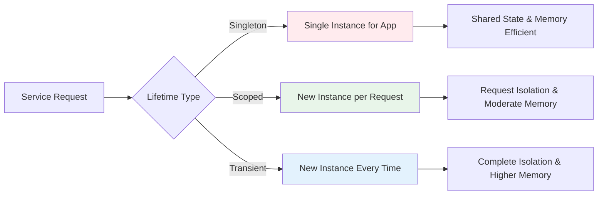
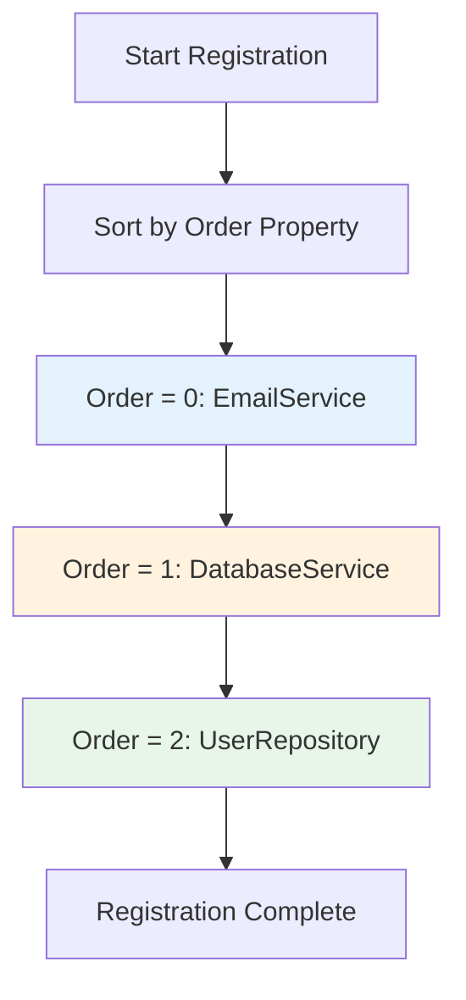
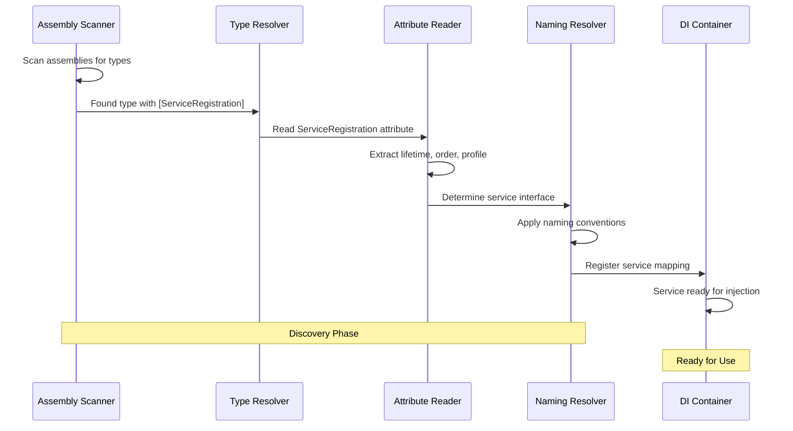

# Service Registration Guide

This comprehensive guide explores the `[ServiceRegistration]` attribute and related service marking mechanisms that form the foundation of automatic service discovery. Understanding these concepts thoroughly will empower you to effectively organize and configure your application's dependency injection without manual registration code.

## 🎯 Understanding Service Registration Attributes

The `[ServiceRegistration]` attribute serves as the primary marker that tells the discovery system "this class should be automatically registered for dependency injection." Think of it as placing a special tag on your services that the system can recognize and process during application startup.

### The ServiceRegistration Attribute

```csharp
[ServiceRegistration(ServiceLifetime.Scoped)]
public class UserService : IUserService
{
    // Your service implementation
}
```

This simple attribute declaration accomplishes several important tasks:
- Marks the class for automatic discovery
- Specifies the service lifetime (how long instances should live)
- Enables automatic interface resolution
- Integrates with the dependency injection container

## 🔄 Service Lifetimes Explained

Understanding service lifetimes is crucial for building robust applications. Each lifetime has specific use cases and performance implications:



### Singleton Lifetime

Singleton services are created once and reused throughout the application's lifetime. Use this for stateless services that are expensive to create or need to maintain shared state:

```csharp
[ServiceRegistration(ServiceLifetime.Singleton)]
public class CacheService : ICacheService
{
    private readonly ConcurrentDictionary<string, object> _cache = new();
    private readonly ILogger<CacheService> _logger;

    public CacheService(ILogger<CacheService> logger)
    {
        _logger = logger;
        _logger.LogInformation("Cache service initialized - this happens only once");
    }

    public T? Get<T>(string key)
    {
        _cache.TryGetValue(key, out var value);
        return value is T result ? result : default;
    }

    public void Set<T>(string key, T value, TimeSpan? expiration = null)
    {
        _cache[key] = value ?? throw new ArgumentNullException(nameof(value));
        
        // In a real implementation, you'd handle expiration
        if (expiration.HasValue)
        {
            // Schedule removal after expiration
        }
    }
}
```

**Best Practices for Singleton Services:**
- Keep them stateless or use thread-safe state management
- Avoid holding references to scoped or transient dependencies
- Perfect for configuration services, caches, and shared resources

### Scoped Lifetime

Scoped services are created once per request (or scope) and reused within that scope. This is the most common lifetime for business logic services:

```csharp
[ServiceRegistration(ServiceLifetime.Scoped)]
public class UserService : IUserService
{
    private readonly IUserRepository _userRepository;
    private readonly ILogger<UserService> _logger;
    private readonly IEmailService _emailService;

    public UserService(
        IUserRepository userRepository, 
        ILogger<UserService> logger,
        IEmailService emailService)
    {
        _userRepository = userRepository;
        _logger = logger;
        _emailService = emailService;
    }

    public async Task<User> CreateUserAsync(CreateUserRequest request)
    {
        _logger.LogInformation("Creating user: {Email}", request.Email);
        
        // Business logic that might call other scoped services
        var user = new User
        {
            Email = request.Email,
            Name = request.Name,
            CreatedAt = DateTime.UtcNow
        };

        await _userRepository.SaveAsync(user);
        await _emailService.SendWelcomeEmailAsync(user);
        
        return user;
    }
}
```

**Best Practices for Scoped Services:**
- Ideal for business logic services that need request context
- Can safely hold state during a single request
- Most repository and service layer classes should be scoped

### Transient Lifetime

Transient services are created every time they're requested. Use this for lightweight, stateless services:

```csharp
[ServiceRegistration(ServiceLifetime.Transient)]
public class EmailService : IEmailService
{
    private readonly IConfiguration _configuration;
    private readonly ILogger<EmailService> _logger;

    public EmailService(IConfiguration configuration, ILogger<EmailService> logger)
    {
        _configuration = configuration;
        _logger = logger;
    }

    public async Task SendWelcomeEmailAsync(User user)
    {
        var emailSettings = _configuration.GetSection("Email");
        
        _logger.LogInformation("Sending welcome email to {Email}", user.Email);
        
        // Email sending logic here
        await Task.Delay(100); // Simulate email sending
        
        _logger.LogInformation("Welcome email sent successfully");
    }

    public async Task SendPasswordResetAsync(string email, string resetToken)
    {
        _logger.LogInformation("Sending password reset email to {Email}", email);
        
        // Password reset email logic
        await Task.Delay(50);
        
        _logger.LogInformation("Password reset email sent successfully");
    }
}
```

**Best Practices for Transient Services:**
- Keep them lightweight and fast to construct
- Avoid holding expensive resources
- Perfect for utility services and factories

## 🏷️ Advanced Registration Options

The `[ServiceRegistration]` attribute provides several additional configuration options for fine-tuning service behavior:

### Explicit Service Type Registration

When your class implements multiple interfaces, you can specify exactly which interface should be used for registration:

```csharp
public interface IUserService
{
    Task<User> GetUserAsync(int id);
}

public interface IUserValidator
{
    bool ValidateUser(User user);
}

// Without explicit service type - ambiguous
[ServiceRegistration(ServiceLifetime.Scoped)]
public class UserService : IUserService, IUserValidator
{
    // Which interface should be used for registration?
}

// With explicit service type - clear and intentional
[ServiceRegistration(ServiceLifetime.Scoped, ServiceType = typeof(IUserService))]
public class UserService : IUserService, IUserValidator
{
    public async Task<User> GetUserAsync(int id)
    {
        // Implementation for IUserService
        return new User { Id = id };
    }

    public bool ValidateUser(User user)
    {
        // Implementation for IUserValidator
        return !string.IsNullOrEmpty(user.Name);
    }
}
```

This approach gives you precise control over which interface is registered while still allowing your class to implement multiple interfaces for different purposes.

### Registration Order Control

When service registration order matters, use the `Order` property to control the sequence:

```csharp
// This service needs to be registered first
[ServiceRegistration(ServiceLifetime.Singleton, Order = 1)]
public class DatabaseService : IDatabaseService
{
    public DatabaseService()
    {
        // Initialize database connection
        Console.WriteLine("Database service initialized first");
    }
}

// This service depends on DatabaseService being available
[ServiceRegistration(ServiceLifetime.Scoped, Order = 2)]
public class UserRepository : IUserRepository
{
    private readonly IDatabaseService _databaseService;

    public UserRepository(IDatabaseService databaseService)
    {
        _databaseService = databaseService;
        Console.WriteLine("User repository initialized after database");
    }
}

// Default order (0) - will be registered before explicitly ordered services
[ServiceRegistration(ServiceLifetime.Scoped)]
public class EmailService : IEmailService
{
    // This will be registered first due to default order of 0
}
```

The registration order flow looks like this:



### Profile-Based Registration

Profile-based registration allows you to have different service implementations for different environments:

```csharp
// Development implementation with mock data
[ServiceRegistration(ServiceLifetime.Scoped, Profile = "Development")]
public class MockUserService : IUserService
{
    private readonly List<User> _mockUsers = new()
    {
        new User { Id = 1, Name = "Test User 1", Email = "test1@example.com" },
        new User { Id = 2, Name = "Test User 2", Email = "test2@example.com" }
    };

    public async Task<User> GetUserAsync(int id)
    {
        await Task.Delay(10); // Simulate async operation
        return _mockUsers.FirstOrDefault(u => u.Id == id) 
               ?? throw new KeyNotFoundException($"User {id} not found");
    }
}

// Production implementation with database access
[ServiceRegistration(ServiceLifetime.Scoped, Profile = "Production")]
public class DatabaseUserService : IUserService
{
    private readonly IUserRepository _repository;

    public DatabaseUserService(IUserRepository repository)
    {
        _repository = repository;
    }

    public async Task<User> GetUserAsync(int id)
    {
        return await _repository.GetByIdAsync(id)
               ?? throw new KeyNotFoundException($"User {id} not found");
    }
}

// Staging environment with enhanced logging
[ServiceRegistration(ServiceLifetime.Scoped, Profile = "Staging")]
public class LoggingUserService : IUserService
{
    private readonly IUserRepository _repository;
    private readonly ILogger<LoggingUserService> _logger;

    public LoggingUserService(IUserRepository repository, ILogger<LoggingUserService> logger)
    {
        _repository = repository;
        _logger = logger;
    }

    public async Task<User> GetUserAsync(int id)
    {
        _logger.LogInformation("Fetching user {UserId} in staging environment", id);
        
        var stopwatch = System.Diagnostics.Stopwatch.StartNew();
        var user = await _repository.GetByIdAsync(id);
        stopwatch.Stop();
        
        _logger.LogInformation("User fetch completed in {ElapsedMs}ms", stopwatch.ElapsedMilliseconds);
        
        return user ?? throw new KeyNotFoundException($"User {id} not found");
    }
}
```

Configure the active profile in your `Program.cs`:

```csharp
builder.Services.AddAutoServices(options =>
{
    options.Profile = builder.Environment.EnvironmentName; // Uses ASPNETCORE_ENVIRONMENT
    options.EnableLogging = true;
});
```

### Test Environment Exclusion

Some services should not be registered during testing to avoid side effects:

```csharp
// This service sends real emails and should be excluded from tests
[ServiceRegistration(ServiceLifetime.Transient, IgnoreInTests = true)]
public class SmtpEmailService : IEmailService
{
    private readonly SmtpClient _smtpClient;

    public SmtpEmailService(IConfiguration configuration)
    {
        _smtpClient = new SmtpClient(configuration.GetConnectionString("SmtpServer"));
    }

    public async Task SendWelcomeEmailAsync(User user)
    {
        // Sends real emails - we don't want this in tests
        var message = new MailMessage("noreply@myapp.com", user.Email, "Welcome!", "Welcome to our app!");
        await _smtpClient.SendMailAsync(message);
    }
}

// This service is safe for testing
[ServiceRegistration(ServiceLifetime.Transient)]
public class MockEmailService : IEmailService
{
    private readonly ILogger<MockEmailService> _logger;

    public MockEmailService(ILogger<MockEmailService> logger)
    {
        _logger = logger;
    }

    public async Task SendWelcomeEmailAsync(User user)
    {
        // Safe for testing - just logs instead of sending real emails
        _logger.LogInformation("Mock: Would send welcome email to {Email}", user.Email);
        await Task.CompletedTask;
    }
}
```

Configure test exclusion:

```csharp
// In your test setup
builder.Services.AddAutoServices(options =>
{
    options.IsTestEnvironment = true; // Excludes services marked with IgnoreInTests = true
});
```

## 🔍 Service Discovery Process

Understanding how the discovery process works helps you troubleshoot issues and optimize your service organization:



### Naming Convention Resolution

The library uses intelligent naming conventions to automatically determine which interface a service should implement:

```csharp
// Convention 1: I{ClassName} pattern (most common)
[ServiceRegistration(ServiceLifetime.Scoped)]
public class UserService : IUserService { } // Automatically maps to IUserService

// Convention 2: Single interface implementation
[ServiceRegistration(ServiceLifetime.Scoped)]
public class EmailSender : INotificationService { } // Maps to INotificationService

// Convention 3: Multiple interfaces - explicit specification needed
[ServiceRegistration(ServiceLifetime.Scoped, ServiceType = typeof(IUserService))]
public class UserService : IUserService, IDisposable { } // Explicitly maps to IUserService

// Convention 4: No interface found - registers as concrete type
[ServiceRegistration(ServiceLifetime.Scoped)]
public class UtilityService { } // Registers as UtilityService (concrete type)
```

## 🛠️ Practical Examples

### Example 1: Repository Pattern Implementation

```csharp
// Generic repository interface
public interface IRepository<T> where T : class
{
    Task<T?> GetByIdAsync(int id);
    Task<IEnumerable<T>> GetAllAsync();
    Task<T> AddAsync(T entity);
    Task UpdateAsync(T entity);
    Task DeleteAsync(int id);
}

// Specific repository interface
public interface IUserRepository : IRepository<User>
{
    Task<User?> GetByEmailAsync(string email);
    Task<IEnumerable<User>> GetActiveUsersAsync();
}

// Repository implementation
[ServiceRegistration(ServiceLifetime.Scoped)]
public class UserRepository : IUserRepository
{
    private readonly IDbContext _context;
    private readonly ILogger<UserRepository> _logger;

    public UserRepository(IDbContext context, ILogger<UserRepository> logger)
    {
        _context = context;
        _logger = logger;
    }

    public async Task<User?> GetByIdAsync(int id)
    {
        _logger.LogDebug("Fetching user with ID: {UserId}", id);
        return await _context.Users.FindAsync(id);
    }

    public async Task<User?> GetByEmailAsync(string email)
    {
        _logger.LogDebug("Fetching user with email: {Email}", email);
        return await _context.Users.FirstOrDefaultAsync(u => u.Email == email);
    }

    // Implement other methods...
}
```

### Example 2: Service Layer with Dependencies

```csharp
[ServiceRegistration(ServiceLifetime.Scoped)]
public class UserManagementService : IUserManagementService
{
    private readonly IUserRepository _userRepository;
    private readonly IEmailService _emailService;
    private readonly ICacheService _cacheService;
    private readonly ILogger<UserManagementService> _logger;

    public UserManagementService(
        IUserRepository userRepository,
        IEmailService emailService,
        ICacheService cacheService,
        ILogger<UserManagementService> logger)
    {
        _userRepository = userRepository;
        _emailService = emailService;
        _cacheService = cacheService;
        _logger = logger;
    }

    public async Task<User> CreateUserAsync(CreateUserRequest request)
    {
        _logger.LogInformation("Creating user: {Email}", request.Email);

        // Check if user already exists
        var existingUser = await _userRepository.GetByEmailAsync(request.Email);
        if (existingUser != null)
        {
            throw new InvalidOperationException($"User with email {request.Email} already exists");
        }

        // Create new user
        var user = new User
        {
            Name = request.Name,
            Email = request.Email,
            CreatedAt = DateTime.UtcNow,
            IsActive = true
        };

        // Save to database
        user = await _userRepository.AddAsync(user);

        // Cache the user for quick access
        _cacheService.Set($"user:{user.Id}", user, TimeSpan.FromMinutes(15));

        // Send welcome email
        await _emailService.SendWelcomeEmailAsync(user);

        _logger.LogInformation("User created successfully: {UserId}", user.Id);
        return user;
    }
}
```

## 🚨 Common Patterns and Anti-Patterns

### ✅ Good Patterns

```csharp
// Clear, single-responsibility service
[ServiceRegistration(ServiceLifetime.Scoped)]
public class UserService : IUserService
{
    // Focused on user-related operations only
}

// Proper lifetime selection
[ServiceRegistration(ServiceLifetime.Singleton)]
public class ConfigurationService : IConfigurationService
{
    // Stateless, expensive to create, shared across app
}

// Explicit interface specification when needed
[ServiceRegistration(ServiceLifetime.Scoped, ServiceType = typeof(ISpecificInterface))]
public class MultiInterfaceService : ISpecificInterface, IDisposable
{
    // Clear about which interface to register
}
```

### ❌ Anti-Patterns to Avoid

```csharp
// ❌ Wrong lifetime - should be Scoped for request-specific data
[ServiceRegistration(ServiceLifetime.Singleton)]
public class UserSessionService : IUserSessionService
{
    private User _currentUser; // This will be shared across all users!
}

// ❌ Missing attribute - won't be discovered
public class ImportantService : IImportantService
{
    // This service won't be registered automatically
}

// ❌ Ambiguous interface resolution
[ServiceRegistration(ServiceLifetime.Scoped)]
public class ServiceWithMultipleInterfaces : IServiceA, IServiceB, IServiceC
{
    // Which interface should be used? Unclear!
}
```

## 📊 Performance Considerations

Service registration choices impact application performance. Here's how to optimize:

### Lifetime Performance Impact

| Lifetime | Memory Usage | Creation Cost | Thread Safety Required |
|----------|--------------|---------------|------------------------|
| Singleton | Low | Once per app | Yes |
| Scoped | Medium | Once per request | No |
| Transient | High | Every injection | No |

### Registration Order Optimization

```csharp
// Register foundational services first
[ServiceRegistration(ServiceLifetime.Singleton, Order = 1)]
public class DatabaseConnectionService : IDatabaseConnectionService { }

// Register dependent services later
[ServiceRegistration(ServiceLifetime.Scoped, Order = 10)]
public class UserRepository : IUserRepository
{
    // Depends on DatabaseConnectionService being available
}
```

## 🎯 Next Steps

Now that you understand service registration thoroughly, explore these related topics:

1. **[Conditional Registration](ConditionalRegistration.md)** - Register services based on environment and configuration
2. **[Naming Conventions](NamingConventions.md)** - Understand and customize interface resolution
3. **[Performance Optimization](PerformanceOptimization.md)** - Optimize discovery performance for large applications

The service registration system provides the foundation for automatic dependency injection. Master these concepts, and you'll have powerful control over how your application's services are organized and configured.