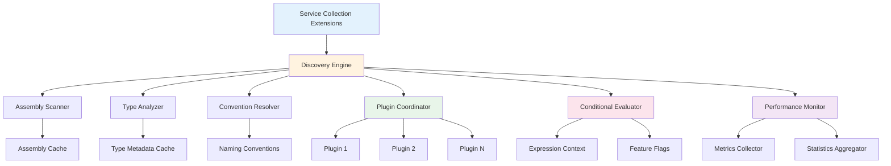
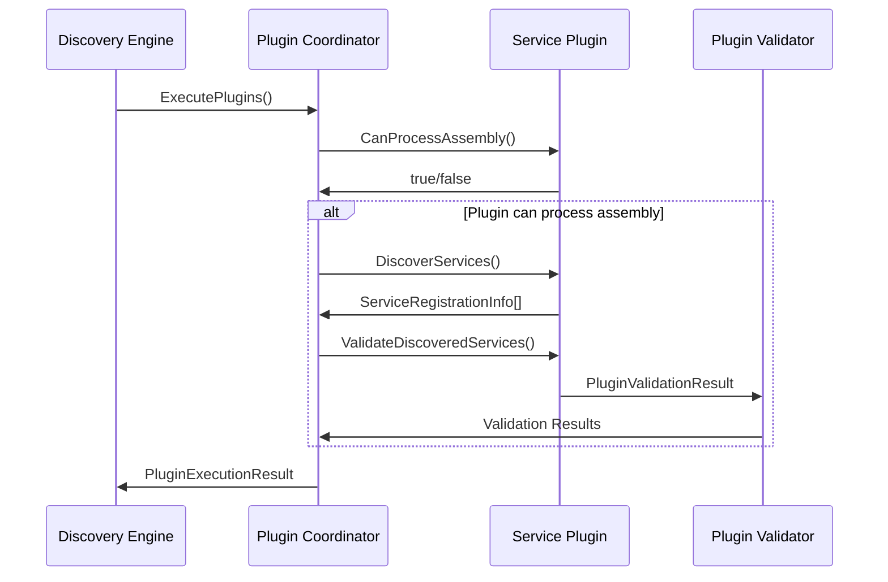
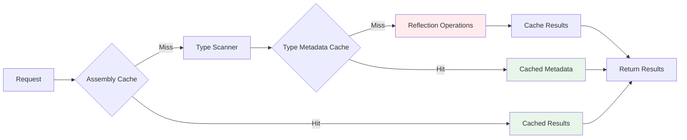
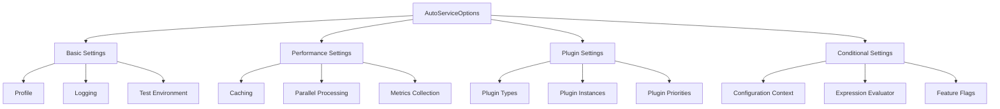
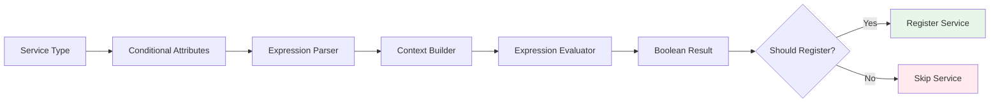
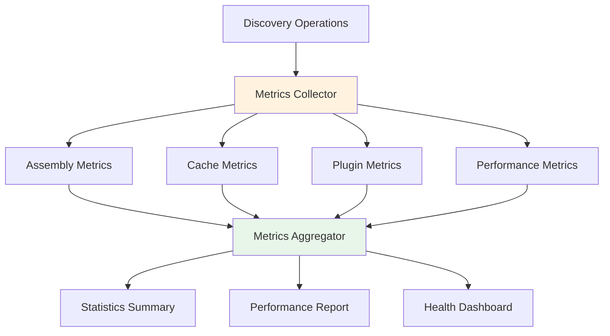

# System Architecture Guide

This comprehensive guide explores the architectural design and structure of FS.AutoServiceDiscovery.Extensions, explaining how all components work together to provide efficient, scalable service discovery.

## 🏗️ Overview

The FS.AutoServiceDiscovery.Extensions library is built on a sophisticated, modular architecture that follows modern software design principles. Think of it as a well-orchestrated symphony where each component has a specific role, but they all work together harmoniously to create beautiful music - in this case, seamless service discovery.

The architecture is designed around several key principles:
- **Separation of Concerns**: Each component has a single, well-defined responsibility
- **Dependency Inversion**: High-level modules depend on abstractions, not concretions
- **Open/Closed Principle**: The system is open for extension but closed for modification
- **Single Responsibility**: Each class and interface has one reason to change
- **Interface Segregation**: Clients aren't forced to depend on interfaces they don't use

## 🧩 Core Components



### Discovery Engine

The Discovery Engine serves as the central orchestrator of the entire discovery process. It coordinates all other components and manages the flow of information through the system.

**Key Responsibilities:**
- Coordinating assembly scanning operations
- Managing the plugin execution lifecycle
- Orchestrating conditional evaluation
- Integrating performance monitoring
- Consolidating results from all discovery sources

**Implementation Pattern:**
The engine follows the Coordinator pattern, where it doesn't perform the actual work but delegates to specialized components while managing their interactions.

### Assembly Scanner

The Assembly Scanner is responsible for examining .NET assemblies and identifying types that are candidates for service registration.

**Architecture Features:**
- **Parallel Processing**: Scans multiple assemblies concurrently for improved performance
- **Smart Filtering**: Early elimination of obviously non-service types
- **Error Resilience**: Graceful handling of problematic assemblies
- **Metadata Caching**: Avoids repeated reflection operations

**Performance Optimizations:**
```csharp
// Layered filtering approach for maximum efficiency
public class OptimizedTypeScanner
{
    // Layer 1: Quick assembly-level filter
    private bool CouldContainServices(Assembly assembly);
    
    // Layer 2: Fast type filtering (minimal reflection)
    private bool FastTypeFilter(Type type);
    
    // Layer 3: Detailed examination (expensive operations)
    private bool DetailedTypeFilter(Type type);
}
```

### Convention Resolver

The Convention Resolver implements the strategy pattern to apply different naming conventions for service type resolution.

**Architectural Benefits:**
- **Extensibility**: New conventions can be added without modifying existing code
- **Priority Ordering**: Conventions are evaluated in configurable order
- **Performance Tracking**: Each convention's effectiveness is monitored
- **Caching**: Results are cached to avoid repeated resolution

## 🔌 Plugin Architecture

The plugin system extends the core discovery capabilities with a sophisticated architecture that maintains isolation while enabling powerful integrations.

### Plugin Lifecycle



### Plugin Isolation

Each plugin operates in isolation to prevent cross-contamination:

**Error Isolation**: Plugin failures don't crash the discovery process
**Resource Isolation**: Plugins can't interfere with each other's resources
**Performance Isolation**: Slow plugins don't block others
**Dependency Isolation**: Plugins have their own dependency injection scope

## 🚀 Performance Architecture

The performance architecture implements multiple layers of optimization to ensure scalable operation.

### Caching Strategy



**Multi-Level Caching:**
1. **Assembly Level**: Complete discovery results cached per assembly
2. **Type Level**: Individual type metadata cached
3. **Convention Level**: Service resolution results cached
4. **Expression Level**: Conditional evaluation results cached

### Parallel Processing

The system uses intelligent parallel processing strategies:

**Assembly Parallelism**: Multiple assemblies processed concurrently
**Type Parallelism**: Types within assemblies processed in parallel
**Plugin Parallelism**: Independent plugins executed concurrently
**Adaptive Scaling**: Parallelism adjusted based on workload

## 🔧 Configuration Architecture

The configuration system provides flexible, type-safe options management with multiple configuration sources.

### Configuration Hierarchy



### Fluent Configuration

The fluent configuration API provides a domain-specific language for complex configurations:

```csharp
services.ConfigureAutoServices()
    .FromCurrentDomain(assembly => !assembly.FullName.StartsWith("System"))
    .WithProfile(ctx => ctx.Environment.IsProduction() ? "Prod" : "Dev")
    .When(ctx => ctx.FeatureEnabled("AutoDiscovery"))
    .ExcludeNamespaces("*.Internal.*", "*.Tests.*")
    .WithPerformanceOptimizations()
    .Apply();
```

## 🔍 Conditional Architecture

The conditional registration system provides sophisticated logic evaluation with compile-time safety.

### Expression Evaluation Pipeline



**Context Architecture:**
- **Environment Context**: Type-safe environment information
- **Configuration Context**: Strongly-typed configuration access
- **Feature Flag Context**: Dynamic feature evaluation
- **Custom Context**: Application-specific extensions

## 📊 Monitoring Architecture

Comprehensive monitoring provides observability into every aspect of the discovery process.

### Metrics Collection



**Monitoring Levels:**
1. **Operation Level**: Individual discovery operations
2. **Component Level**: Assembly scanning, plugin execution, etc.
3. **System Level**: Overall performance and health
4. **Business Level**: Service registration trends and patterns

## 🏛️ Architectural Patterns

The system implements several well-established architectural patterns:

### Strategy Pattern
Used for naming conventions, caching strategies, and plugin implementations.

### Observer Pattern
Implemented for performance monitoring and event notification.

### Factory Pattern
Applied for creating context objects, plugin instances, and configuration builders.

### Coordinator Pattern
Central to the plugin system and discovery engine coordination.

### Template Method Pattern
Used in base classes for common discovery workflows.

## 🔐 Security Architecture

Security considerations are built into the architecture at multiple levels:

**Assembly Validation**: Assemblies are validated before processing
**Type Safety**: Strong typing prevents many categories of errors
**Sandboxing**: Plugins operate in controlled environments
**Input Validation**: All external input is validated
**Error Handling**: Comprehensive error handling prevents information leakage

## 🌐 Integration Architecture

The system is designed for seamless integration with existing .NET applications:

### ASP.NET Core Integration
```csharp
// Seamless integration with existing DI registration
builder.Services.AddControllers();
builder.Services.AddAutoServices(); // Plug-and-play
builder.Services.AddSwaggerGen();
```

### Testing Integration
```csharp
// Test-friendly architecture with easy mocking
services.AddAutoServices(options => 
{
    options.IsTestEnvironment = true;
    options.EnableLogging = false;
});
```

## 🔄 Extensibility Architecture

The architecture provides multiple extension points:

### Custom Naming Conventions
```csharp
public class CustomNamingConvention : INamingConvention
{
    // Custom logic for service resolution
}
```

### Custom Plugins
```csharp
public class CustomPlugin : IServiceDiscoveryPlugin
{
    // Specialized discovery logic
}
```

### Custom Conditional Logic
```csharp
[ConditionalService(ctx => CustomBusinessLogic(ctx))]
public class ConditionalService : IService { }
```

## 📈 Scalability Considerations

The architecture is designed to scale from small applications to enterprise systems:

**Horizontal Scaling**: Multiple instances can share cache state
**Vertical Scaling**: Efficient resource utilization on powerful hardware
**Memory Scaling**: Intelligent memory management and garbage collection optimization
**CPU Scaling**: Effective utilization of multi-core processors

## 🎯 Design Goals Achievement

The architecture successfully achieves its primary design goals:

✅ **Performance**: Sub-second discovery for hundreds of assemblies
✅ **Extensibility**: Easy addition of new discovery strategies
✅ **Maintainability**: Clear separation of concerns and responsibilities  
✅ **Testability**: Comprehensive test coverage with easy mocking
✅ **Reliability**: Robust error handling and graceful degradation
✅ **Usability**: Intuitive APIs with excellent developer experience

## 🔗 Related Documentation

- **[Getting Started](GettingStarted.md)** - Basic setup and usage
- **[Performance Optimization](PerformanceOptimization.md)** - Detailed performance tuning
- **[Plugin Architecture](PluginArchitecture.md)** - Plugin development guide
- **[Conditional Registration](ConditionalRegistration.md)** - Advanced conditional logic

The architecture of FS.AutoServiceDiscovery.Extensions represents a carefully balanced approach to creating a powerful, flexible, and maintainable service discovery system. Each architectural decision supports the overall goals of performance, extensibility, and developer productivity.